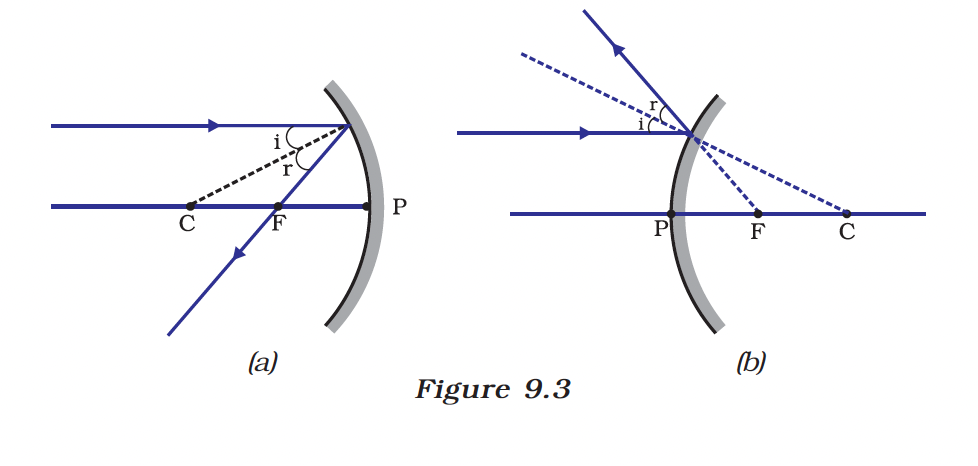
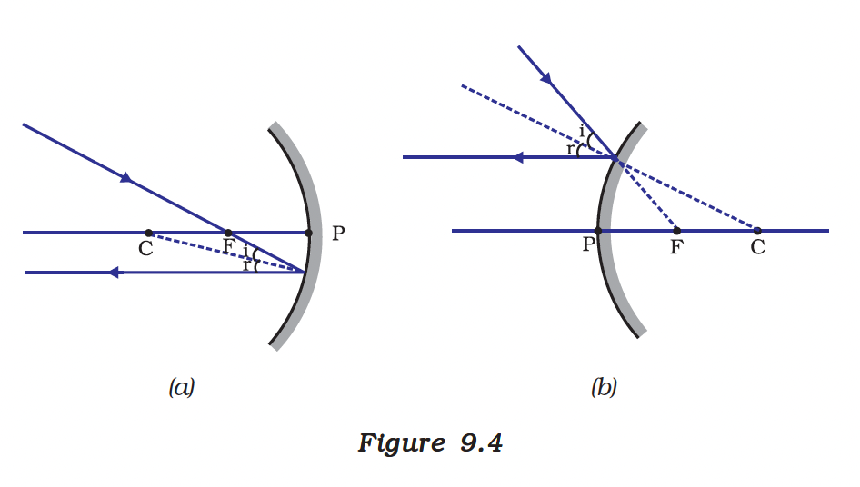
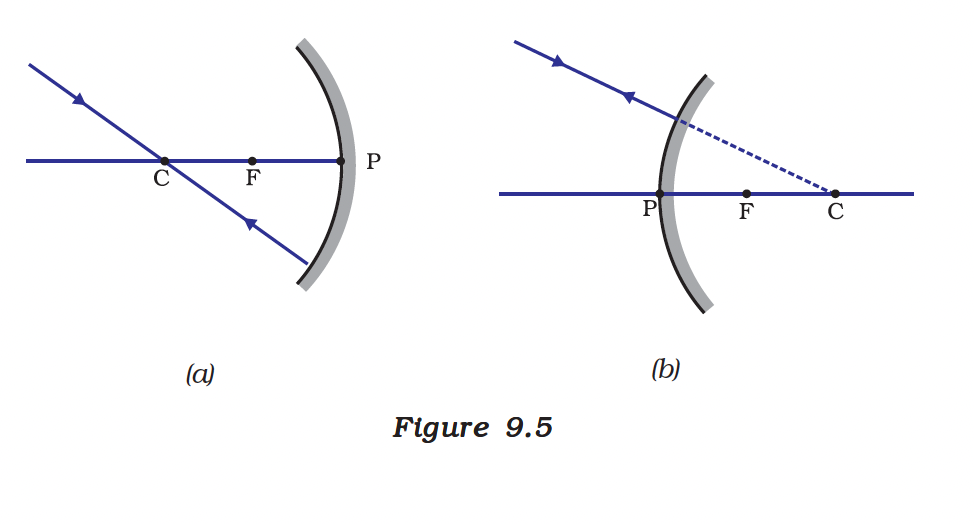
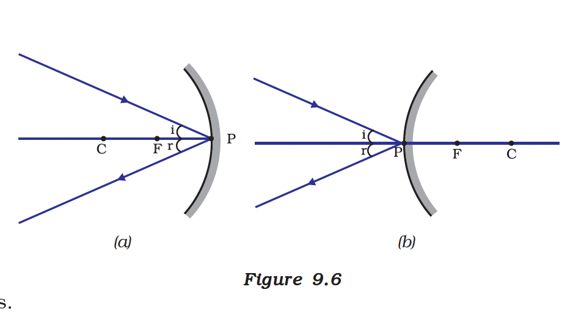
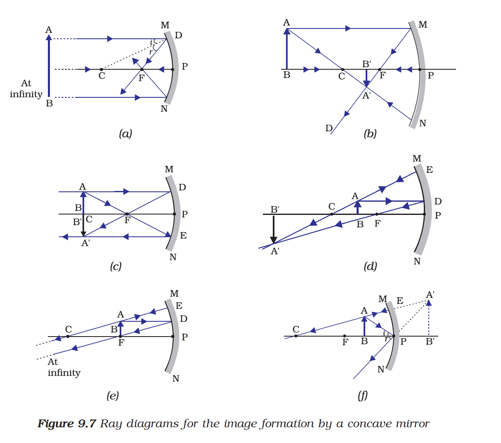
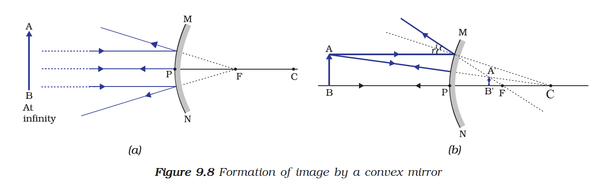
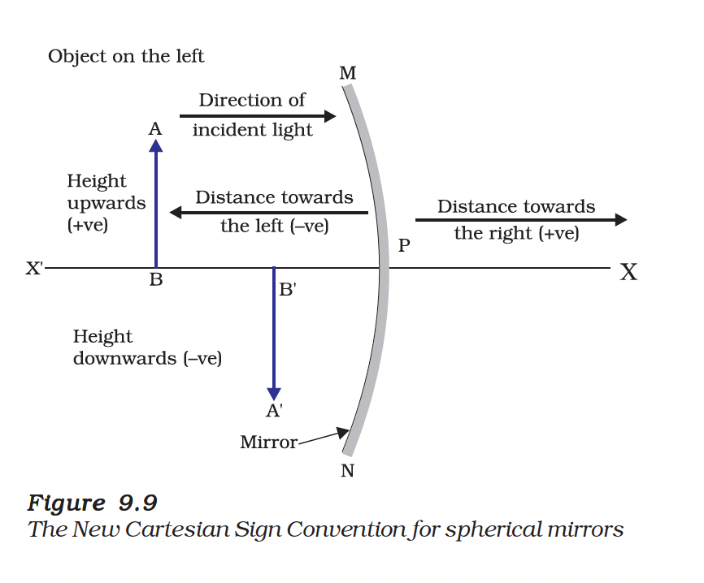

# 9.2 Spherical Mirrors

The reflecting surface of a spherical mirror may be curved inwards or outwards. A spherical mirror, whose reflecting surface is curved inwards, that is, faces towards the centre of the sphere, is called a **concave mirror**. A spherical mirror whose reflecting surface is curved outwards, is called a **convex mirror**.

*Figure 9.3: (a) Concave mirror (b) Convex mirror*

The schematic representation of spherical mirrors with their reflecting surfaces is shown in Figure 9.3. You may note that in these diagrams, concave mirrors are represented by line bent inwards and convex mirrors are represented by line bent outwards.

---

## 9.2.1 Some Important Terms Related to Spherical Mirrors

*Figure 9.4: Important terms related to spherical mirrors*

| Term | Symbol | Definition |
|------|--------|------------|
| **Pole** | P | The centre of the reflecting surface of a spherical mirror. It lies on the surface of the mirror. |
| **Centre of Curvature** | C | The centre of the sphere of which the reflecting surface of a spherical mirror forms a part. It is not a part of the mirror. |
| **Radius of Curvature** | R | The radius of the sphere of which the reflecting surface of a spherical mirror forms a part. |
| **Principal Axis** | — | The straight line passing through the pole and the centre of curvature of a spherical mirror. |
| **Principal Focus** | F | The point on the principal axis where rays parallel to the principal axis converge (concave) or appear to diverge from (convex) after reflection. |
| **Focal Length** | f | The distance between the pole and the principal focus of a spherical mirror. |

### Relationship between R and f

$f = \frac{R}{2}$

The principal focus lies midway between the pole and centre of curvature.

---

## 9.2.2 Image Formation by Spherical Mirrors

### Image Formation by Concave Mirrors

*Figure 9.5: Formation of image by a concave mirror for different positions of the object*

### Rules for Obtaining Images Formed by Spherical Mirrors

**(i)** A ray parallel to the principal axis, after reflection, will pass through the principal focus in case of a concave mirror or appear to diverge from the principal focus in case of a convex mirror.

**(ii)** A ray passing through the principal focus of a concave mirror or a ray which is directed towards the principal focus of a convex mirror, after reflection, will emerge parallel to the principal axis.

**(iii)** A ray passing through the centre of curvature of a concave mirror or directed towards the centre of curvature of a convex mirror, after reflection, is reflected back along the same path.

**(iv)** A ray incident obliquely to the principal axis, towards a point P (pole), on the concave or convex mirror, is reflected obliquely, following laws of reflection.

---

### Image Formation by Concave Mirror - Table

| Position of Object | Position of Image | Size of Image | Nature of Image |
|-------------------|-------------------|---------------|-----------------|
| At infinity | At the focus F | Highly diminished, point-sized | Real and inverted |
| Beyond C | Between F and C | Diminished | Real and inverted |
| At C | At C | Same size | Real and inverted |
| Between C and F | Beyond C | Enlarged | Real and inverted |
| At F | At infinity | Highly enlarged | Real and inverted |
| Between P and F | Behind the mirror | Enlarged | Virtual and erect |

---

### Image Formation by Convex Mirrors

*Figure 9.6: Formation of image by a convex mirror*

### Image Formation by Convex Mirror - Table

| Position of Object | Position of Image | Size of Image | Nature of Image |
|-------------------|-------------------|---------------|-----------------|
| At infinity | At the focus F, behind the mirror | Highly diminished, point-sized | Virtual and erect |
| Between infinity and the pole P | Between P and F, behind the mirror | Diminished | Virtual and erect |

> **Note:** A convex mirror always forms a virtual, erect and diminished image, irrespective of the position of the object.

---

## 9.2.3 Uses of Spherical Mirrors

### Uses of Concave Mirrors

*Figure 9.7: Uses of concave mirrors*

- Concave mirrors are commonly used in **torches, search-lights and headlights** of vehicles to get powerful parallel beams of light.
- They are used as **shaving mirrors** to see a larger image of the face.
- Dentists use concave mirrors to see **large images of the teeth** of patients.
- Large concave mirrors are used to concentrate sunlight to produce heat in **solar furnaces**.

### Uses of Convex Mirrors

*Figure 9.8: Convex mirror as rear-view mirror*

- Convex mirrors are commonly used as **rear-view (wing) mirrors** in vehicles because:
  - They always give an erect, though diminished, image
  - They have a wider field of view as they are curved outwards
  - Thus, convex mirrors enable the driver to view much larger area than would be possible with a plane mirror

---

## 9.2.4 Sign Convention for Reflection by Spherical Mirrors

*Figure 9.9: New Cartesian Sign Convention for spherical mirrors*

While dealing with the reflection of light by spherical mirrors, we shall follow a set of sign conventions called the **New Cartesian Sign Convention**:

**(i)** The object is always placed to the **left of the mirror**.

**(ii)** All distances are measured from the **pole** of the mirror.

**(iii)** Distances measured in the **direction of incident light are positive**, those measured in the direction opposite to the direction of incident light are **negative**.

**(iv)** Distances measured **perpendicular to and above the principal axis are positive**, those measured perpendicular to and below the principal axis are **negative**.

---

## 9.2.5 Mirror Formula and Magnification

### Mirror Formula

The mirror formula gives the relationship between the object distance (u), image distance (v) and focal length (f) of a spherical mirror:

$\frac{1}{v} + \frac{1}{u} = \frac{1}{f}$

This formula is valid for both concave and convex mirrors.

### Magnification

Magnification produced by a spherical mirror gives the relative extent to which the image of an object is magnified with respect to the object size.

$m = \frac{\text{Height of the image } (h')}{\text{Height of the object } (h)}$

It is also related to the object distance (u) and image distance (v):

$m = \frac{h'}{h} = -\frac{v}{u}$

| Value of m | Interpretation |
|------------|----------------|
| m > 1 | Image is enlarged |
| m = 1 | Image is same size as object |
| m < 1 | Image is diminished |
| m is positive | Image is virtual and erect |
| m is negative | Image is real and inverted |

---

## Solved Examples

### Example 9.1
A convex mirror used for rear-view on an automobile has a radius of curvature of 3.00 m. If a bus is located at 5.00 m from this mirror, find the position, nature and size of the image.

**Solution:**
- Radius of curvature, R = +3.00 m
- Focal length, f = R/2 = +3.00/2 = +1.50 m
- Object distance, u = –5.00 m

Using mirror formula:
$\frac{1}{v} + \frac{1}{u} = \frac{1}{f}$

$\frac{1}{v} + \frac{1}{-5.00} = \frac{1}{1.50}$

$\frac{1}{v} = \frac{1}{1.50} + \frac{1}{5.00} = \frac{5.00 + 1.50}{7.50} = \frac{6.50}{7.50}$

$v = \frac{7.50}{6.50} = +1.15 \text{ m}$

Magnification: $m = -\frac{v}{u} = -\frac{1.15}{-5.00} = +0.23$

**Answer:** The image is 1.15 m behind the mirror. It is virtual, erect and diminished (about 0.23 times the size of the object).

---

### Example 9.2
An object, 4.0 cm in size, is placed at 25.0 cm in front of a concave mirror of focal length 15.0 cm. At what distance from the mirror should a screen be placed in order to obtain a sharp image? Find the nature and the size of the image.

**Solution:**
- Object size, h = +4.0 cm
- Object distance, u = –25.0 cm
- Focal length, f = –15.0 cm

Using mirror formula:
$\frac{1}{v} + \frac{1}{-25.0} = \frac{1}{-15.0}$

$\frac{1}{v} = \frac{1}{-15.0} + \frac{1}{25.0} = \frac{-25.0 + 15.0}{375} = \frac{-10.0}{375}$

$v = -37.5 \text{ cm}$

Magnification: $m = -\frac{v}{u} = -\frac{-37.5}{-25.0} = -1.5$

Image height: $h' = m \times h = -1.5 \times 4.0 = -6.0$ cm

**Answer:** The screen should be placed 37.5 cm in front of the mirror. The image is real, inverted and enlarged (6.0 cm, 1.5 times the object size).

---

## Summary

- Spherical mirrors are of two types: concave and convex
- Concave mirrors can form both real and virtual images
- Convex mirrors always form virtual, erect, and diminished images
- Mirror formula: $\frac{1}{v} + \frac{1}{u} = \frac{1}{f}$
- Magnification: $m = \frac{h'}{h} = -\frac{v}{u}$
- Focal length: $f = \frac{R}{2}$

---
