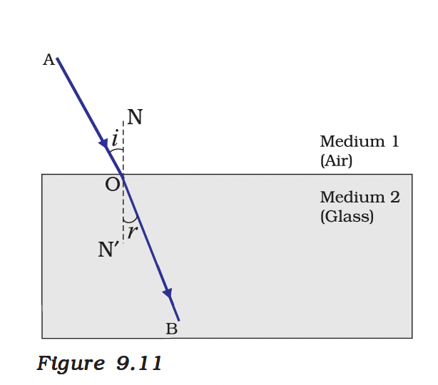
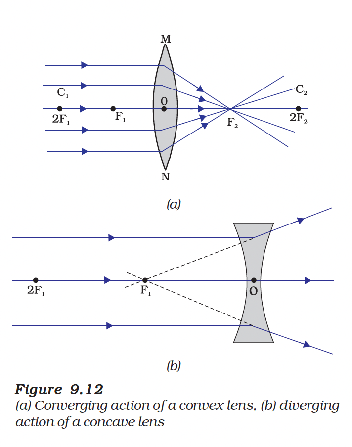
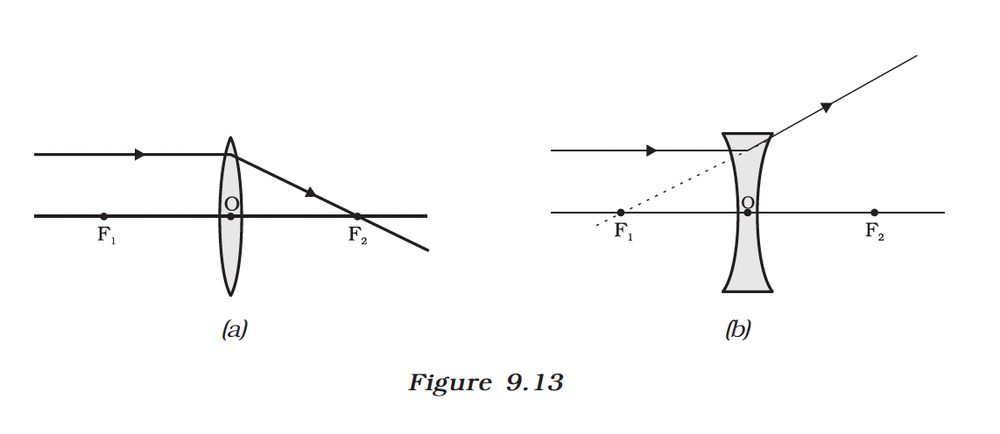
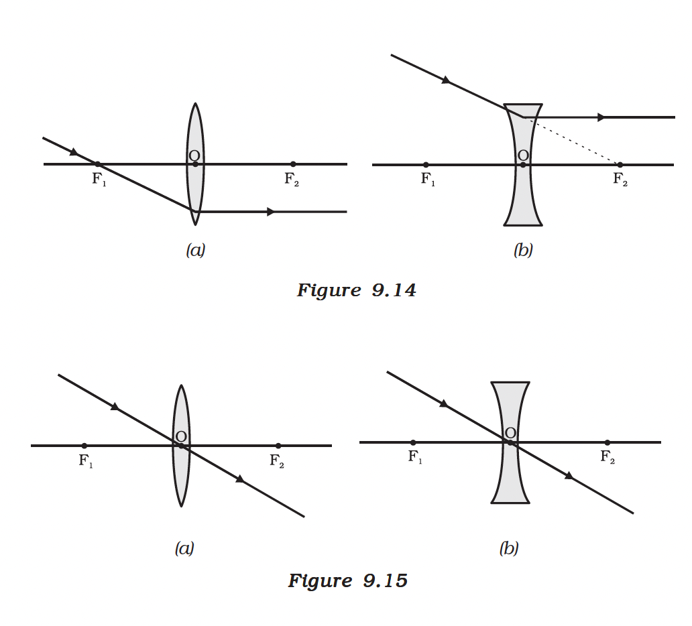

# 9.3 Refraction of Light

Light seems to travel along straight-line paths in a transparent medium. When light travels obliquely from one transparent medium to another, the direction of propagation of light in the second medium changes. This phenomenon is known as **refraction of light**.

*Figure 9.10: Refraction of light at the interface of two media*

---

## Activity 9.4: Observe Refraction

Place a thick glass slab on a white paper fixed on a table. Draw the outline of the slab with a pencil. Fix two pins A and B on one side of the slab. Look through the glass slab from the opposite side. Fix pins C and D such that all four pins appear in a straight line.

Remove the slab and join the points. You will notice that the emergent ray is parallel to the incident ray but laterally displaced.

---

## 9.3.1 Laws of Refraction

*Figure 9.11: Refraction of light through a rectangular glass slab*

The refraction of light is governed by the following laws:

**(i)** The incident ray, the refracted ray and the normal to the interface of two transparent media at the point of incidence, all lie in the same plane.

**(ii)** The ratio of sine of angle of incidence to the sine of angle of refraction is a constant, for the light of a given colour and for the given pair of media. This law is also known as **Snell's law of refraction**.

$\frac{\sin i}{\sin r} = \text{constant}$

This constant value is called the **refractive index** of the second medium with respect to the first.

---

## 9.3.2 The Refractive Index

The refractive index can be expressed as:

$n_{21} = \frac{\text{Speed of light in medium 1}}{\text{Speed of light in medium 2}} = \frac{v_1}{v_2}$

### Absolute Refractive Index

When light travels from vacuum to a medium:

$n = \frac{c}{v}$

Where:
- c = speed of light in vacuum = $3 \times 10^8$ m/s
- v = speed of light in the medium

### Table: Absolute Refractive Index of Some Materials

| Material | Refractive Index |
|----------|-----------------|
| Air | 1.0003 |
| Ice | 1.31 |
| Water | 1.33 |
| Alcohol | 1.36 |
| Kerosene | 1.44 |
| Fused quartz | 1.46 |
| Turpentine oil | 1.47 |
| Benzene | 1.50 |
| Crown glass | 1.52 |
| Canada Balsam | 1.53 |
| Rock salt | 1.54 |
| Carbon disulphide | 1.63 |
| Dense flint glass | 1.65 |
| Ruby | 1.71 |
| Sapphire | 1.77 |
| Diamond | 2.42 |

---

## 9.3.3 Optically Denser and Rarer Medium

- **Optically denser medium**: A medium with higher refractive index (light travels slower)
- **Optically rarer medium**: A medium with lower refractive index (light travels faster)

> Note: Optical density is different from mass density.

### Behavior of Light During Refraction

*Figure 9.12: Refraction of light: (a) rarer to denser (b) denser to rarer medium*

| Light travelling from | Bending direction | Speed |
|----------------------|-------------------|-------|
| Rarer to denser medium | Towards the normal | Decreases |
| Denser to rarer medium | Away from the normal | Increases |

---

## 9.3.4 Refraction by Spherical Lenses

A transparent material bound by two surfaces, of which one or both surfaces are spherical, forms a **lens**.

*Figure 9.13: Types of lenses: (a) Convex lens (b) Concave lens*

### Types of Lenses

| Type | Also called | Shape | Action |
|------|-------------|-------|--------|
| **Convex Lens** | Converging lens | Thicker at centre | Converges light rays |
| **Concave Lens** | Diverging lens | Thinner at centre | Diverges light rays |

---

## 9.3.5 Image Formation by Lenses

### Rules for Drawing Ray Diagrams

*Figure 9.14: Rules for drawing ray diagrams for convex and concave lenses*

**(i)** A ray of light from the object, parallel to the principal axis, after refraction passes through the principal focus on the other side of the lens (convex) or appears to diverge from the principal focus on the same side (concave).

**(ii)** A ray of light passing through the principal focus (convex) or directed towards it (concave), after refraction, emerges parallel to the principal axis.

**(iii)** A ray of light passing through the optical centre of a lens emerges without any deviation.

---

### Image Formation by Convex Lens

*Figure 9.15: Image formation by a convex lens for various positions of the object (continued from Figure 9.14)*

| Position of Object | Position of Image | Size of Image | Nature of Image |
|-------------------|-------------------|---------------|-----------------|
| At infinity | At focus F₂ | Highly diminished, point-sized | Real and inverted |
| Beyond 2F₁ | Between F₂ and 2F₂ | Diminished | Real and inverted |
| At 2F₁ | At 2F₂ | Same size | Real and inverted |
| Between F₁ and 2F₁ | Beyond 2F₂ | Enlarged | Real and inverted |
| At focus F₁ | At infinity | Infinitely large | Real and inverted |
| Between focus F₁ and optical centre O | On the same side of the lens as the object | Enlarged | Virtual and erect |

---

### Image Formation by Concave Lens

<!-- Note: Add fig-9.16.png when available -->
*Figure 9.16: Image formation by a concave lens*

| Position of Object | Position of Image | Size of Image | Nature of Image |
|-------------------|-------------------|---------------|-----------------|
| At infinity | At focus F₁ | Highly diminished, point-sized | Virtual and erect |
| Between infinity and optical centre O | Between F₁ and optical centre O | Diminished | Virtual and erect |

> A concave lens will always give a virtual, erect and diminished image, irrespective of the position of the object.

---

## 9.3.6 Sign Convention for Spherical Lenses

The same New Cartesian Sign Convention is used for lenses:

<!-- Note: Add fig-9.17.png when available -->
*Figure 9.17: Sign convention for lenses*

- All distances are measured from the **optical centre** of the lens.
- Distances measured in the direction of incident light are **positive**.
- Distances measured opposite to the direction of incident light are **negative**.

---

## 9.3.7 Lens Formula and Magnification

### Lens Formula

$\frac{1}{v} - \frac{1}{u} = \frac{1}{f}$

Where:
- v = image distance
- u = object distance
- f = focal length

### Magnification

$m = \frac{h'}{h} = \frac{v}{u}$

---

## 9.3.8 Power of a Lens

The power of a lens is defined as the reciprocal of its focal length:

$P = \frac{1}{f}$

**SI unit of power:** Dioptre (D)

- 1 dioptre = power of a lens whose focal length is 1 metre
- Convex lens: **Positive power**
- Concave lens: **Negative power**

### Power of a Combination of Lenses

$P = P_1 + P_2 + P_3 + ...$

---

## Solved Examples

### Example 9.3
A concave lens has focal length of 15 cm. At what distance should the object from the lens be placed so that it forms an image at 10 cm from the lens? Also, find the magnification produced by the lens.

**Solution:**
- Focal length, f = –15 cm (concave lens)
- Image distance, v = –10 cm (virtual image, same side)

Using lens formula:
$\frac{1}{v} - \frac{1}{u} = \frac{1}{f}$

$\frac{1}{-10} - \frac{1}{u} = \frac{1}{-15}$

$\frac{1}{u} = \frac{1}{-10} + \frac{1}{15} = \frac{-3 + 2}{30} = \frac{-1}{30}$

$u = -30 \text{ cm}$

Magnification: $m = \frac{v}{u} = \frac{-10}{-30} = +\frac{1}{3} = +0.33$

**Answer:** Object should be placed 30 cm from the lens. Magnification = +0.33 (image is virtual, erect and diminished).

---

### Example 9.4
A 2.0 cm tall object is placed perpendicular to the principal axis of a convex lens of focal length 10 cm. The distance of the object from the lens is 15 cm. Find the nature, position and size of the image. Also find its magnification.

**Solution:**
- Height of object, h = +2.0 cm
- Focal length, f = +10 cm
- Object distance, u = –15 cm

Using lens formula:
$\frac{1}{v} - \frac{1}{-15} = \frac{1}{10}$

$\frac{1}{v} = \frac{1}{10} - \frac{1}{15} = \frac{3 - 2}{30} = \frac{1}{30}$

$v = +30 \text{ cm}$

Magnification: $m = \frac{v}{u} = \frac{30}{-15} = -2$

Height of image: $h' = m \times h = -2 \times 2.0 = -4.0$ cm

**Answer:** Image is formed at 30 cm on the other side of the lens. It is real, inverted and enlarged (4.0 cm, twice the object size). Magnification = –2.

---

## Summary

| Concept | Key Point |
|---------|-----------|
| Refraction | Bending of light when passing from one medium to another |
| Snell's Law | $\frac{\sin i}{\sin r} = n_{21}$ |
| Refractive Index | $n = \frac{c}{v}$ |
| Lens Formula | $\frac{1}{v} - \frac{1}{u} = \frac{1}{f}$ |
| Magnification | $m = \frac{h'}{h} = \frac{v}{u}$ |
| Power of Lens | $P = \frac{1}{f}$ (in metres), unit: Dioptre (D) |

---
