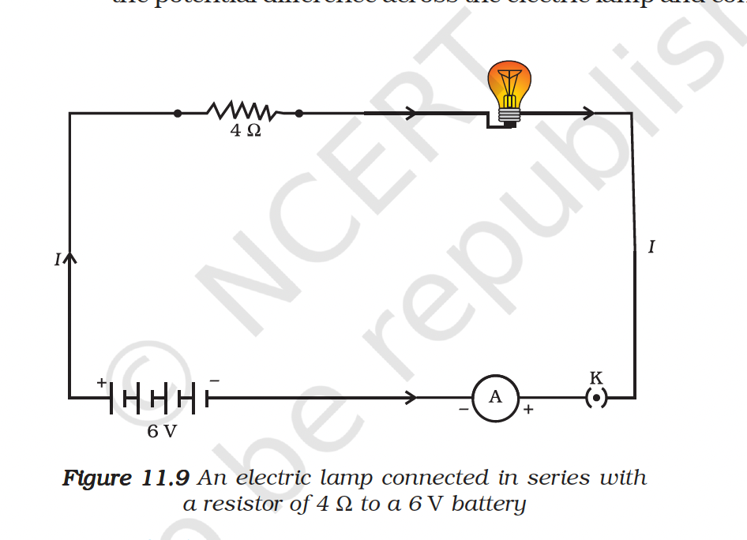

Example 11.3
(a) How much current will an electric bulb draw from a 220 V source, if the resistance of the bulb filament is $1200 \Omega$ ? (b) How much current will an electric heater coil draw from a 220 V source, if the resistance of the heater coil is $100 \Omega$ ?

Example 11.4
The potential difference between the terminals of an electric heater is 60 V when it draws a current of 4 A from the source. What current will the heater draw if the potential difference is increased to 120 V ?

Example 11.4
The potential difference between the terminals of an electric heater is 60 V when it draws a current of 4 A from the source. What current will the heater draw if the potential difference is increased to 120 V ?

