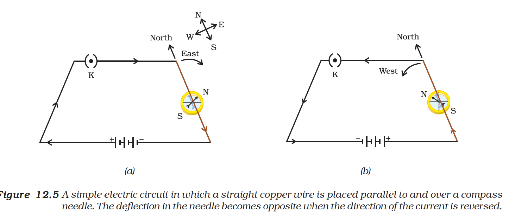
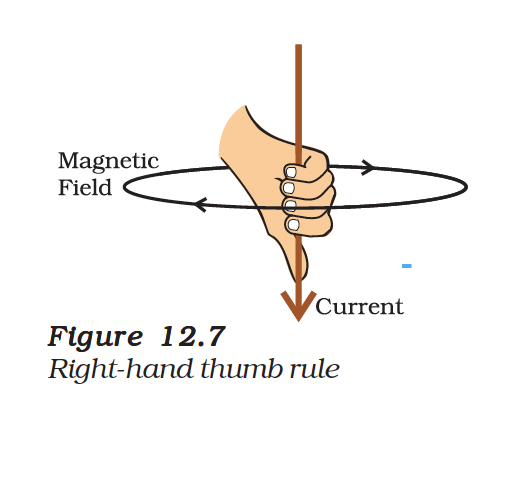
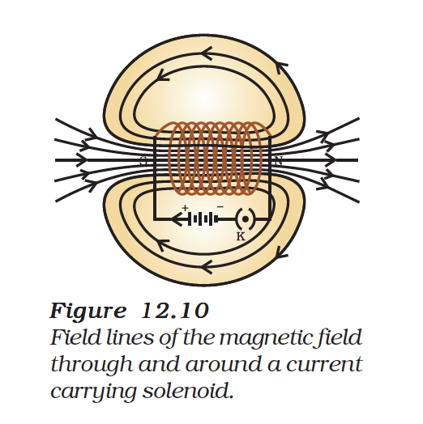
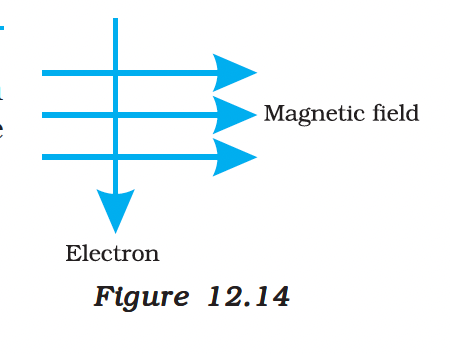

# Magnetic Field and Field Lines

## Compass Needle
- A compass needle is essentially a small **bar magnet**.
- The end pointing towards the north is the **North pole** (north-seeking).
- The end pointing towards the south is the **South pole** (south-seeking).
- **Interaction:** Like poles repel, while unlike poles attract each other.

## Magnetic Field
- The region surrounding a magnet where its force can be detected is called the **magnetic field**.
- A compass needle gets deflected near a bar magnet because it experiences a force exerted by the magnet's field.

## Magnetic Field Lines (Activity 12.2)
- **Observation:** When iron filings are sprinkled around a bar magnet, they arrange themselves in a specific pattern.
- **Conclusion:** The filings align along **magnetic field lines**, representing the magnetic field's direction and strength.
- The magnet exerts its influence in the region surrounding it, forcing the iron filings to align.

### Questions

**1. Why does a compass needle get deflected when brought near a bar magnet?**
> A compass needle is a small magnet. When brought near a bar magnet, the magnetic field of the bar magnet exerts a force on the poles of the compass needle (due to attraction/repulsion properties), causing it to deflect.

## Properties of Magnetic Field Lines
- **Nature**: Magnetic field is a quantity that has both direction and magnitude.
- **Direction**:
  - **Outside the magnet**: Field lines emerge from the **North pole** and merge at the **South pole**.
  - **Inside the magnet**: Field lines move from the **South pole** to the **North pole**.
  - Therefore, magnetic field lines are **closed curves**.
- **Strength**: The relative strength of the magnetic field is shown by the degree of closeness of the field lines.
  - **Crowded lines** indicate a **stronger** magnetic field.
- **No Intersection**: No two field lines are found to cross each other.
  - *Reason*: If they did, the compass needle would point in two directions at the point of intersection, which is impossible.

## 12.2 Magnetic Field due to a Current-Carrying Conductor
In Activity 12.1, we have seen that an electric current through a metallic conductor produces a magnetic field around it. In order to find the direction of the field produced let us repeat the activity in the following way:

### Drawing a Magnetic Field Line with a Compass Needle
- Mark the position of two ends of the needle.
- Now move the needle to a new position such that its south pole occupies the position previously occupied by its north pole.
- In this way, proceed step by step till you reach the south pole of the magnet as shown in Fig. 12.3.

- Join the points marked on the paper by a smooth curve. This curve represents a field line.
- Repeat the above procedure and draw as many lines as you can. You will get a pattern shown in Fig. 12.4. These lines represent the magnetic field around the magnet. These are known as **magnetic field lines**.

- **Observation**: Observe the deflection in the compass needle as you move it along a field line. The deflection increases as the needle is moved towards the poles.

## 12.2.1 Magnetic Field due to a Current through a Straight Conductor
What determines the pattern of the magnetic field generated by a current through a conductor? Does the pattern depend on the shape of the conductor? We shall investigate this with an activity.

We shall first consider the pattern of the magnetic field around a straight conductor carrying current.

### Activity 12.4
- Take a long straight copper wire, two or three cells of 1.5 V each, and a plug key. Connect all of them in series as shown in Fig. 12.5 (a).
- Place the straight wire parallel to and over a compass needle.
- Plug the key in the circuit.
- **Observation 1**: Observe the direction of deflection of the north pole of the needle. If the current flows from north to south, as shown in Fig. 12.5 (a), the north pole of the compass needle would move towards the east.
- Replace the cell connections in the circuit as shown in Fig. 12.5 (b). This would result in the change of the direction of current through the copper wire, that is, from south to north.
- **Observation 2**: Observe the change in the direction of deflection of the needle. You will see that now the needle moves in opposite direction, that is, towards the west [Fig. 12.5 (b)]. It means that the direction of magnetic field produced by the electric current is also reversed.

### Factors Affecting Magnetic Field Strength
- **Effect of Current**:
  - If the current in the wire is increased, the deflection in the compass needle increases.
  - **Conclusion**: The magnitude of the magnetic field produced at a given point **increases** as the current through the wire increases.
- **Effect of Distance**:
  - If the compass is moved away from the wire (while current is constant), the deflection decreases.
  - **Conclusion**: The magnetic field produced by a given current **decreases** as the distance from the conductor increases.
- **Field Pattern**:
  - The concentric circles representing the magnetic field around a current-carrying straight wire become larger and larger as we move away from it (see Fig. 12.6).

## 12.2.2 Right-Hand Thumb Rule
A convenient way of finding the direction of magnetic field associated with a current-carrying conductor is given in Fig. 12.7.

### Activity
- Connect the copper wire vertically between the points X and Y, as shown in Fig. 12.6 (a), in series with the battery, a plug and key.
- Sprinkle some iron filings uniformly on the cardboard. (You may use a salt sprinkler for this purpose.)
- Keep the variable of the rheostat at a fixed position and note the current through the ammeter.
- Close the key so that a current flows through the wire. Ensure that the copper wire placed between the points X and Y remains vertically straight.
- Gently tap the cardboard a few times. Observe the pattern of the iron filings. You would find that the iron filings align themselves showing a pattern of concentric circles around the copper wire (Fig. 12.6).
- **What do these concentric circles represent?** They represent the magnetic field lines.
- **How can the direction of the magnetic field be found?** Place a compass at a point (say P) over a circle. Observe the direction of the needle. The direction of the north pole of the compass needle would give the direction of the field lines produced by the electric current through the straight wire at point P. Show the direction by an arrow.
- **Does the direction of magnetic field lines get reversed if the direction of current through the straight copper wire is reversed?** Check it.

> **Figure 12.6**:
> (a) A pattern of concentric circles indicating the field lines of a magnetic field around a straight conducting wire. The arrows in the circles show the direction of the field lines.

> (b) A close up of the pattern obtained.

### The Rule
Imagine that you are holding a current-carrying straight conductor in your right hand such that the thumb points towards the direction of current. Then your fingers will wrap around the conductor in the direction of the field lines of the magnetic field, as shown in Fig. 12.7. This is known as the **Right-Hand Thumb Rule**.

### Example 12.1
**Question**: A current through a horizontal power line flows in east to west direction. What is the direction of magnetic field at a point directly below it and at a point directly above it?

**Solution**:
The current is in the east-west direction. Applying the right-hand thumb rule, we get that the magnetic field (at any point below or above the wire) turns clockwise in a plane perpendicular to the wire, when viewed from the east end, and anti-clockwise, when viewed from the west end.

## 12.2.3 Magnetic Field due to a Current through a Circular Loop

> **Figure 12.8**: Magnetic field lines of the field produced by a current-carrying circular loop.

We have so far observed the pattern of the magnetic field lines produced around a current-carrying straight wire. Suppose this straight wire is bent in the form of a circular loop and a current is passed through it. How would the magnetic field lines look like? We know that the magnetic field produced by a current-carrying straight wire depends inversely on the distance from it. Similarly at every point of a current-carrying circular loop, the concentric circles representing the magnetic field around it would become larger and larger as we move away from the wire (Fig. 12.8). By the time we reach at the centre of the circular loop, the arcs of these big circles would appear as straight lines. Every point on the wire carrying current would give rise to the magnetic field appearing as straight lines at the center of the loop. By applying the right hand rule, it is easy to check that every section of the wire contributes to the magnetic field lines in the same direction within the loop.

> **Note**: This rule is also called **Maxwell's corkscrew rule**. If we consider ourselves driving a corkscrew in the direction of the current, then the direction of the rotation of corkscrew is the direction of the magnetic field.

We know that the magnetic field produced by a current-carrying wire at a given point depends directly on the current passing through it. Therefore, if there is a circular coil having $n$ turns, the field produced is $n$ times as large as that produced by a single turn. This is because the current in each circular turn has the same direction, and the field due to each turn then just adds up.

### Questions

1. Consider a circular loop of wire lying in the plane of the table. Let the current pass through the loop clockwise. Apply the right-hand rule to find out the direction of the magnetic field inside and outside the loop.
2. The magnetic field in a given region is uniform. Draw a diagram to represent it.
3. Choose the correct option.
   The magnetic field inside a long straight solenoid-carrying current
   (a) is zero.
   (b) decreases as we move towards its end.
   (c) increases as we move towards its end.
   (d) is the same at all points.

## 12.3 Force on a Current-Carrying Conductor in a Magnetic Field

We have learnt that an electric current flowing through a conductor produces a magnetic field. The field so produced exerts a force on a magnet placed in the vicinity of the conductor. French scientist Andre Marie Ampere (1775-1836) suggested that the magnet must also exert an equal and opposite force on the current-carrying conductor. The force due to a magnetic field acting on a current-carrying conductor can be demonstrated through the following activity.

### Activity 12.7

- Take a small aluminium rod $AB$ (of about 5 cm). Using two connecting wires suspend it horizontally from a stand, as shown in Fig. 12.12.
- Place a strong horse-shoe magnet in such a way that the rod lies between the two poles with the magnetic field directed upwards. For this put the north pole of the magnet vertically below and south pole vertically above the aluminium rod (Fig. 12.12).
- Connect the aluminium rod in series with a battery, a key and a rheostat.
- Now pass a current through the aluminium rod from end $B$ to end $A$.
- **What do you observe?** It is observed that the rod is displaced towards the left. You will notice that the rod gets displaced.
- Reverse the direction of current flowing through the rod and observe the direction of its displacement. It is now towards the right.
- **Why does the rod get displaced?**

> **Figure 12.12**: A current-carrying rod, $AB$, experiences a force perpendicular to its length and the magnetic field. Support for the magnet is not shown here, for simplicity.

The displacement of the rod in the above activity suggests that a force is exerted on the current-carrying aluminium rod when it is placed in a magnetic field. It also suggests that the direction of force is also reversed when the direction of current through the conductor is reversed. Now change the direction of field to vertically downwards by interchanging the two poles of the magnet. It is once again observed that the direction of force acting on the current-carrying rod gets reversed. It shows that the direction of the force on the conductor depends upon the direction of current and the direction of the magnetic field. Experiments have shown that the displacement of the rod is largest (or the magnitude of the force is the highest) when the direction of current is at right angles to the direction of the magnetic field. In such a condition we can use a simple rule to find the direction of the force on the conductor.

### Fleming's Left-Hand Rule

In Activity 12.7, we considered the direction of the current and that of the magnetic field perpendicular to each other and found that the force is perpendicular to both of them. The three directions can be illustrated through a simple rule, called **Fleming's left-hand rule**. According to this rule, stretch the thumb, forefinger and middle finger of your left hand such that they are mutually perpendicular (Fig. 12.13). If the first finger points in the direction of magnetic field and the second finger in the direction of current, then the thumb will point in the direction of motion or the force acting on the conductor.

> **Figure 12.13**: Fleming's left-hand rule.

Devices that use current-carrying conductors and magnetic fields include electric motor, electric generator, loudspeakers, microphones and measuring instruments.

### Example 12.2

**Question**: An electron enters a magnetic field at right angles to it, as shown in Fig. 12.14. The direction of force acting on the electron will be:
(a) to the right.
(b) to the left.
(c) out of the page.
(d) into the page.

> **Figure 12.14**

**Solution**:
Answer is option (d). The direction of force is perpendicular to the direction of magnetic field and current as given by Fleming's left hand rule. Recall that the direction of current is taken opposite to the direction of motion of electrons. The force is therefore directed into the page.