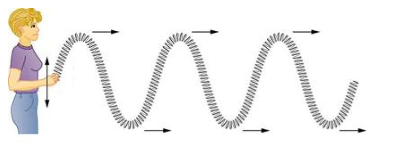
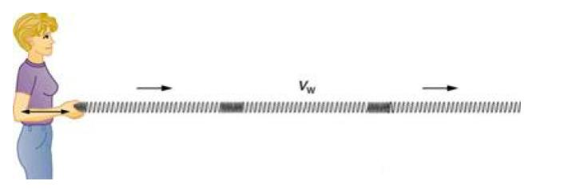

# Transverse and longitudinal waves review

Overview of key terms and skills for waves, including how to identify longitudinal and transverse waves.

Key terms

| Term | Meaning |
| :--- | :--- |
| Wave | An oscillation that transfers energy and momentum. 
| Mechanical   wave | A disturbance of matter that travels along a medium.   Examples include waves on a string, sound, and water   waves. |  |
| Wave speed | Speed at which the wave disturbance moves. Depends   only on the properties of the medium. Also called the   propagation speed. |
| Transverse Wave | Oscillations where particles are displaced perpendicular   to the wave direction. |
| Longitudnal wave | Oscillations where particles are displaced parallel to the wave direction |

## How to identify types of waves
In a transverse wave, the particles are displaced perpendicular to the direction the wave travels. Examples of transverse waves include vibrations on a string and ripples on the surface of water. We can make a horizontal transverse wave by moving the slinky vertically up and down.

Figure 1: The parts of the slinky in a transverse wave move vertically up and down while the wave disturbance travels horizontally. 

In a longitudinal wave the particles are displaced parallel to the direction the wave travels. An example of longitudinal waves is compressions moving along a slinky. We can make a horizontal longitudinal wave by pushing and pulling the slinky horizontally.

Figure 2: The parts of the slinky in a longitudinal wave and the wave disturbance travel horizontally. I

Common mistakes and misconceptions
Sometimes people forget wave speed isn't the same as the speed of the particles in the medium. The wave speed is how quickly the disturbance travels through a medium. The particle speed is how quickly a particle moves about its equilibrium position.
Learn more
For deeper explanations of transverse and longitudinal waves, see our video introduction to waves.
To check your understanding and work toward mastering these concepts, check out the exercise on identifying transverse and longitudinal waves.