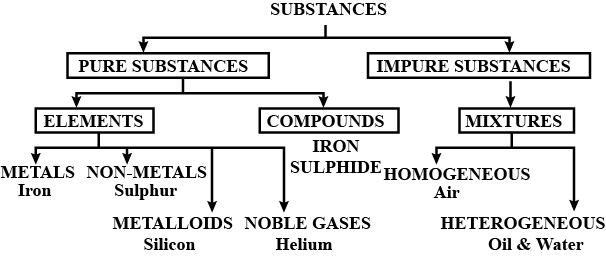

# Is Matter Around Us Pure?

## Introduction  
How do we judge whether milk, ghee, butter, selt, spices, mineral water or fuice that we buy from the market are pure?

Have you ever noticed the word 'pure' written on the packs of these consumables? For a cornmon person pure means having no adulteration. But, for a sciontist all these things aro mixtures of different substances and hence not pure. For example, milk is a mixture of water, fat, proteins etc. When a scientist says that something is pure, it means that all the constituent particies of that substance are the same in their chemical nature. A pure substance consists of a single type of particies.

As we look around, we can see that most of the matter around us exisis as mixiures of two or more pure components, for example, sea water, minerals, soil etc. are all mixtures.

## Pure Substances  

A pure substance should be the one which is made up of only one kind of particles. It is differentiated into two categories: Element and Compounds For example, sulphur element is made up of only one kind of particles; therefore, sulphur is a pure substance. Similarly, water is made up of only one kind of particles; therefore, water is a pure substance. Ali the elements and compounds are pure substances because they contain only one kind of particies. These particles may be atoms or molecules, If constituting particles are onily one type of atoms these are called eiernents. On the other hand, if the constituting particles are only one type of molecuies these are called compounds.

## Impure Substances  

The other category of matter is one the in which more than one type of atoms or molecule are present together, these are called mbxiure. All the mixtures are impure substances because they contain mors than one kind of particies. Sorne of the examples of the mixtures are: sait solution, sugar solution, milk, sea-water, air, sugarcane juice, soft drinks, sharbat, jaggery (Gur), rocks, minerals, petroleurn, biogas, tap water, coffee, paint, soil etc.

<b>$\sigma$ Illustration 1 :</b>  
Which of the following aro 'pure substances'?  
Ice, Milk, Iron, Hydrochloric acid, Calcium oxide, Mercury, Brick, Wood, Air  
**Solution:** Iron, mercury, ica, hydrochioric acid, calcium oxide  

<b>$\sigma$ Illustration 2 :</b>   
Name three mixtures found in nature.  
**Solution:**  
Minerais, air, soil.  

<b>Exercise 1 </b>

(i) What is the other name for impure substances? Give two examples of impure substances.  
(ii) Is coffee pure or impure substance.  
(iii) Pure substances is differentiated into which two categories?  

