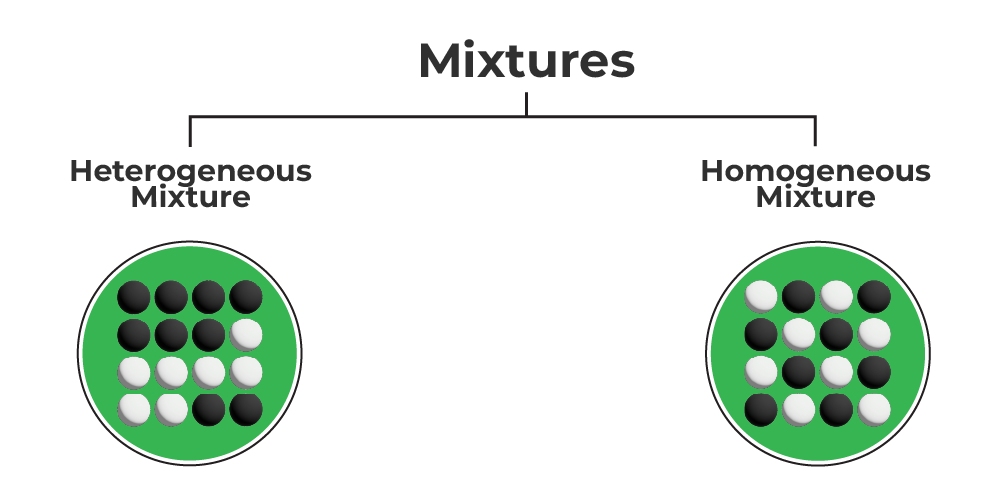

# Mixtures

A materiai containing two or more substances (elements or compounds) in any proportion is called a mixdure. The properties of a mixture are the properties of its constituents. Further, a mixiure can be separated into its constituents by simple physical methods.

A Homogeneous mixture has a uniform composition throughout its mass. There is no visible disfinct feature between the various constituents. eg. mixture of aicohol and water.

A Heterogeneous mixture does not have a uniform composition throughout its mass. e.g sand in sugar

### Difference between Mixtures and Compounds

| A Mixtures | Compounds |
| :---: | :---: |
| 1. A mbrture can be separated into its constituents by the physical processes (ike filtration, evaporation, sublimation, distilation, solvents, magnet, elc.). | 1. A compound cannot be separated into is constituents by physical processes (it can orly be separated inlo its constituents by chomical processes). |
| 2. A moxture shows the properties of its constituents. | 2 The properties of a compound are entirsly different from those of it constiluents. |
| 3. Energy (in the form of heat, light, etc.) is neither given out nor absorbed in the preparation of a mixlure. | 3. Energy (in the form of heat, light, etc.) is usually given out or absorbed during the preparation of a compound. |
| 4. The composition of a mixturs is variable. the constituents can be present in any proportion by mass. A mixture does not have a definito formula. | 4. The composition of a compound is fixed; the constituents are present in fixed proportion by mass. A compound has a definite formuda. |
| 5. A mixture does not have a fixed metting point and borling point | 5. A compound has a fixed melting-point and boiling point. |

<b>$\sigma$ Illustration 5 :</b>   

Explain why ghrcose ( $\mathrm{C}_6 \mathrm{H}_{12} \mathrm{O}_3$ ) is a compound not a mixture?
**Solution:**
1. Glucose cannol be separated into its conslituenis as $\mathrm{C}, \mathrm{H}, \mathrm{O}$ by the physical methods.
2. The properies of glucose are entirely different from those of its constivents lide Hydrogen, Oxygen 3 Carbon.
3. Heat \& light are given out when $\mathrm{C}_4 \mathrm{H}_{12} \mathrm{O}_4$ is prepared by burning carbon and hydrogen in oxygen.
4. The composition of glucose is fixed. It contains Hydrogen, Oxygen 8 Carbon combined together in a fixed proportion by weight. It has a definite formula $\mathrm{C}_4 \mathrm{H}_2 \mathrm{O}_4$

<b>$\sigma$ Illustration 6 :</b>   
What is brass?

**Solution:** A mixture of copper and zinc.

<b>$\sigma$ Illustration 7 :</b>   

Which of the following is a mirture?  
Salt, Alr, Water, Alum, Sugar  
**Solution:** Air is mixture. Salt, water, alum and sugar are compounds.  

Okay, here's the provided text reformatted using Markdown:

## Exercise 3:

(i) What is the general name of the substances which contain at least two pure substances and show the properties of their constituents?

(ii) In the following set of substances, one item does not belong to the set. Select this item and explain why it does NOT belong to the set: Hydrogen, Oxygen, Steam, Chlorine

(iii) Is 22 K gold a compound or a mixture?

### Homogeneous Mixtures:

**Solution:**
A solution is a homogenous mixture of two or more solids, liquids, or gases.
Examples: Sugar solution, salt solution, iodine in ethyl alcohol (tincture of iodine), soft drink (CO₂ dissolved in flavored water), ethanol in water, milk, brass, and bronze are solutions.

**Solvent:**
The component which is present in a larger amount in a solution is called the solvent, e.g., water, alcohol, CCl₄ are liquid solvents.

**Solute:**
The component which is present in a lesser amount in a solution is called the solute, e.g., in sugar solution, sugar is the solute.

A solution is homogeneous even at a micro level, e.g., in a salt solution, salt mixes with water so uniformly that if we take out 1 ml of solution from any part of the solution, it will have the same taste and concentration. In other words, it will have the same number of salt and water molecules per unit volume.

Solutions can be categorized into the following types:
*   (i) **Aqueous solution:** When a solute is dissolved in water, the solution is called an aqueous solution, e.g., salt in water, sugar in water, copper sulfate in water.
*   (ii) **Saturated solution:** The solution in which no more amount of solute can be dissolved at a particular temperature is called a saturated solution. There is equilibrium between dissolved and undissolved solute.
*   (iii) **Super-saturated solution:** A solution in which no more amount of solute can be dissolved at any temperature and which contains more dissolved solute than the saturated concentration, is called supersaturated, e.g., sodium thiosulphate (Na₂S₂O₃) forms a super-saturated solution. Also, a solution in which no more solute can be dissolved even after raising the temperature is called a super-saturated solution.

### Heterogeneous Mixtures

(i) **Suspension:**

A suspension is a heterogeneous mixture in which the small particles of a solid are spread throughout a liquid without dissolving in it. The size of solid particles in a suspension is quite large. The diameter of the solute is larger than 10⁻⁵ cm. These solute particles can be seen by the naked eye.
e.g., chalk water, muddy water, sand water. A suspension is an example of a heterogeneous solution. It can scatter a beam of light passing through it. These solutions are unstable.

(ii) **Colloids**

A colloid is a kind of solution in which the size of solute particles is bigger than that of a true solution but smaller than that of a suspension. The size of solute particles in a colloid is between 10⁻⁷ cm to 10⁻⁵ cm. These particles do not separate out or settle down.
e.g., Jelly, Jam, toothpaste.

**Dispersion medium:** The medium in which colloidal particles are dispersed is called the dispersion medium, e.g., in milk, water is the dispersion medium.

**Dispersed phase:** The colloidal particles which are dispersed in the dispersion medium are collectively called the dispersed phase.

**Classification of Colloidal Solutions:** On the basis of physical states of the two phases, namely, the dispersed phase and the dispersion medium, colloidal solutions can be classified into eight types as given below:

| S.N. | Dispersed   Phase | Dispersion   Medium | Type | Examples |
| :---: | :--- | :--- | :--- | :--- |
| 1. | Solid | Gas | Aerosol | Smoke, automobilo, exhaust   dust particles in air |
| 2. | Solid | Liquid | Sol | Mulk of magnesia, mud,   sulphur sol, gold sol |
| 3. | Solid | Solid | Solid sol | Some coloured gemstones,   milky glass, Ruby glass |
| 4. | Liquid | Solid | Gel | Jelly cheese, solidified   butter, shoe polish |
| 5 | Liquid | Liquid | Emulsion | Milk, face cream, liquid   butter, hair cream |
| 6 | Liquid | Gas | Aerosol | Fog, douds mist |
| 7. | Gas | Solid | Solid Foam | Foam rubber, sponge,   pumice stone, cork |
| 8 | Gas | Liquid | Foam | Shaving cream, lemonade   lroth, whipped cream |