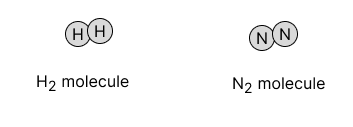
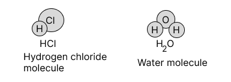

# Atoms and Molecules

## Introduction

Ancient Indian and Greek philosophers have always wondered about the unknown and unseen form of matter. The idea of divisibility of matter was considered long back in India, around 500 BC. An Indian philosopher Maharishi Kanad, postulated that if we go on dividing matter (padarth), we shall get smaller and smaller particles. Ultimately, a time will come when we shall come across the smallest particles beyond which further division will not be possible. He named these particles Parmanu. Another Indian philosopher, Pakudha Katyayama, elaborated this doctrine and said that these particles normally exist in a combined form which gives us various forms of matter.
Around the same era, ancient Greek philosophers - Democritus and Leucippus suggested that if we go on dividing matter, a stage will come when particles obtained can not be divided further. Democritus called these indivisible particles atoms (meaning indivisible). All this was based on philosophical considerations and not much experimental work to validate these ideas could be done till the eighteenth century.
By the end of the eighteenth century, scientists recognized the difference between elements and compound and naturally became interested in finding out how and why elements combine and what happens when they combine.
Antoine L . Lavoisier laid the foundation of chemical sciences by establishing two important laws of chemical combination.

## Classification of Matter

Matter can be classified broadly based on its physical and chemical nature.

## Laws of Chemical Combination
The modern era in chemistry had its inception with the formulation of three important laws of chemical combination. These are
1. Law of conservation of mass (or matter),
2. Law of constant proportion, and
3. Law of multiple proportion.

The laws of chemical combination are the experimental laws which have been formulated by scientists after performing many experiments involving various types of chemical reactions. These experimental laws ultimately led to the idea of 'atoms' being the "smallest unit"
Law of Conservation of Mass
The law of conservation of mass means that in a chemical reaction, the total mass of products is equal to the total mass of reactants. There is no change in mass during a chemical reaction. The law of conservation of mass will become clear from the following example.
When calcium carbonate is heated, a chemical reaction takes place to form calcium oxide and carbon dioxide. It has been found by experiments that if 100 grams of calcium carbonate are decomposed completely then 56 grams of calcium oxide and 44 grams of carbon dioxide are formed. This can be written as:

$58+44=1009$

$
\underset{100 \mathrm{~g}}{\text { Calcium carbonate }} \xrightarrow[\text{Chemical(reaction)}]{\text{Heat}}  \underset{56 g} {\text {Calcium oxide }}+ \underset{44 g}{\text { Carbon dioxide }}
$

In this example, calcium carbonate is the reactant and it has a mass of 100 g . Calcium oxide and carbon dioxide are the products and they have a total mass of $56 \mathrm{~g}+44 \mathrm{~g}=100 \mathrm{~g}$. Now, since the total mass of products $(100 \mathrm{~g})$ is equal to the total mass of reactant $(100 \mathrm{~g})$, there is no change of mass during this chemical reaction. The mass remains the same or conserved.

<b>Illustration 1 :</b>

Sodium carbonate reacts with ethanoic acid to form sodium ethanoate, carbon dioxide and water. In an experiment, 5.3 g sodium carbonate reacted with 6 g of ethanoic acid to form 8.2 g of sodium ethanoate, 2.2 g of carbon dioxide and 0.9 g of water. Show that this data verifies the law of conservation of mass.

Solution: All that we have to do in this problem is to calculate the mass of reactants and products separately, and then compare the two. If the two masses are equal, then the law of conservation of mass gets verified. The given reaction can be written as:
$\underbrace{\text { Sodium carbonate }+ \text { Ethanoic acid }} \rightarrow \underbrace{\text { Sodium ethanoate }+ \text { Carbon dioxide }+ \text { Water }}$
Reactants
(i) Sodium carbonate and ethanoic acid are reactants.

$
\begin{aligned}
\text { So, Mass of reactants } & =\text { Mass of sodium carbonate }+ \text { Mass of ethanoic acid } \newline
& =5.3+6 \newline
& =11.3 \mathrm{~g}
\end{aligned}
$

(ii) Sodium ethanoate, carbon dioxide and water are products.

So, Mass of products
$=$ Mass of sodium ethanoate + Mass of carbon dioxide + Mass of water

$
\begin{aligned}
& =8.2+2.2+0.9 \newline
& =11.3 \mathrm{~g}
\end{aligned}
$

<b>Illustration 2 :</b>

12.25 g of potassium chlorate $\left(\mathrm{KClO}_3\right)$ on heating produces 7.45 g of potassium chloride ( KCl$)$ and 4.8 g of oxygen. Show that this data verifies the law of conservation of mass.

Solution:

$$
\begin{aligned}
& \mathrm{KClO}_3 \xrightarrow{\Delta} \mathrm{KCl}+\frac{3}{2} \mathrm{O}_2 \newline
& \text { Total mass of reactant }\left(\mathrm{KClO}_3\right)=12.25 \mathrm{~g} \newline
& \text { Total mass of products }=\text { Mass of } \mathrm{KCl}+\text { Mass of } \mathrm{O}_2 \newline
& \quad=7.45 \mathrm{~g}+4.8 \mathrm{~g}=12.25 \mathrm{~g} \newline
& \because \quad \text { Mass of reactant }=\text { Mass of products }
\end{aligned}
$$

Thus, the given data verifies the law of conservation of mass.

<b>$\sigma$ Illustration 3 :</b>

Ammonium nitrate $\left(\mathrm{NH}_4 \mathrm{NO}_3\right)$ decomposes on heating to produce nitrous oxide ( $\mathrm{N}_2 \mathrm{O}$ ) and water $\left(\mathrm{H}_2 \mathrm{O}\right)$. When $0.8 \mathrm{~g} \mathrm{NH}_4 \mathrm{NO}_3$ is heated it produces 0.44 g of $\mathrm{N}_2 \mathrm{O}$ and 0.36 g of $\mathrm{H}_2 \mathrm{O}$. Show that the above data verifies the law of conservation of mass.

Solution:

$
\begin{aligned}
& \mathrm{NH}_4 \mathrm{NO}_3 \xrightarrow{\Delta} \mathrm{N}_2 \mathrm{O}+2 \mathrm{H}_2 \mathrm{O} \newline
& \text { Total mass of reactant }=\text { Mass of } \mathrm{NH}_4 \mathrm{NO}_3=0.8 \mathrm{~g} \newline
& \text { Total mass of products }=\text { Mass of } \mathrm{N}_2 \mathrm{O}+\text { Mass of } \mathrm{H}_2 \mathrm{O} \newline
& =0.44+0.36 \newline
& =0.8 \mathrm{~g}
\end{aligned}
$

<b>$\sigma$ Illustration 4 :</b>

If 100 g of $\mathrm{CaCO}_3$ is heated it produces 44 g of $\mathrm{CO}_2$. If it follows law of conservation of mass then how much CaO will be produced?.

Solution:

$
\begin{aligned}
& \mathrm{CaCO}_3 \xrightarrow{\Delta} \mathrm{CaO}+\mathrm{CO}_2 \newline
& \text { Since mass of } \mathrm{CaCO}_3=100 \mathrm{~g} \newline
& \text { Mass of } \mathrm{CO}_2=44 \mathrm{~g} \newline
& \text { Mass of } \mathrm{CaCO}_3=\text { Mass of } \mathrm{CaO}+\text { Mass of } \mathrm{CO}_2 \newline
& \therefore \text { Mass of } \mathrm{CaO}=100-44=56 \mathrm{~g}
\end{aligned}
$

<b>$\sigma$ Illustration 5 :</b>

Illustration 5 :
1.06 g of $\mathrm{Na}_2 \mathrm{CO}_3$ completely reacts with HCl to produce 1.17 g NaCl and 0.62 g of $\mathrm{H}_2 \mathrm{CO}_3$. The above reaction follows the law of conservation of mass, calculate the mass of HCl required?.

Solution:

$
\begin{aligned}
& \mathrm{Na}_2 \mathrm{CO}_3+2 \mathrm{HCl} \rightarrow 2 \mathrm{NaCl}+\mathrm{H}_2 \mathrm{CO}_3 \newline
& \text { According to law of conservation of mass. } \newline
& \text { Total mass of reactants }=\text { Total mass of products } \newline
& \text { Mass of } \mathrm{Na}_2 \mathrm{CO}_3+\text { Mass of } \mathrm{HCl}=\text { Mass of } \mathrm{NaCl}+\text { Mass of } \mathrm{H}_2 \mathrm{CO}_3 \newline
& \text { or } 1.06+\mathrm{Mass} \text { of } \mathrm{HCl}=1.17+0.62 \newline
& \text { or mass of } \mathrm{HCl}=1.17+0.62-1.06=0.73 \mathrm{~g}
\end{aligned}
$

<b>Exercise 1 :</b>   

(i) For the production of 36 g of water, 4 g of hydrogen is required according to following reaction $2 \mathrm{H}_2+\mathrm{O}_2 \rightarrow 2 \mathrm{H}_2 \mathrm{O}$. What is the mass of oxygen required to produce 0.72 g of water?   
(ii) 10 g of calcium carbonate reacts with HCl to produce 11.1 g of $\mathrm{CaCl}_2, 4.4 \mathrm{~g}$ of $\mathrm{CO}_2$ and 1.8 g of $\mathrm{H}_2 \mathrm{O}$. Following law of conservation of mass, calculate the mass of HCl required?   
(iii) Calcium carbonate decomposes, on heating, to form calcium oxide and carbon dioxide. When 10 g of calcium carbonate is decomposed completely, then 5.6 g of calcium oxide is formed. Calculate the mass of carbon dioxide formed. Which law of chemical combination will you use in solving this problem?

## Law of constant proportion

According to the law of constant proportion: A chemical compound always consists of the same elements combined in the same proportion by mass. This law means that whatever be the source from which it is obtained (or the method by which it is prepared), a pure chemical compound is always made up of the same elements in the same mass percentage. For example, water is a compound which always consists of the same two elements, hydrogen and oxygen, combined together in the same constant proportion of 1: 8 by mass ( 1 part by mass of hydrogen and 8 parts by mass of oxygen).

<b>$\sigma$ Illustration 6 :</b>   

When 3 g of carbon is burnt in 8 g of oxygen, 11 g of carbon dioxide is produced. What mass of carbon dioxide will be formed when 3 g of carbon is burnt in 50 g of oxygen? Which law of chemical combination will govern your answer?

Solution: Our answer will be governed by the law of constant proportions. Now, since carbon and oxygen combine in the fixed proportions of $3: 8$ by mass to produce 11 g of carbon dioxide, therefore, the same mass of carbon dioxide ( 11 g ) will be obtained even if we burn 3 g of carbon in 50 g of oxygen. The extra oxygen $(50-8=42 \mathrm{~g}$ oxygen) will remain
unreacted.

<b>$\sigma$ Illustration 7:</b>
Hydrogen and oxygen combine in the ratio of 1:8 by mass to form water. What mass of oxygen gas would be required to react completely with 3 g of hydrogen gas?

Solution: Here, we have been given that hydrogen and oxygen always combine in the fixed ratio of 1: 8 by mass. This means that:
1 g of hydrogen gas requires $=8 \mathrm{~g}$ of oxygen gas
So, 3 g of hydrogen gas requires $=8 \times 3 \mathrm{~g}$ of oxygen gas $=24 \mathrm{~g}$ of oxygen gas
Thus, 24 grams of oxygen gas would be required to react completely with 3 grams of hydrogen gas.

<b>Exercise 2: </b>
(i) A 0.24 g sample of compound of oxygen and boron was found by analysis to contain 0.096 g of boron and 0.144 g of oxygen. Calculate the percentage composition of the compound by mass.  
(ii) Carbon and hydrogen combine in the ratio of 3: 1 by mass to form methane. What mass of hydrogen gas would be required to react completely with 24 g of carbon?  
(iii) Prove law of constant proportion by giving a suitable example.  

### Dalton's Atomic Theory of Matter

Dalton's atomic theory was based on the laws of chemical combination.  
The various postulates (or assumption) of Dalton's atomic theory of matter are as follows:  
(i) All the matter is made up of very small particles called "atoms".
(ii) Atoms cannot be divided.  
(iii) Atoms can neither be created nor destroyed.  
(iv) All the atoms of a given element are identical in every respect, having the same mass, size and chemical properties.  
(v) Atoms of different elements differ in mass, size and chemical properties.  
(vi) The "number" and "kind" of atoms in each compound is fixed.  
(vii) During chemical combination, atoms of different elements combine in small whole numbers to form compounds.  
(viii) Atoms of the same elements can combine in more than one ratio to form more than one compound.  

### Drawback of Atomic Theory of Matter

(i) Atoms can be divided.  
(ii) This theory fails to explain different properties of charcoal, graphite \& diamond. Whereas they all are made up of carbon atoms.  
(iii) Dalton's atomic theory says that atoms of different element have different masses but now even atoms of different elements can have the same mass.  
(iv) Dalton's theory says that all the atoms of an element have exactly the same mass, but atoms of the same element can have slightly different masses.  

  
## Important Terminology
### Atoms
An atom is the smallest particle of an element that can take part in a chemical reaction. They are so small that we can not see them even under the most powerful optical microscope. Atoms of most of the elements are very reactive and do not exist in the free state. The size of an atom is indicated by its radius which is called "atomic radius". Atomic radius is measured in nanometers. $1 \mathrm{~nm}=10^{-9} \mathrm{~m}$. Hydrogen atom is the smallest of all.

#### Atomic Mass of an Eloment
Actual masses of the atoms of the elements are very, very small. For example, one atom of hydrogen ( H ) has a mass of $1.673 \times 10^{-24}$ gram. It is not convenient to use such small and complicated figures in our calculations; therefore, it was necessary to define atomic masses in such a way that we get simple figures for them. In order to understand the present definition of atomic mass.
Since a carbon-12 atom has been assigned an atomic mass of 12 atomic mass units, therefore, the atomic mass unit should be equal to $\frac{1}{12}$ (one-twelfth) the mass of a carbon-12 atom. That is

Atomic mass unit $=\frac{1}{12}$ the mass of a carbon-12 atom
or $\quad 1 u=\frac{1}{12}$ the mass of a carbon-12 atom.
Thus, one atomic mass unit ( 1 u ) is defined as exactly one-twelfth the mass of an atom of carbon-12. The atomic mass of an element is the relative mass of its atom as compared with the mass of a carbon12 atom taken as 12 units.

#### Gram Atomic Mass
The amount of a substance whose mass in grams is numerically equal to its atomic mass is called Gram atomic mass of that substance. e.g. Gram atomic mass of oxygen $=16$ grams

<b>Exercise 3: </b>   
(i) Define amu.  
(ii) Define an atom and a molecule.  
(iii) What are the postulates of Dalton's atomic theory?  

### Molecules

A molecule is the smallest particle of a substance which has the properties of that substance and can exist in the free state.
e.g. $\mathrm{O}_2, \mathrm{~N}_2, \mathrm{~F}_2$.
(i) Molecules of elements: The molecule of an element contains two (or more) similar atoms chemically combined.  

Ozone exist in the form of $\mathrm{O}_3$ molecules.
(ii) Molecules of compounds: The molecule of a compound contains two (or more) different types of atoms chemically combined.  
(H)

Molecular Mass
Just as an atom has atomic mass, in the same way, a molecule has a molecular mass. The molecular mass of a substance is the relative mass of its molecule as compared with the mass of a carbon-12 atom taken as 12 units.

#### Molecular Mass
Just as an atom has atomic mass, in the same way, a molecule has a molecular mass. The molecular mass of a substance is the relative mass of its molecule as compared with the mass of a carbon-12 atom taken as 12 units.

##### Gram Molecular Mass
The amount of a substance whose mass in grams is numerically equal to its molecular mass, is called gram molecular mass of that substance.
Molecular mass of oxygen $\mathrm{O}_2=32$
Gram molecular mass of oxygen, $\mathrm{O}_2=32 \mathrm{~g}$

<b>Calculation of Molecular Mass</b>  
The molecular mass is equal to sum of the atomic masses of all the atom present in one molecule of the substance.
Example:
Mass of H atom $=1 \mathrm{u}$  
Mass of 2 H atoms $=2 \times 1=2 \mathrm{u}$  
Mass of $O$ atom $=16 \mathrm{u}$  
Now, Molecular mass of $\mathrm{H}_2 \mathrm{O}=$ Mass of 2 H atoms + Mass of O atom $=2+16=18 \mathrm{u}$  
Thus, the molecular mass of water $\left(\mathrm{H}_2 \mathrm{O}\right)$ is 18 u .  

<b>Illustration 8 :</b>  
How many gram of 'S' are present in $49 \mathrm{gH}_2 \mathrm{SO}_4$ ?
Solution:

$
\begin{aligned}
& \because 98 \mathrm{~g} \mathrm{H}_2 \mathrm{SO}_4 \text { has } 32 \mathrm{~g} \text { of ' } \mathrm{S} \text { ' } \newline
& \therefore 49 \mathrm{~g} \mathrm{H}_2 \mathrm{SO}_4 \text { has } \frac{32 \times 49}{98}=16 \mathrm{~g} \text { of ' } \mathrm{S} \text { '. }
\end{aligned}
$

<b>Illustration 9 :</b>  

What is the molecular weight of a substance, each molecule of which contains 9 carbon atoms, 13 hydrogen atoms and 1 atom of other component ( $X$ ) of atomic mass 14.04?

Solution: Molecule has $\mathrm{C}, \mathrm{H}$ and another component  
$\therefore$ Wt of 9 C atoms $=12 \times 9=108 \mathrm{amu}$  
$\because$ Wt. of 13 H atoms $=13 \times 1=13 \mathrm{amu}$  
Wt. of one atom of $(X)=1 \times 14.04=14.04$ amu  
$\therefore$ Total weight of one molecule $=108+13+14.04=135.04 \mathrm{amu}$ 
Molecular weight $=135.04 \mathrm{~g}$  

<b>Exercise 4:</b>  
(i) What is the mass of $\mathrm{H}_2 \mathrm{O}$ in 1000 kg of $\mathrm{CuSO}_4 10 \mathrm{H}_2 \mathrm{O}$ ? (Atomic w.t of $\mathrm{Cu}=63.5$ ).  
(ii) The atomic masses of two elements ' $A$ ' and ' $B$ ' are 20 and 40 respectively. If $x g$ of ' $A$ ' contains $y$ ' atoms, how many atoms are present in $2 \times$ g of B?  
(iii) What is the mass of $\mathrm{H}_2 \mathrm{O}$ in 100 g of $\mathrm{Na}_2 \mathrm{CO}_3 1 \mathrm{H}_2 \mathrm{O}$ ?  
(iv) What is the mass of oxygen presont in 10.6 g of $\mathrm{Na}_2 \mathrm{CO}_3$ ?
 

### lons 
An ion is a positively or negatively charged atom (or group of atoms). Examples of the ions are: sodium ion, $\mathrm{Na}^*$, magnesium ion, 
$\mathrm{Mg}^{2+}$, chloride ion, Cl , and oxide ion $\mathrm{O}^2$. 
An lon is formed by the loss or gain of electrons by an atom, so it contains an unequal number of electrons and protons. There are two types of ions: cations and anions.

1. <b>A positively charged ion is known as cation:</b> Sodium ion, $\mathrm{Na}^{+}$, and magnesium ion, $\mathrm{Mg}^{2+}$, are cations because they are positively charged ions. A cation is formed by the loss of one or more electrons by an atom. For example, sodium atom loses 1 electron to form a sodium ion, $\mathrm{Na}^{+}$, which is a cation:

$$\underset{\text { Sodium atom }}{\mathrm{Na}} \xrightarrow{-1 \text { electron }} \underset{\begin{array}{c}\text { Sodium ion } \\ \text { (A cation) }\end{array}}{\mathrm{Na}^{+}}$$

   Since a cation is formed by the removal of electrons from an atom, therefore, a cation contains less electrons than a normal atom. The ions of all the metal elements are cations.
(i) If an atom loses 1 electron, then the cation (positive ion) formed has 1-unit positive charge. For example, a sodium atom loses 1 electron to form a sodium ion, $\mathrm{Na}^{+}$, having 1 -unit positive charge.
(ii) If an atom loses 2 electrons, then the cation (positive ion) formed has 2 units of positive charge. For example, a magnesium atom can lose 2 electrons to form a magnesium ion, $\mathrm{Mg}^{2+}$, having 2 units of positive charge.
(iii) And if an atom loses 3 electrons, then the cation (positive ion) formed has 3 units of positive charge. For example, an aluminium atom can lose 3 electrons to form an aluminium ion, $\mathrm{Al}^{3+}$, having 3 units of positive charge.
2. <b>A negatively charged ion is known as anion: </b>Chloride ion, Cr , and oxide ion, $\mathrm{O}^2$, are anions because they are negatively charged ions. An anion is formed by the gain of one or more electrons by an atom. For example, a chloride atom gains (accepts) 1 electron to form a chloride ion, $\mathrm{Cl}^{-}$, which is an anion:

$$\underset{\text { Chlorine ion }}{\mathrm{Cl}} \xrightarrow{+1 \text { electron }} \underset{\begin{array}{c}\text { Chloride ion } \\ \text { (A anion) }\end{array}}{\mathrm{Cl}^{-}}$$
   Since an anion is formed by the addition of electrons to an atom, therefore, an anion contains more electrons than a normal atom.
(i) If an atom gains 1 electron, then the anion (negative ion) formed has 1 unit of negative charge. For example, a chloride atom accepts 1 electron to form a chloride ion, $\mathrm{Cl}^{-}$, having 1 unit negative charge.
(ii) If an atom gains 2 electrons, then the anion (negative ion) formed has 2 units of negative charge. For example, an oxygen atom accepts 2 electrons to form an oxide ion, $\mathrm{O}^2$, having 2 units negative charge.  
(iii) And if an atom gains 3 electrons, then the anion (negative ion) formed will have 3 units of negative charge. For example, a nitrogen atom can gain 3 electrons to form a nitride ion, $\mathbf{N}^3$, having 3 units of negative charge.

<b>Illustration 10 :</b>   
How many electrons can a phosphorous atom gain to form phosphide ion?  
Solution :
$$
3 \text { i.e., } \mathrm{P}+3 \mathrm{e}^{-} \rightarrow \underset{\text { (Phosphide ion) }}{\mathbf{P}^{3-}}
$$

<b>Illustration 11 :</b>   
A neutral chromium atom loses six electrons to form which type of ion?  
Solution:  
A cation. $\mathrm{Cr}-6 \mathrm{e}^{-} \rightarrow \mathrm{Cr}^{+6}$

<b>Exercise 5:</b>  

(i) What are the ions present in (a) $\mathrm{CaCl}_2$ and (b) $\mathrm{Al}_2\left(\mathrm{SO}_4\right)_3$ respectively?  
(ii) What are the ions present in (a) $\mathrm{K}_2 \mathrm{CO}_3$ and (b) $\mathrm{Ca}_3\left(\mathrm{PO}_4\right)_2$ ?  
(iii) Write the chomical formula for calcium carbide.  

### lonic Compound's
The compounds which are made up of ions are known as ionic compounds. In an ionic compound, the positively charged ions (cations) and negatively charged ions (anions) are held together by the strong electrostatic forces of attraction.

#### Formula Mass
Since the ionic compound do not consist of molecules, the use of term 'molecular mass' for them is not very correct. So, we use the term 'formula mass' for ionic compounds in which individual molecules do not exist. The formula mass of an ionic compound is the relative mass of its 'formula unit' as compared with the mass of a carbon-12 atom taken as 12 units.
Formula mass of sodium chloride $(\mathrm{NaCl})$ will be $23+35.5=58.5 \mathrm{u}$.

### Mole concept

#### Mole of Molecules

1 mole of molecules of a substance has a mass equal to the gram molecular mass of the substance. That is,
1 mole of molecules of a substance $=$ Gram molecular mass of the substance  
Now, the molecular mass of oxygen $\left(\mathrm{O}_2\right)$ is 32 u , so the gram molecular mass of oxygen is 32 grams.
Thus,
1 mole of oxygen molecules $=$ Gram molecular mass of oxygen $=32$ grams  
It should be noted that the molecular formula of a substance represents 1 mole of molecules of that substance. For example:
(i) Formula $\mathrm{O}_2$ represents 1 mole of oxygen molecules and $2 \mathrm{O}_2$ represents 2 moles of oxygen molecules
(ii) Formula $\mathrm{H}_2 \mathrm{O}$ represents 1 mole of water molecules and $2 \mathrm{H}_2 \mathrm{O}$ represents 2 moles of water molecules

Please note that one mole of sulphuric acid, $\mathrm{H}_2 \mathrm{SO}_4$, contains:  
2 mole of hydrogen atom  
1 mole of sulphur atom and 4$ moles of oxygen atoms  

A mole of a substance is that amount of the substance which contains the same number of particles (atoms, molecules or ions) as there are carbon atoms in 12 grams of carbon-12 element. Since 12 grams of carbon-12 element contain $6.022 \times 10^{23}$ particles (atoms, molecules or ions) of the substance. Thus, the SI unit of amount of a substance is mole which is written in short form as mol.

$$
\text { Mole }=\frac{\text { Wt. in grams }}{\text { Molecular mass }}
$$

<b>$\sigma$ Illustration 21:</b>   
How many moles are there in 2.3 gms of Na ?

Solution:

$$
\begin{aligned}
& \text { We know, } \text { mole }=\frac{\text { mass in gms }}{\text { atomic mass }} \\
& \text { mole }=\frac{2.3}{23}=0.1
\end{aligned}
$$

<b> $ \sigma$ IIIustration 22:</b>   
How many moles are there in $9.03 \times 10^{24}$ atoms of helium $(\mathrm{He}) ?$
Solution:
We know that,

$$
6.023 \times 10^{23} \text { atoms of } \mathrm{He}=1 \text { mole }
$$

So, 9.033 \times 10^{24}$ atoms of $\mathrm{He}=\frac{1}{6.023 \times 10^{23}} \times 9.033 \times 10^{24}=15$ moles

<b> $ \sigma$ IIIustration 23:</b>     
Find out number of ions of $\mathrm{SO}_4^{2-}$ in 48 grams of ions?
Solution:

$
\begin{aligned}
& \text { molar mass for } \mathrm{SO}_4^{2-} \text { ions }=32+64=96 \text { grams } \newline
& \text { So, number of moles of ions of } \mathrm{SO}_4^{2-}=\frac{48}{96}=0.5 \newline
& \begin{aligned}
\text { So, number of ions } & =0.5 \times 6.023 \times 10^{23} \text { ions } \newline
& =3.011 \times 10^{23} \text { ions }
\end{aligned}
\end{aligned}
  $

<b>Exercise 7: </b>

(i) If one mole of carbon atoms weighs 12 grams, what is mass in grams of 1 atom of carbon?  
(ii) What is the mass of 4 moles of aluminium atoms? (Atomic mass of $A l=27 \mathrm{u}$ )   
(iii) Which has a greater number of atoms, 100 grams of sodium or 100 grams of iron? (Atom  ic masses: $\mathrm{Na}=23 \mathrm{u} ; \mathrm{Fe}=56 \mathrm{u}$ )  
(iv)   
(a) Find out the number of ions of $\mathrm{PO}_4^{3-}$ in 95 grams of $\mathrm{PO}_4^{3-}$.  
(b) Find out the number of atoms in 65 grams of Zinc?  

### Mole Based Stoichiometry
A basic question raised in the chemical laboratory is, "How much product will be formed from specific amounts of reactants?" Or in some cases we might ask the reverse question: "How much starting material (reactant) must be used to obtain a specific amount of product?" To interpret a reaction quantitatively, we need to apply our knowledge of molar masses and the mol concept.
For example,

$
\mathrm{CaCO}_3 \xrightarrow{\Delta} \mathrm{CaO}(\mathrm{g})+\mathrm{CO}_2(\mathrm{~g}) \uparrow
$

we see that $\mathrm{CaCO}_3$ on decomposition gives CaO and $\mathrm{CO}_2$.  

The above equation is balanced. But if the equation is not balanced, then first balance the equation. For above example, we can say that,
$1 \mathrm{~mol}^2 \mathrm{CaCO}_3$ decomposes to give 1 mole of CaO and $1 \mathrm{~mol} \mathrm{CO}_2$.

 
or we can also say that,
100 gms of $\mathrm{CaCO}_3$ gives 56 gm of CaO and 44 gms of $\mathrm{CO}_2$. So, it it is asked that how much CaO will be formed from 20 gms of $\mathrm{CaCO}_3$.  

So, we can apply unitary method and find out.
Here, $100 \mathrm{gms} \mathrm{CaCO}_3$ gives 56 gm of CaO .
$20 \mathrm{gms} \mathrm{CaCO}_3$ gives $\frac{56}{100} \times 20=11.2 \mathrm{gm}$  
So, summarizing the following points:  
The mol method consists of the following steps  
(i) Write correct formula for all reactants and products and balance the resulting equation.  
(ii) Convert the quantities of some or all given or known substances (usually reactants) into mol.  
(iii) Use the coefficients in the balanced equation to calculate the number of mol of the unknown quantities (usually products).  
(iv) Using the calculated number of mol and molar masses, convert the unknown quantities to whatever units are required.  
Mol of reactant $\rightarrow$ Mol of product  
Mass of reactant $\rightarrow$ Mol of reactant $\rightarrow$ Mol of product  
Mass of reactant $\rightarrow$ Mol of reactant $\rightarrow$ Mol of product $\rightarrow$ Mass of product  

