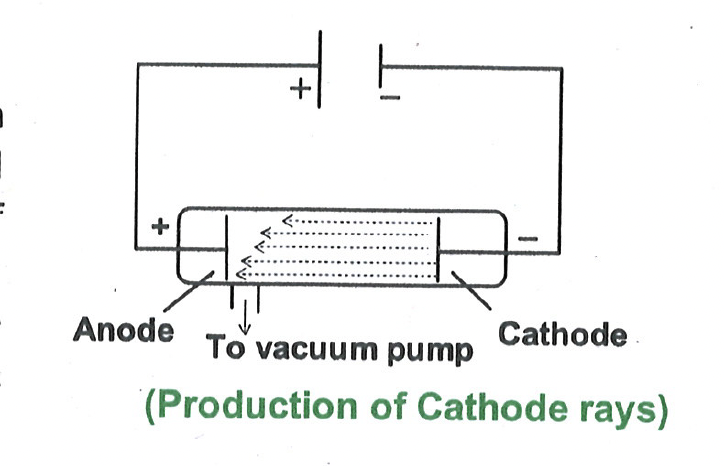

# Strucuture of Atom

## Introduction

Atom is the smallest particle of the element that takes part in chemical reactions. Various theories were given to explain the structure of atom. Initially Dalton defined atom as an indivisible particles of the element but now it has been well established that atom consists of sub-atomic particles like electron, proton and neutron. Electron has negative charge, proton has positive charge, whereas neutron has no charge, it is neutral. Protons and neutrons are present in a small nucleus at the centre of the atom. Almost the entire mass of the atom is in the nucleus because the electrons, which are outside the nucleus have very, very small mass. Electrons are outside the nucleus. The electrons in an atom revolve rapidly round the nucleus in fixed circular paths called energy levels or shells. In this chapter we will study various theories that were given to explain the structure of the atom.

## Production of cathode rays
### Discovery of Electron

<table>
<td width="60%">
J.J. Thomson constructed a special discharge tube which was operated under a high potential and low pressure and fluorescent radiations were observed in the back side of anode.  
It is then known that some invisible rays are formed at the cathode and when they strike the glass tube emits a greenish light. These rays are known as cathode rays.
(Production of Cathode rays)
</td>
<td></td>
</table>

Properties of Cathode Rays  
(i) Cathode rays travel in straight lines.  
(ii) Cathode rays can produce mechanical effect.  
(iii) Cathode rays are negatively charged.  
(iv) Nature of cathode rays does not depends upon the nature of gas taken in the discharge tube.  
(v) The mass of cathode ray is very very small as compared to mass of the atom from which it is formed.  
(vi) When the cathode rays strike some heavy metal at high voltage, new kind of rays were emitted. These rays were termed as X -rays.  

When electric field was applied between anode and cathode a deviation was observed in the path of the radiation and this radiation was also deflected in a strong magnetic field. This radiation consists of negatively charged particles. These negatively charged particles present in the cathode rays were called electrons. J.J Thomson also determined the value of $\mathrm{e} / \mathrm{m}$ (charge/mass ratio) for these particles of cathode rays. The value of $\mathrm{e} / \mathrm{m}$ was found to be $1.76 \times 10^{11} \mathrm{C} / \mathrm{kg}$.

It was observed that $\mathrm{e} / \mathrm{m}$ ratio did not change even when the material of these electrodes changed or when different gases were introduced in the discharge tube. The charge of these particles was defined by Mullikan and this value was found to be equal to $1.6 \times 10^{-19} \mathrm{C}$. When this value of charge related with that of e/m value, the mass of the particle was calculated as:

$
\begin{aligned}
M & =\frac{1.6 \times 10^{-19} \mathrm{C}}{1.76 \times 10^{11} \mathrm{C} / \mathrm{kg}} \newline
& =9.1 \times 10^{-31} \mathrm{~kg}
\end{aligned}
$
### Characteristics of Electrons

(i) Mass: The mass of an electron is about $\frac{1}{1840}$ of the mass of the hydrogen atom. We can say that relative mass of an electron is $\frac{1}{1840}$ a.m.u.  
Absolute mass of electron is $9.1 \times 10^{-28} \mathrm{gm}$.
(ii) Charge: The absolute charge of electron is $1.6 \times 10^{-19}$ coulomb of negative charge.  

Relative charge of an electron is -1 .

### X-Rays
X-rays were discovered by W.K. Roentegen. X-rays were emitted when the cathode rays struck to the heavy metal at high voltage. X-rays are used to observe the shadows of bones to see fractures, deformities and other deviations, which help to explain health problems.

### Properties
(i) They travel in straight line.
(ii) They are not bent in electric and magnetic field.
(iii) They are electromagnetic waves of very short wavelengths (1 A).

### X-Rays
X-rays were discovered by W.K. Roentegen. X-rays were emitted when the cathode rays struck to the heavy metal at high voltage. X-rays are used to observe the shadows of bones to see fractures, deformities and other deviations, which help to explain health problems.

### Properties
(i) They travel in straight line.  
(ii) They are not bent in electric and magnetic field.  
(iii) They are electromagnetic waves of very short wavelengths (1 A).  

### Production of anode rays/canal rays
<table>
<td width="60%">
<h4>Discovery of Proton</h4>
In 1886, German scientist E. Goldstein, reported the discovery of new rays in cathode ray tube.
Goldstein found that the electric discharge between the cathode and anode was accompanied by observation of new rays. These rays passed through the holes of the cathode and struck by other end of the chamber. These rays were made visible by glow of the residual gas along their path. These rays were named as the canal rays as they passed through the holes or canals in the cathode.
</td>
<td></td>
</table>

### Properties of Anode Rays/Canal Rays

(i) Anode rays travel in straight line.  
(ii) They can produce mechanical effect.  
(iii) They are positively charged.  
(iv) The nature of anode rays depends upon the gas taken in the discharge tube.  
(v) The mass of anode rays particle is almost equal to the mass of the atom from which it is formed.  

J.J. Thomson and his colleagues made an indepth study of the deflection of the positive ray by passing them through electric and magnetic fields. The mass and charge of the positive ray particles depend upon the gas taken in discharge tube. Different gases give different types of positive rays which contain particles having different masses and different charges. In other words, the charge to mass ratio $\left(\frac{\mathrm{e}}{\mathrm{m}}\right.$ ratio $)$ is not constant for positive ray particles that obtained for different gases, it changes with nature of the gas in the discharge tube. These positively charged particles constituting the canal rays were termed as protons

#### Characteristics of Protons  
(i) Mass: The relative mass of proton is 1 amu . Proton is actually a hydrogen atom which has lost its electron.  
The absolute mass of proton is $1.6 \times 10^{-24} \mathrm{gm}$.  
(ii) Charge:Absolute charge of proton is $1.6 \times 10^{-19}$ coulomb of positive charge.  

Relative charge of proton is +1 .

**Illustration 1:**
What is the nature of charge on cathode rays?  
Solution: Negative

**IIlustration 2:**
What does the formation of cathode rays and anode rays tell us about the atoms?  
Solution: Cathode rays - electron; Anode rays - proton

**Exercise 1:**  
(i) Describe the discovery of the electron.  
(ii) Why charge/mass ratio is not constant for different positively charged nuclei.  
(iii) What is the absolute charge of an electron.  

### Discovery of neutron
Rutherford proposed that inside the nucleus, proton might be closely associated to the other particle whose charge would be neutral and its mass is expected to be closer to that of proton. In 1932 Chadwick demonstrated the existence of neutrons by bombarding lighter elements like Be and B with energetic $\alpha$-particles ( $\alpha$-rays). An $\alpha$-ray is positively charged helium nuclei. The changes that took place is depicted as follows: ${ }_5^{11} \mathrm{~B}+{ }_2^4 \mathrm{He}^{2+} \rightarrow \underset{7}{14} \mathrm{~N}+\underset{\text { (noutton) }}{1 \mathrm{n}} ;{ }_4^9 \mathrm{Be}+{ }_2^4 \mathrm{He}^{2+} \longrightarrow{ }_6^{12} \mathrm{C}+\underset{\text { (neutron) }}{1 \mathrm{n}}$
Characteristics of Neutron
(i) Mass: Relative mass of neutron is 1 amu .
(ii) Charge: Neutron has no charge. It is electrically neutral.

### Rutherford's experiment

<table>
<td width="50%">
<h4>Discovery of Nucleus</h4>
Rutherford observed that maximum alpha-particles crossed the gold foil and some alpha-particles were deviated from their path and one out of 10000 alpha-particles came back on this path. It was well known that alpha-particles were highly energetic particles. Their scattering at large angles indicated that they had direct collision with entire mass of the atom.
(Rutherford's experiment of alpha-ray scattering)
</td>
<td></td>
</table>

Rutherford concluded that the entire mass of the atom must be concentrated in the nucleus and its order is $10^{-15} \mathrm{~A}^{\circ}$. It was expected to be positively charged. On the basis of above observation Rutherford proposed his model to explain the structure of the atom. He proposed that electrons move in the circular path around the nucleus.
The following figures describe the $\alpha$-scattering experiment:

**Observation**  
- Majority of the $\alpha$-particles pass straight through the gold strip with little or no deflection.  
- Some $\alpha$-particles are deflected from their path and diverge.  
- Very few $\alpha$-particles are deflected backwards through angles greater than $90^{\circ}$.  
- Some were even scattered in the opposite direction at an angle of $180^{\circ}$  

**Conclusions**

- The fact that most of the $\alpha$ - particles passed straight through the metal foil indicates that most part of the atom is empty.
- The fact that few $\alpha$-particles are deflected at large angles indicates the presence of a heavy positively charge body i.e., for such large deflections to occur, $\alpha$ - particles must have come closer to or collided with a massive positively charged body.
- The fact that one in 20,000 have deflected at $180^{\circ}$ backwards indicates that volume occupied by this heavy positively charged body is very small in comparison to total volume of the atom.
- All the +ve charge and nearly the total mass of an atom is present in a very small region at the centre of the atom. The atom's central core is called nucleus.
- The electrons, equal in number to the net nuclear positive charge, revolve around the nucleus with fast speed just like planets around the sun.
- The centrifugal force arising due to the fast speed of an electron balances the coulombic force of attraction of the nucleus and the electron remains stable in its path. Thus according to him atom consists of two parts (a) nucleus and (b) extra nuclear part.

| Particle | Mass in Kg | Absolute charge | Relative   charge | Discovery | Symbol |
| :--- | :--- | :--- | :--- | :--- | :--- |
| Electron | $9.109 \times 10^{-31}$ | $-1.6026 \times 10^{-19} \mathrm{C}$ | -1 | J.J. Thomson | ${ }_{-1} \mathrm{e}^0$ |
| Proton | $1.67266 \times 10^{-27}$ | $+1.6026 \times 10^{-19} \mathrm{C}$ | +1 | E. Goldstein   $(1886)$ | $\mathrm{N}^1$ |
| Neutron | $1.6748 \times 10^{-27}$ | Zero | 0 | James   Chadwick   $(1932)$ | $\mathrm{o}^{\mathrm{n}^1}$ |

**Illustration 3:** 
What are the relative charges of electron, proton and neutron?
Solution: Relative charge of  
Electron $\rightarrow-1$  
Proton $\rightarrow+1$  
Neutron $\rightarrow 0$  

**Illustration 4: **  
What is the other name given to Rutherford's experiment?  
Solution: $\alpha$-scattering experiment.  

**Exercise 2:**
(i) What are the characteristics of neutron?
(ii) Convert mass of electron in amu.
(iii) What is relative mass of neutron.