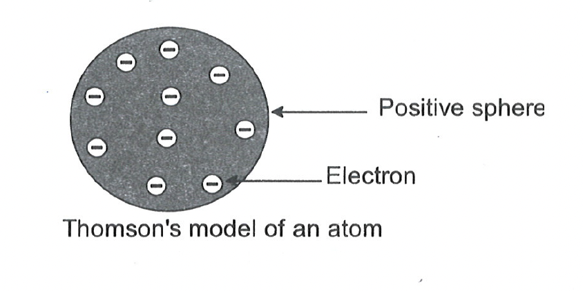
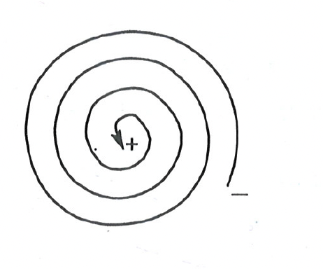
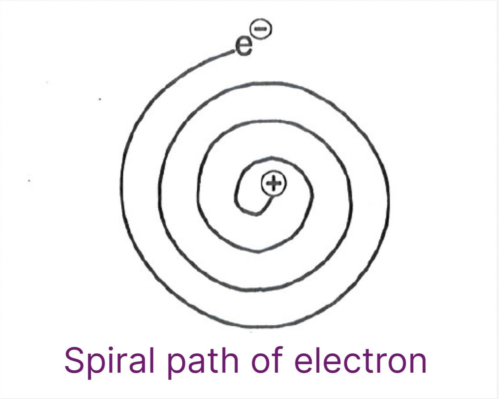
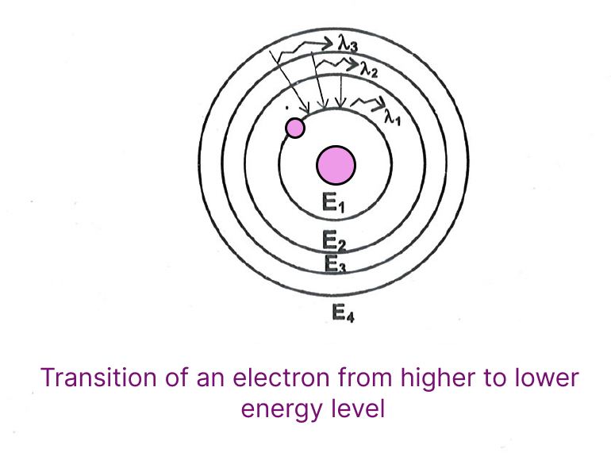
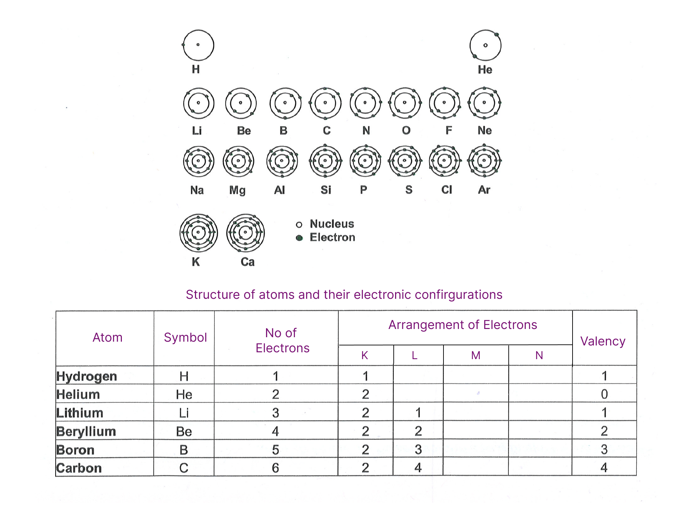
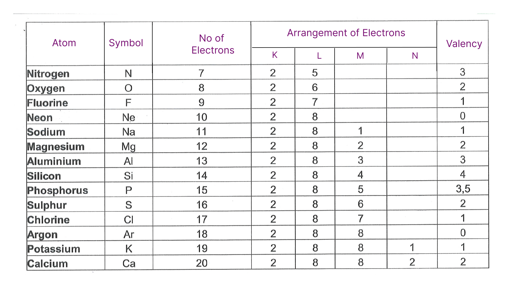
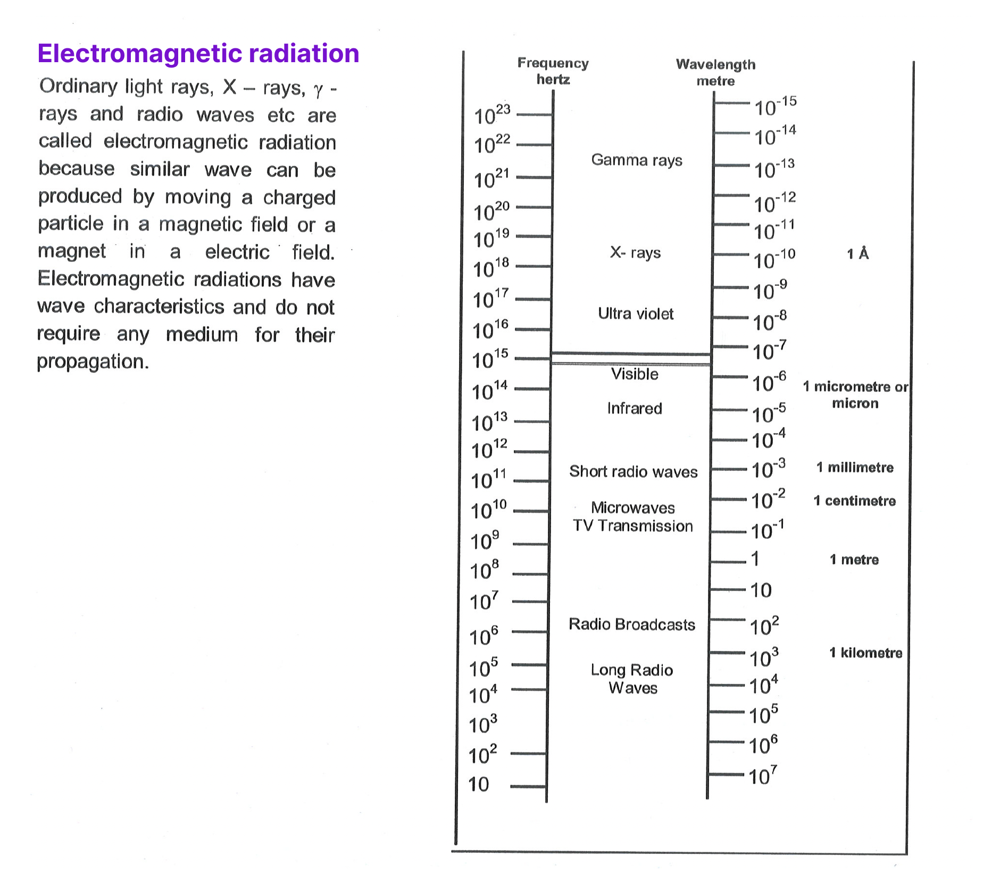
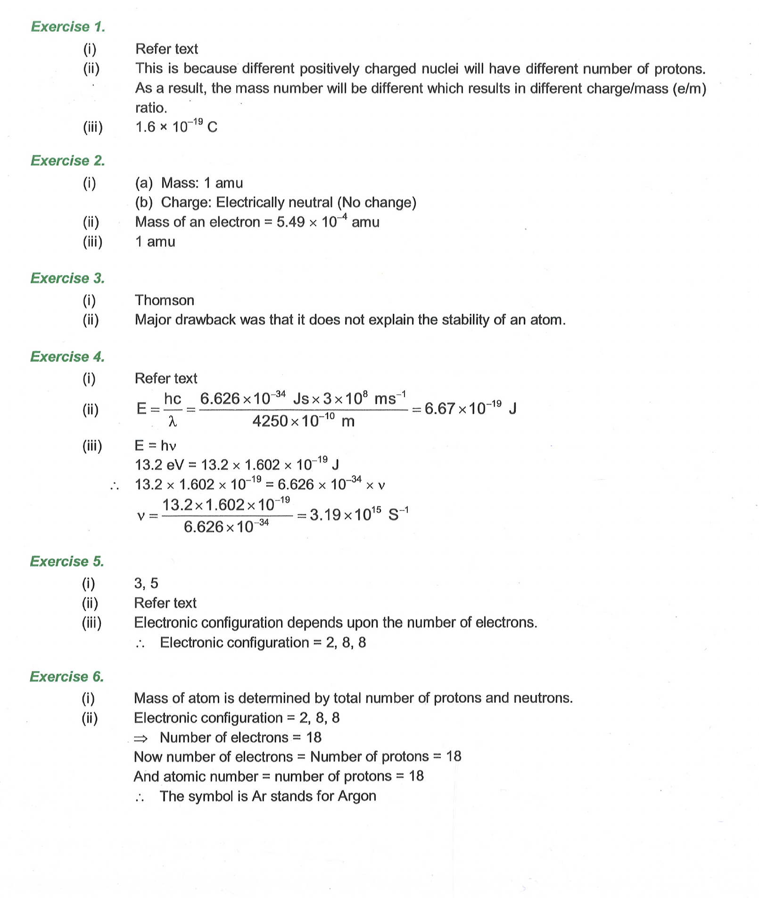
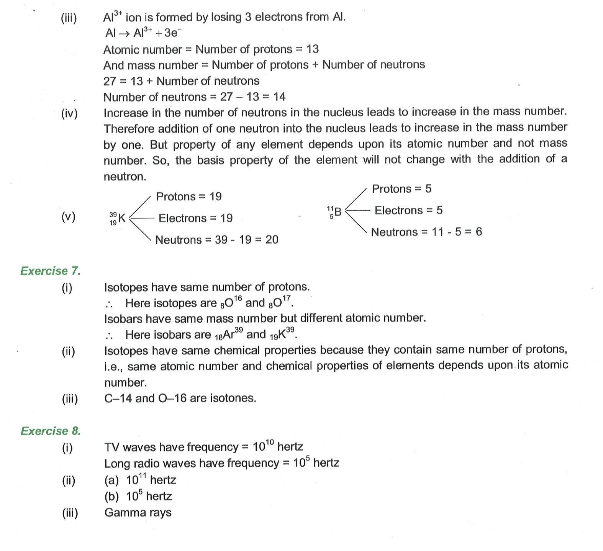

## Thomson's model of an atom

Thomson proposed the model of an atom to be similar to that of a Christmas pudding. The electrons, in a sphere of positive charge, were like dry fruits in a spherical Christmas pudding.

<table style="border-bottom:0px;border-top:0px;">
<td width="50%">
Thomson proposed that:   
(i) An atom consists of a positively charged sphere and the electrons are embedded in it.  
(ii) The negative and positive charges are equal in magnitude. So, the atom as a whole is electrically neutral. 
</td>
<td>
 
Thomson's model of an atom
</td>
</table>
 
**Drawbacks of Thomson's Model**

Although Thomson's model explained that atoms are electrically neutral, the results of experiments carried out by other scientists could not be explained by this model.

## Rutherford's Model

Based on alpha particle scattering experiment, Rutherford gave the following model of the structure of an atom:
An atom consists of a positively charged, dense and very small nucleus containing all the protons and neutrons. The nucleus is surrounded by negatively charged electrons. It was suggested that the electrons are revolving round the nucleus at very high speed due to which they do not fall into the oppositely charged nucleus. Since an atom is electrically neutral, therefore, the number of electrons in an atom is equal to the number of protons in it. The electrostatic attraction between the positively charged protons and the negatively charged electrons holds the atom together.

### Drawbacks of Rutherford's Model

<table>
<td width="70%">
<ul>
<li><b>Position of electrons</b>: The exact positions of the electrons from the nucleus are not mentioned.</li>
<li><b>Stability of the atom</b>: Bohr pointed out that Rutherford's atom should be highly unstable. According to the law of electrodynamics, when a charged body moves under the influence of an attractive force, it loses energy continuously in the form of electromagnetic radiation. The electron should therefore, continuously emit radiation and lose energy. As a result of this a moving electron will come closer and closer to the nucleus and after passing through a spiral path, it should ultimately fall into the nucleus. This was the major drawback of this prescribed model</li>
</ul>
</td>
<td>
 
</td>
</table>

**$\sigma$ Illustration 5:**  
Rutherford's model of an atom was based on which experiment?
Solution: Rutherford's $\alpha$-scattering experiment.

**Exercise 3:**  
(i) Who proposed the Plum-Pudding model of an atom?  
(ii) What was the major drawback of Rutherford's model?  
(iii) What was the drawback of plum-pudding model?  

## Bohr's Model

<table>
<td width="60%">
When Rutherford proposed his model, there were some drawbacks in his theory. Rutherford said that electrons move around the nucleus in circular path but according to electrodynamics when any charged particle moves in the circular path with acceleration it emits some radiations. Hence electrons that move around the nucleus keep emitting the radiation and their energy goes on decreasing and path of electron becomes spiral and finally it falls in the nucleus. But such a phenomenon does not take place.
</td>
<td>
 
</td>
</table>

Hence Rutherford's model was unable to explain the stability of the atom. Bohr proposed that electrons move in certain fixed energy levels and their distance remains constant from the nucleus and when electron moves in these orbits its energy also remains constant. These energy levels are called as "stationary orbits" or "stationary states".
Infinite number of orbits are possible around the nucleus, but electron will move only in that energy level only for which angular momentum of electron is given by

$
m v r=n \frac{h}{2 \pi}, \quad n=1,2,3 \ldots \ldots \ldots
$

 
The equation mvr = n * h / 2π represents one of Niels Bohr's postulates for his model of the hydrogen atom. Let's break down each component: 
m: Represents the mass of the electron orbiting the nucleus. 
v: Represents the velocity of the electron in its orbit. 
r: Represents the radius of the electron's orbit.
n: Represents the principal quantum number, which is a positive integer (1, 2, 3, ...). It denotes the energy level or shell the electron occupies. Higher values of n correspond to higher energy levels and larger orbital radii. 
h: Represents Planck's constant, a fundamental constant in quantum mechanics that relates a photon's energy to its frequency. Its value is approximately <b>6.626 x 10⁻³⁴ joule-seconds</b>. 
π (pi): The mathematical constant pi (approximately 3.14159). 
What the equation means: 
This equation quantizes the angular momentum of an electron orbiting the nucleus. Angular momentum is a measure of rotational motion, and in classical physics, it can take on any continuous value. However, Bohr's model proposed that the angular momentum of an electron is not continuous but is quantized, meaning it can only take on specific discrete values. 
The equation states that the angular momentum of an electron (mvr) is an integer multiple (n) of h/2π. This quantization has important consequences:
Stable Orbits: It explains why electrons don't spiral into the nucleus. Only specific orbits with quantized angular momentum are allowed.
Discrete Energy Levels: The quantization of angular momentum leads to the quantization of energy levels. Electrons can only exist in specific energy levels, and transitions between these levels involve the absorption or emission of photons with specific energies.
Spectral Lines: The discrete energy levels explain the discrete lines observed in the atomic spectra of hydrogen and other elements. These lines correspond to the specific energies of photons emitted or absorbed during electron transitions between energy levels.

 ..
 

 ...

According to Bohr, the exchange of energy is possible only when electron transmits from one energy level to another.

$
\Delta E=E_2-E_1=h v=\frac{h c}{\lambda} \text { joule }
$

Where $h$ is plank constant having fixed value $6.63 \times 10^{-34} \mathrm{~J} / \mathrm{sec}$ and $\lambda$ is wave length.When an electron falls from an orbit of higher energy level to lower energy level, the difference in energy is radiated in the form of electro-magnetic radiations of particular wavelength. 

Since, each atom has its specific energy levels, it can emit radiations of specific wavelengths. With this model, it was possible to explain the characteristic spectra of different atoms.

### Drawbacks of Bohr's Mode!

(i) This theory was applicable only for monoelectronic system i.e.   
$ \mathrm{H}, \mathrm{He}^{+}, \mathrm{Li}^{++}$and $\mathrm{H}_2^{+} $.
(ii) It fails to explain why spectrum of hydrogen atom is discontinous.  
(iii) Also it fails to explain Zeeman effect (effect of magnetic field) and stark effect (effect of electric field)

**Illustration 6:**
Calculate the wave length of the photon with frequency 123 s.  
Solution: $\mathrm{v}=123 \mathrm{~s}^{-1}$

$
\lambda=\frac{C}{v}=\frac{3 \times 10^8}{123}=0.024 \times 10^8 \mathrm{~m}
$

**Illustration 7:**
Calculate the wavelength of a photon having an energy of 10 eV .

Solution: $\mathrm{E}=10 \mathrm{eV}=10 \times 1.602 \times 10^{-19} \mathrm{~J}$
Butwe know that

$
\begin{aligned}
& \mathrm{E}=\left(\frac{\mathrm{hc}}{\lambda}\right) \\
& \lambda=\left(\frac{\mathrm{hc}}{\mathrm{E}}\right)=\frac{6.62 \times 10^{-34} \times 3 \times 10^8}{10 \times 1.602 \times 10^{-19}}=12.42 \times 10^{-8} \mathrm{~m}=1242 \AA
\end{aligned}
$

**Exercise 4:**  
(i) Describe the drawbacks of Rutherford's atomic model.  
(ii) Calculate the energy of an electron with wavelength $4250 \AA$.  
(iii) Calculate the frequency of a photon with energy 13.2 eV .  

According to Bohr's model number of electrons that can be accommodated in different orbits is fixed. The maximum number of electrons in $\mathrm{n}^{\text {th }}$ orbit is $2 \mathrm{n}^2$.  
In $1^{\text {st }}$ orbit $2(1)^2=2$ electrons  
$1{ }^{\text {nd }}$ orbit $\quad 2(2)^2=8$ electrons  
III ${ }^{\text {rd }}$ orbit $\quad 2(3)^2=18$ electrons  
$\mathrm{IV}^{\mathrm{th}}$ orbit $\quad 2(4)^2=32$ electrons  

### Electronic distribution in the first 20 elements

**Illustration 8:** 
Write the configuration of $\mathrm{Ca}^{2+}, \mathrm{Cr}$.  
Solution: $\mathrm{Ca}^{2+} \rightarrow 2,8,8 ; \mathrm{Cl}^{-} \rightarrow 2,8,8$

**Illustration 9:**  
What valency will be shown by an element having atomic number 12?  
Solution: 2, 8, 2. Hence, valency=2

**Exercise 5:**   
(i) Give the valencies of sulphur?  
(ii) Draw electron distribution diagram of nitrogen and sulphur.  
(iii) The atom of an element has 18 protons, 18 electrons and 22 neutrons. Write the electronic configuration of the element.

# Atomic number and atomic mass
Atomic number is equal to the total number of protons inside the nucleus. For a neutral atom total number of protons has to be equal to total number of electrons hence atomic number is also total number of electrons in a neutral atom.  
The total number of protons and neutrons present in the nucleus of an atom is known as its mass number. The atomic number $(Z)$ and the mass number $(A)$ of an element are represented as 

$
\text { Alomic No. } \mathbf{X}^{\text {Mass No. }} \text { or }{ }_z X^A
$

The constituents of a nucleus together are also referred as Nucleons.

Atomic number and atomic mass
Atomic number is equal to the total number of protons inside the nucleus. For a neutral atom total number of protons has to be equal to total number of electrons hence atomic number is also total number of electrons in a neutral atom.
The total number of protons and neutrons present in the nucleus of an atom is known as its mass number. The atomic number $(Z)$ and the mass number $(A)$ of an element are represented as

$
\text { Alomic No. } \mathbf{X}^{\text {Mass No. }} \text { or }{ }_z X^A
$

The constituents of a nucleus together are also referred as Nucleons.

**$\sigma$ Ilustration 10:**  
An atom of an element $X$ may be written as ${ }_{16}^{32} X$, what does figure $32 \& 16$ indicates.

Solution: Element contains 16 protons, 16 electrons \& 16 neutrons

**$\sigma$ Illustration 11:**  
An element contains 11 electrons and 12 neutrons. What is its atomic number and mass number?
Solution: Atomic number $=11$

$
\begin{aligned}
\text { Mass number } & =11+12 \newline
& =23
\end{aligned}
$

**$\sigma$ Illustration 12:**
Find out the number of neutrons in the element with atomic number 20 and mass number 40.
Solution: Number of neutrons $=40-20$

$
=20
$

**$\sigma$ Illustration 13:**
What are the number of neutrons in the three hydrogen isotopes?

$
\begin{array}{ll}
\text { Solution: } & { }_1^1 \mathrm{H} \rightarrow 0 \text { neutron } \\
& { }_1^2 \mathrm{H} \rightarrow 1 \text { neutron } \\
& { }_1^3 \mathrm{H} \rightarrow 2 \text { neutrons }
\end{array}
$

**Exercise 6:**  
(i) Which particles actually determines mass of atom?  
(ii) If electronic configuration of element is 2, 8, 8. What is its atomic number and its symbols?  
(iii) Find out the total number of neutrons in tripositive aluminium ion with mass number 27.  
(iv) Will introduction of a neutron into the nucleus of an atom lead to any change in any property?  
(v) Write the number of electrons, protons and neutrons present in ${ }_{19}^{39} \mathrm{~K},{ }_5^{11} \mathrm{~B}$.

**Some important definitions**  
Isotopes: Atoms having same atomic number but differ in their atomic mass.
Number (i.e. ${ }_z \mathrm{X}^A \mathrm{Z}$ will be similar) $\Rightarrow{ }_1 \mathrm{H}^1,{ }_1 \mathrm{H}^2,{ }_1 \mathrm{H}^3 \&{ }_6 \mathrm{C}^{12},{ }_6 \mathrm{C}^{14}$

### Applications of Isotopes
Isotopes are used widely for medical treatment of deadly diseases like cancer. In particular, radioactive isotopes are widely used. One of the commonly used Isotopes is that of cobalt with atomic mass 60. It gives the radioactive disintegrations of high energy, which help in destroying malignant cells in patients suffering from cancer.

**Isobars:** Element having same mass number. i.e. ${ }_6 \mathrm{C}^{14},{ }_7 \mathrm{~N}^{14}$ (i.e. ${ }_z \mathrm{X}^A \quad \mathrm{~A}$ will be similar)

**Isoelectronic:** Species or atoms having same number of electrons. i.e. $\mathrm{Na}^{+}, \mathrm{O}^{--}, \mathrm{F}^{-}, \mathrm{Al}^{3+}, \mathrm{N}^{3-}$  

**Isotones:** Species or atoms having same number of neutrons.

i.e. ${ }_5 \mathrm{~B}^{11},{ }_6 \mathrm{C}^{12}\left[\right.$ i.e. ${ }_z \mathrm{X}^{\mathrm{A}}(\mathrm{A}-\mathrm{Z})$ will be similar]

**Isomers:** Molecule having same molecular formula but differ in their structure.
i.e. $\mathrm{C}_2 \mathrm{H}_5-\mathrm{OH}, \mathrm{CH}_3-\mathrm{O}-\mathrm{CH}_3$ and $\mathrm{CH}_3 \mathrm{C} \equiv \mathrm{N}$ and

**$\sigma$ Illustration 14:**  
Find out the pair of isotone from the following: ${ }_8^{16} \mathrm{O},{ }_9^{19} \mathrm{~F},{ }_7^{15} \mathrm{~N},{ }_6^{12} \mathrm{C}$  
Solution: ${ }_8^{16} \mathrm{O}$ and ${ }_7^{15} \mathrm{~N}$  

**$\sigma$ Illustration 15:**  
Name the different isotopes of hydrogen.  
Solution: ${ }_1^1 \mathrm{H}$ - Protium; ${ }_2^1 \mathrm{H}$ - Deuterium; ${ }_1^3 \mathrm{H}$ - Tritium

**$\sigma$ Illustration 16:**  
Name two elements (other than hydrogen) which are having isotopes.  
Solution: Oxygen and sulphur

**Exercise 7:**   
(i) Identify the isotopes and isobars from the following: 
 

${ }_6 \mathrm{C}^{12}$, ${ }_8 \mathrm{O}^{16}$, ${ }_8 \mathrm{O}^{17}$, ${ }_18 \mathrm{Ar}^{39}$, ${ }_19 \mathrm{K}^{39}$  

(ii) Explain why isotopes have identical chemical properties.  
(iii) Give an example of isotones.

**$\sigma$ Illustration 17:**  

What is the range of wavelength from UV rays to Gamma rays?  
Solution: $10^{-8} \AA-10^{-10} \AA$

**$\sigma$ Illustration 18:**    
What will be the frequency of $X$-rays?
Solution: $10^{18}-10^{20}$ hertz

**Exercise 8:**  

(i) What is the difference in frequency between TV waves and long radio waves?  
(ii) Give the frequency of
(a) short radio waves  
(b) long radio waves  
(iii) Which ray has maximum penetrating power?  

## Key to Exercise

