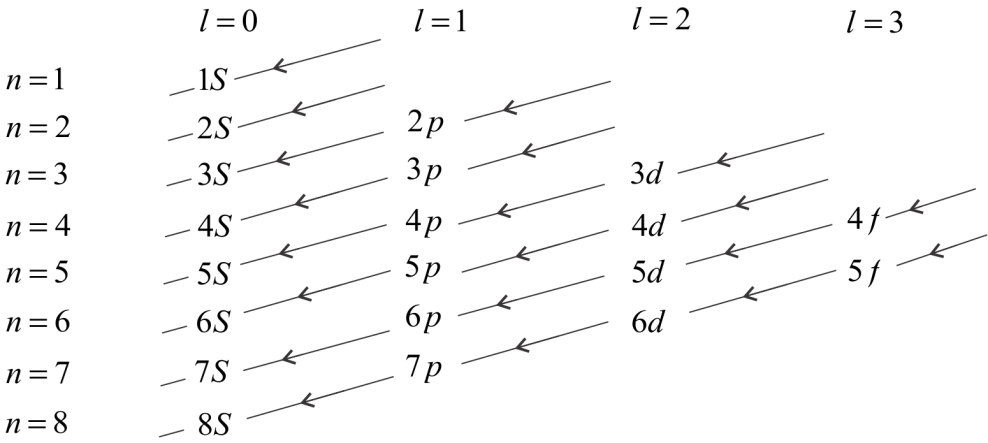
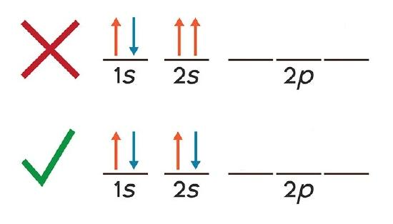
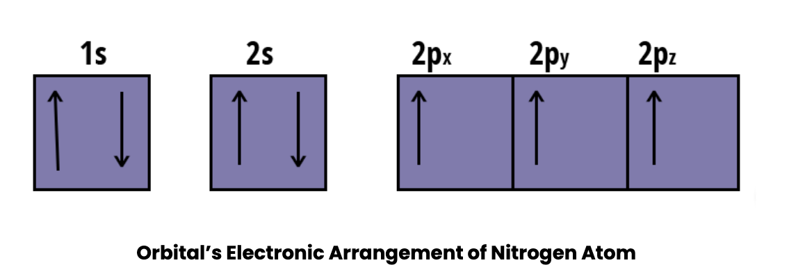
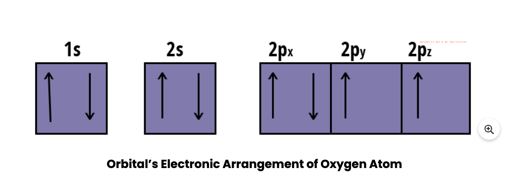
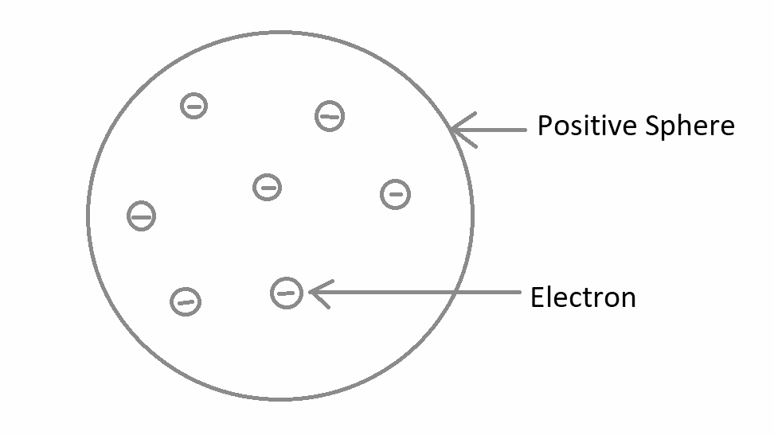
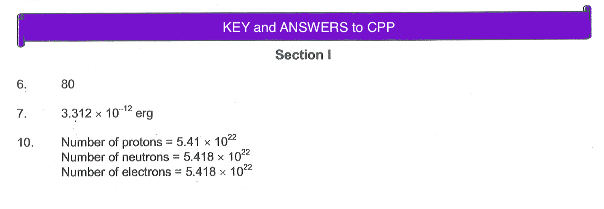

Click the "Try it" button to toggle between hiding and showing the DIV element:

# CHAPTER PRACTICE PROBLEMS

## Section I

1. What happens to cathode rays when they are subjected to an electric field?  
2. What are isotopes? Give one example.  
3. What are cathode rays and how do they differ from positive rays?  
4. Describe Rutherford's $\alpha$-ray scattering experiment and mention the   observations derived from it. Cite one defect of Rutherford's model of the atom.
5. Describe Bohr model of the atom.
6. In bromine, the two isotopes are $49.7 \%{ }_{35}^{79} \mathrm{Br}$ and $50.3 \%{ }_{35}^{81} \mathrm{Br}$. Calculate the atomic mass of bromine.
7. Calculate the energy associated with photon of light having a wavelength $6000 \AA$.

    $
    \left[\lambda=6.624 \times 10^{-27} \text { erg-sec }\right]
    $

8. Write the electronic configuration of the following  
(a) $\mathrm{Cr}(\mathrm{Z}=24)$  
(b) $\mathrm{Fe}^{2+}$  

9. Explain the term 
(a) Isotones  
(b) Isoelectronic  

10. How many protons, electrons and neutrons are present in $0.18 \mathrm{~g}{ }_{15} \mathrm{P}^{30}$ ?

### Solution

6. Okay, let's calculate the atomic mass of bromine using the given isotope information.

    **Understanding Atomic Mass**

    The atomic mass of an element is the weighted average of the masses of its naturally occurring isotopes. The "weight" is determined by the percentage abundance of each isotope.

    **Given Information**

    *   **Isotope 1:**  
        *   Symbol:  79Br
        *   Mass: 79 amu (we'll use the mass number as an approximation for isotopic mass)
        *   Abundance: 49.7%
    *   **Isotope 2:**  
        *   Symbol:  81Br
        *   Mass: 81 amu
        *   Abundance: 50.3%

    **Calculation**

    1.  **Convert Percentages to Decimals:**
        *   Abundance of 79Br: 49.7% = 49.7/100 = 0.497
        *   Abundance of 81Br: 50.3% = 50.3/100 = 0.503

    2.  **Multiply Each Isotope's Mass by Its Decimal Abundance:**
        *   Contribution of 79Br:  79 amu * 0.497 = 39.263 amu
        *   Contribution of 81Br:  81 amu * 0.503 = 40.743 amu

    3.  **Add the Contributions of Each Isotope Together:**
        *   Atomic mass of Br = 39.263 amu + 40.743 amu = 80.006 amu

    **Result**

    The atomic mass of bromine is approximately **80.01 amu**.

    **Important Note:**
    We have rounded the atomic mass of the isotopes and the final answer for simplicity, but in practice you would use the actual, very precisely measured isotopic masses (they are very close to the mass numbers) for more accurate results. The actual atomic mass of Bromine is very close to 79.904 amu.
7. Okay, let's calculate the energy of a photon with a wavelength of 6000 Å.

    **Understanding the Concepts**

    *   **Photon Energy:** The energy of a photon is related to its frequency and wavelength by the following equation:
        *   E = h * f
        *   Where:
            *   E is the energy of the photon (usually in Joules or ergs)
            *   h is Planck's constant (given as 6.624 x 10-27 erg-sec)
            *   f is the frequency of the light (in Hertz, Hz or s-1)

    *   **Relationship Between Frequency and Wavelength:**
        *   c = λ * f
        *   Where:
            *   c is the speed of light (approximately 3 x 1010 cm/sec)
            *   λ is the wavelength of the light (in cm or meters)
            *   f is the frequency of the light (in Hz or s-1)

    *   **Combined Equation:**  We can combine these two equations to relate energy directly to wavelength:
        *   E = h * (c / λ)
        *   E = hc / λ

    **Given Information**

    *   Planck's constant (h) = 6.624 x 10-27 erg-sec
    *   Speed of light (c) = 3 x 1010 cm/sec
    *   Wavelength (λ) = 6000 Å

    **Calculations**

    1.  **Convert Wavelength to cm:**
        *   1 Å = 10-8 cm
        *   λ = 6000 Å * 10-8 cm/Å = 6 x 10-5 cm

    2.  **Use the Energy Equation:**
        *   E = (h * c) / λ
        *   E = (6.624 x 10-27 erg-sec * 3 x 1010 cm/sec) / (6 x 10-5 cm)

    3.  **Simplify the Equation:**
        *   E = (19.872 x 10-17 erg-cm) / (6 x 10-5 cm)
        *   E = 3.312 x 10-12 erg

    **Result**

    The energy associated with a photon of light having a wavelength of 6000 Å is approximately **3.312 x 10-12 ergs**.

8. The maximum number of electrons that can be accommodated in a shell is based on the principal quantum number (n). It is represented by the formula $2n^2$, where ‘n’ is the shell number. The shells, values of n, and the total number of electrons that can be accommodated are tabulated below.

        
    | Shell and ' $n$ ' value | Maximum electrons present in the shell |
    | :--- | :--- |
    | K shell, $n=1$ | $2 * 1^2=2$ |
    | L shell, $n=2$ | $2 * 2^2=8$ |
    | M shell, $n=3$ | $2 * 3^2=18$ |
    | N shell, $n=4$ | $2 * 4^2=32$ |

    Electronic configuration for Cr=24   
    (a) $\mathrm{Cr}(\mathrm{Z}=24)$  2,6,14  
    (b) $\mathrm{Fe}^{2+}$  Z= 26, 2+ ==> 24, Electronic configuration= 2,5,16

9. Isotones: Species or atoms having same number of neutrons.  
   Isoelectronic: Species or atoms having same number of electrons

10. > 
11. Define  
    (a) Aufbau principle  
    A Aufbau principle dictates the manner in which the electrons are filled in the atomic orbitals of an atom in ground state.It states that in the ground state of an atom or ion, electrons fill atomic orbitals of the lowest available energy levels before occupying higher levels.
    Complete step by step answer:
    The Aufbau principle states that the electrons are filled into an atomic orbital in the increasing order of orbital energy level, according to the Aufbau principle, the available atomic orbitals with the lowest energy levels are occupied before those with higher energy levels.
    Following is the chart to understand energy levels –

    

      The electrons are to be filled in the order. We can understand it in few points:

    * According to the Aufbau principle, electrons first occupy those orbitals whose energy is the lowest. This implies that the electrons enter the orbitals having higher energies only when orbitals with lower energies have been completely filled.
    * The order in which the energy of orbitals increases can be determined with the help of the 
        rule, where the sum of the principal and azimuthal quantum numbers determines the energy level of orbitals.
    * Lower values corresponds to lower orbital energies, if two orbitals share equal  values, the orbital with the lower value of is said to have lower energy associated with it.
    > Note:
        Ruthenium, Rhodium, silver, platinum, chromium and copper are all exceptions of Aufbau’s principle because of half-filled or fully filled subshells. In the lower atomic number, the difference between the energy levels for the normal sequence of electron shells is larger and exceptions are not as common.

    (b) Pauli's exclusion principle  
    Pauli Exclusion Principle

The Pauli Exclusion Principle states that, in an atom or molecule, no two electrons can have the same four electronic quantum numbers. As an orbital can contain a maximum of only two electrons, the two electrons must have opposing spins. This means if one electron is assigned as a spin up (+1/2) electron, the other electron must be spin-down (-1/2) electron.

Electrons in the same orbital have the same first three quantum numbers, e.g.,  $n=1$,  $l=0$,  $m_l=0$
  for the 1s subshell. Only two electrons can have these numbers, so that their spin moments must be either  $m_s=−1/2$
  or  $m_s=+1/2$
 . If the 1s orbital contains only one electron, we have one  $m_s$
  value and the electron configuration is written as $1s^1$ (corresponding to hydrogen). If it is fully occupied, we have two  $m_s$
  values, and the electron configuration is $1s^2$ (corresponding to helium). Visually these two cases can be represented as

As you can see, the 1s and 2s subshells for beryllium atoms can hold only two electrons and when filled, the electrons must have opposite spins. Otherwise they will have the same four quantum numbers, in violation of the Pauli Exclusion Principle.

(c) Hund's rule   

  Introduction: According to Hund's rule, the lowest energy term for a given electron configuration is the one with the greatest spin multiplicity value. This means that if two or more orbitals of equal energy are available, electrons will occupy them individually before filling them in pairs. Friedrich Hund discovered the rule in 1925 and it is widely used in atomic chemistry, spectroscopy and quantum chemistry. In this article, we state Hund's rule of maximum multiplicity.

  Hunds Rule of Maximum Multiplicity
    What is Hund's rule? Hund's principle states that:
    1. Before any orbital in a sublevel is doubly occupied, every orbital is singly occupied.
    2. Every electron in a singly occupied orbital has the same spin (to maximise total spin).

  Before pairing with another electron in a half-filled orbital, an electron attempts to fill all orbitals with similar energy (also known as 'degenerate orbitals'). Ground-state atoms have as many unpaired electrons as possible. Consider how electrons behave in this process when visualising it.

   As negatively charged electrons fill orbitals, they try to get as far apart as possible before having to pair up, much like how the same poles on a magnet would if they came into contact.
   
  Explanation of Hund's Rule

  The pairing of electrons in orbitals belonging to the same subshell ( $p, d$ or $f$ ), i.e. degenerate orbitals, does not occur according to this rule until each orbital belonging to that subshell has one electron, i.e. it is singly occupied. This is because electrons with the same charge repel each other if they are in the same orbital. Repulsion can be reduced by moving two electrons as far apart as possible by occupying different degenerate orbitals or having parallel spins (in different orbitals).

  Rules for Electronic Configuration

   The Aufbau principle, Hund's rule and the Pauli Exclusion principle govern the overall electronic configuration of atoms in the periodic table.
    * The Aufbau rule dictates that the orbitals with the lowest energy be filled first.
    * The Pauli exclusion rule states that no two electrons in the same orbital can have the same spin.
    * Hund's rule is concerned with the electronic configuration of orbitals in the same subshell. Here, we explain Hund's rule with example:
    
  p-subshell: Each p-subshell has three orbitals. First, the three orbitals are filled singly. The remaining electrons then enter the orbitals and pair up. They adhere to the Pauli exclusion rule, which states that electrons inside an orbital will have opposite spin.

  d-subshell: According to Hund's rule, the first five electrons in each of the five orbitals have the same spin. Following that, they pair up. When the electron-electron repulsion is minimised, the

  Examples
  
  

  
  
  Reference: https://www.vedantu.com/jee-main/chemistry-hunds-rule-of-maximum-multiplicity

12.  What are the properties of electromagnetic radiations? Name two such radiations.  
    
      reference: https://chem.libretexts.org/Bookshelves/Physical_and_Theoretical_Chemistry_Textbook_Maps/Supplemental_Modules_(Physical_and_Theoretical_Chemistry)/Spectroscopy/Fundamentals_of_Spectroscopy/Electromagnetic_Radiation

13.    Explain Bohr's orbits.  
        Bohr developed a model for hydrogen atom and hydrogen like one–electron species (hydrogenic species). He applied quantum theory in considering the energy of an electron bound to the nucleus.

        Important postulates

        An atom consists of a dense nucleus situated at the centre with the electron revolving around it in circular orbits without emitting any energy. The force of attraction between the nucleus and an electron is equal to the centrifugal force of the moving electron.

        Of the finite number of circular orbits around the nucleus, an electron can revolve only in those orbits whose angular momentum (mvr) is an integral multiple of factor Bohr’s Atomic Model 

        mvr = Bohr’s Atomic Model 

        where,m = mass of the electron

        v = velocity of the electron

        n = orbit number in which electron is present

        r = radius of the orbit

        As long as an electron is revolving in an orbit it neither loses nor gains energy. Hence these orbits are called stationary states. Each stationary state is associated with a definite amount of energy and it is also known as energy levels. The greater the distance of the energy level from the nucleus, the more is the energy associated with it. The different energy levels are numbered as 1,2,3,4, ( from nucleus onwards) or K,L,M,N etc.

        Ordinarily an electron continues to move in a particular stationary state without losing energy. Such a stable state of the atom is called as ground state or normal state.

        If energy is supplied to an electron, it may jump (excite) instantaneously from lower energy (say 1) to higher energy level (say 2,3,4, etc.) by absorbing one or more quanta of energy. This new state of electron is called as excited state. The quantum of energy absorbed is equal to the difference in energies of the two concerned levels.

        Since the excited state is less stable, atom will lose it’s energy and come back to the ground state.

        Energy absorbed or released in an electron jump, (ΔE) is given by

        ΔE = E2 – E1 = hν
14. What is the common name of "Plum-Pudding Model"? Who gave this model?  

    The atom, according to Thomson’s model, is structurally similar to a plum pudding. He imagined electrons as dry fruits in a positive-charged sphere that represented the pudding. We can also compare this to a watermelon, with the positive charge dispersed throughout the edible part of the watermelon and electrons studded in that sphere, as shown in the figure below:

    Thomson’s model diagram:

    

    It is also possible to say that the electrons were randomly inserted in a positively charged sphere. According to Thomas, the positive and negative charges were of equal magnitude, cancelling each other out and neutralising the atom.

    Thomson model’s postulates:
    The atom is neutrally charged.

    There is a source of positive charge that cancels out electrons’ negative charge.

    This positive charge is distributed equally across the atom.

    According to Thomson, “negatively electrified corpuscles,” or electrons, are contained within the uniform mass of positive charge.

    Electrons could freely move within the atom.

    The electrons possessed stable orbits, according to Gaussian Law. If the electrons moved through the positive “mass,” their internal forces were balanced by the positive charge that was formed automatically around the orbit.

    J.J. Thomson’s atomic model was generally known as a plum pudding model in England because the electron distribution predicted by Thomson was comparable to the arrangement of plums in that delicacy.

    Limitations:
        
    This model was the most fundamental of all the others. It had many flaws, but it piqued the interest of other scientists and paved the path for additional important discoveries in the subject.

    The presence of a nucleus in the atom was not mentioned in the model.

    It did not explain how the positively charged electrons might be contained by the positive charge. In other words, it couldn’t account for the atom’s stability.

    It was unable to explain Rutherford’s scattering experiment and the scattering of alpha particles when projected on gold foils.

15.    What do you understand by $\mathrm{e} / \mathrm{m}$ ratio? What is its value for proton and electron?  

        The ratio of charge to mass, or $\mathrm{e} / \mathrm{m}$, is a comparison of the charge of a particle to its mass. The $\mathrm{e} / \mathrm{m}$ ratio for an electron is 1837 , while the $\mathrm{e} / \mathrm{m}$ ratio for a proton is 1:

        Electron
        The charge of an electron is -1 , and its mass is $1 / 1837 \mathrm{u}$. Therefore, the e/m ratio for an electron is 1837.

        Proton
        The charge of a proton is +1 , and its mass is 1 u . Therefore, the $\mathrm{e} / \mathrm{m}$ ratio for a proton is $1 / 1=1$.

        The $\mathrm{e} / \mathrm{m}$ ratio for a neutron is 0 , and the $\mathrm{e} / \mathrm{m}$ ratio for an alpha particle is 0.5.

        The proton-to-electron mass ratio is the ratio of the rest mass of a proton to the rest mass of an electron. It is represented by the 
        

<input type="button" id="myButton1" onclick="myFunction()" value="Show Key"/>

