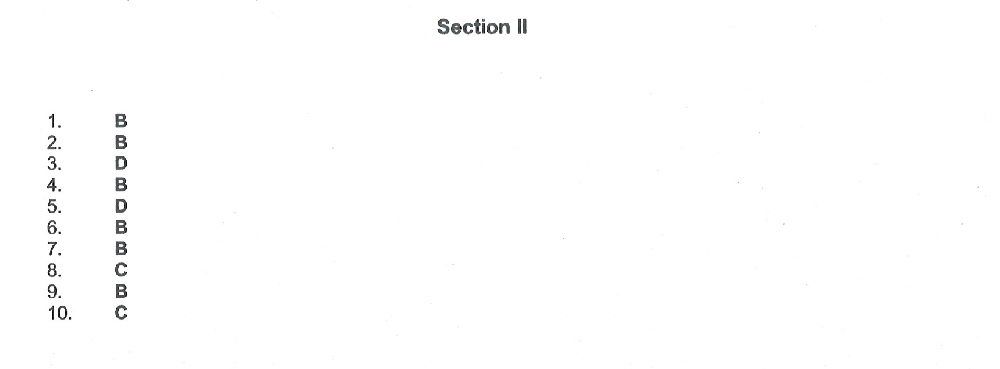

# Section II

1. When an electron drops from a higher energy level to a low energy level, then   
(A) energy is absorbed   
(B) energy is emitted   
(C) atomic number increases   
(D) atomic number decrease
2. Bohr's model can explain   
(A) spectrum of hydrogen atom only   
(B) spectrum of any atom or ion having one electron only   
(C) spectrum of hydrogen molecule   
(D) solar spectrum
3. Any p-orbital can accommodate up to   
(A) 4 electrons   
(B) 2 electrons with parallel spins   
(C) 6 electrons   
(D) 2 electrons with opposite spins
4. The number of orbitals in the fourth energy level is   
(A) 4   
(B) 16   
(C) 32   
(D) 9
5. The electronic configuration of Mn can be written as   
(A) $[\mathrm{Ar}] 4 \mathrm{~s}^2$   
(B) $[\mathrm{Ar}] 4 \mathrm{~s}^2 3 \mathrm{~d}^6$   
(C) $[\mathrm{Ar}] 4 \mathrm{~s}^1 3 \mathrm{~d}^5$   
(D) $[\mathrm{Ar}] 4 \mathrm{~s}^2 3 \mathrm{~d}^5$
6. Splitting of spectral lines under the influence of magnetic field is called   
(A) Stark effect   
(B) Zeeman effect   
(C) Photoelectric effect   
(D) None of these
7. Which of the following species has more number of protons than the number of electrons?   
(A) $\mathrm{F}^{-}$   
(B) $\mathrm{Na}^{+}$   
(C) $\mathrm{O}^{2-}$   
(D) Ne
8. The maximum number of electrons on a principal shell is   
(A) $\mathrm{n}^2$   
(B) $n$   
(C) $2 n^2$   
(D) $3 n^2$
9. The electronic configuration of chromium $(Z=24)$ is   
(A) $[\mathrm{Ne}] 3 \mathrm{~s}^2 3 \mathrm{p}^6 3 \mathrm{~d}^4 4 \mathrm{~s}^2$   
(B) $[\mathrm{Ne}] 3 \mathrm{~s}^2 3 \mathrm{p}^6 3 \mathrm{~d}^5 4 \mathrm{~s}^1$   
(C) $[\mathrm{Ne}] 3 \mathrm{~s}^2 3 \mathrm{p}^6 3 \mathrm{~d}^1 4 \mathrm{~s}^2$   
(D) $[\mathrm{Ne}] 3 \mathrm{~s}^2 3 \mathrm{p}^6 4 \mathrm{~s}^2 4 \mathrm{p}^4$
10. How many unpaired electrons are there in $\mathrm{Ni}^{2+} \quad(Z=28)$ ?   
(A) zero   
(B) 8   
(C) 2   
(D) 4

<input type="button" id="myButton1" onclick="myFunction()" value="Show Key"/>

Solution:   

4. No. of orbitals is given by 
$n^2$. So,for value n = 4 in the number of orbitals formula it is $4×4=16$  

5. The atomic number of Manganese $(\mathrm{Mn})$ is $\mathbf{2 5}$. Thus its electronic configuration is $[\mathrm{Ar}] 4 \mathrm{~s}^2 3 \mathrm{~d}^5$ or $1 s^2 2 s^2 2 p^6 3 s^2 3 p^6 4 s^2 4 d^5$. Thus answer is option C.

6. Zeeman effect

7. $Na^+$

8. Maximum number of electroncs on principle shell is $2n^2$   
9. Z = 24 
   $1S^2 \textbf{ } 2S^2 \textbf{ } 2P^6 \textbf{ } 3S^2 \textbf{ } 3P^6 \textbf{ } 4S^2 \textbf{ } 3d^5 4S^1$

10 No of unpaired electrons Z = 28   
   $1S^2 \textbf{ } 2S^2 \textbf{ } 2P^6 \textbf{ } 3S^2 \textbf{ } 3P^6 \textbf{ } 4S^2 \textbf{ } 3d^8$
   unpaired are 2 electrons  
    Reference: https://www.doubtnut.com/qna/23583435

