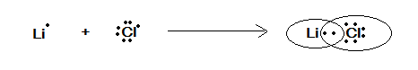

# Section - C

## Numerical Based Questions (Single Digit Answer 0 To 9)

1. What is the value of ' $n$ ' (principle quantum number) for $M$ shell?
2. How many neutrons are there in tritium?
3. Calculate the $(\mathrm{n}+\mathrm{I})$ value for 4 f subshell.
4. How many unpaired electrons are present in Fe (III) ion.
(Other Than Numerical Based)
5. Show the electron dot representation of
(a) LiCl
(b) CaO
6. Lithium can not achieve the 8 electrons configuration in its outermost shell during bond formation. Why?
7. Which of the following is larger?  
(a) Mg or Magnesium ion?  
(b) Chlorine or its chloride ion?  
8. Arrange the following particles in increasing order of frequency if all have same kinetic energy.  
(a) electron  
(b) $\alpha$ particle  
(c) proton  
9. A photon of $3000 A^{\circ}$ is absorbed by a gas and then re-emitted as two photons. One photon is red $\left(7600 A^{\circ}\right)$. What would be the wavelength of other photon?
10. Name two isoelectronic species of helium.
11. Give two examples of isotonic species.

## Solution

1. Complete Step by step answer: In the structure of the atom, the centre is known as the nucleus. The nucleus is surrounded by the orbits having electrons are known as electron shells.
The shell closest to the nucleus is known as the K shell. The next shell is known as the L shell. The next higher shell is M and then next is known as the N shell.
The shell corresponds to the principal quantum numbers.
Shell and their principal quantum number are shown as follows:
Shell  Principle quantum number
K  1
L  2
M  3
N  4
Each shell has a fixed number of electrons. The formula to determine the number of electrons in a shell is as follows:

    Where,

    is the principal quantum number
    For the M shell principal quantum number is 3.
    So, the maximum number of electrons is,

    Maximum number of electrons 

2. Tritium, a radioactive isotope of hydrogen, has two neutrons in its nucleus
3. 4f : n=4,l=3,m=-3,-2,-1,0,1,2,3, s=+-1/2.
4. Electronic configuration $\mathrm{Fe}^{3+}:[\mathrm{Ar}]_3 \mathrm{~d}^5$
Hence it has 5 unpaired electrons.
5. (A) LiCl

    Here the compound given is LiCl , for the electron dot configuration or representation we must know about these atoms electronic configuration as:

    Electronic configuration of $L i: 1 s^2 2 s^1$

    Electronic configuration of $\mathrm{Cl}: 1 s^2 2 s^2 2 p^6 3 s^2 3 p^5$

    Valence electron of $L i$ is 1 and of $C l$ is 1
    Therefore, the electron dot representation is given in the following figure as:

    

    )

7. Okay, let's break down why lithium (Li) doesn't achieve an 8-electron configuration (octet) in its outermost shell during bonding:

    **Understanding the Octet Rule and Exceptions**

    *   **The Octet Rule:** The octet rule states that atoms tend to gain, lose, or share electrons to achieve a stable configuration with eight electrons in their outermost (valence) shell. This usually corresponds to a noble gas electron configuration, which is very stable.
    *   **Exceptions:** The octet rule is a good guideline but isn't universally followed. There are exceptions, especially with elements in the first few periods of the periodic table.

    **Why Lithium is an Exception**

    1.  **Atomic Structure of Lithium:**
        *   Lithium (Li) has an atomic number of 3. This means it has 3 protons and 3 electrons.
        *   Its electronic configuration is 1s² 2s¹.
        *   It has one electron in its outermost (valence) shell – the 2s shell.

    2.  **Achieving Stability:**
        *   **Losing an Electron:** Lithium has a relatively low ionization energy, meaning it's easy for it to lose its single valence electron. It does this readily to achieve a stable configuration.
        *   **Not Gaining Electrons:** Lithium has a small atomic radius and its nucleus doesn't have a strong pull on additional electrons. Furthermore, it would be difficult to get it to gain seven electrons to achieve an octet. Gaining electrons would require significant energy input which wouldn't be favorable.

    3.  **Formation of Li+ Ion:**
        *   By losing its single valence electron, lithium becomes a positively charged ion (Li+).
        *   The electron configuration of Li+ becomes 1s², which is isoelectronic with the noble gas Helium. Helium is stable with only two electrons in its outer shell, which makes Li+ stable with a full 1s shell.

    4.  **Small Size:**
        *   Lithium has a small atomic size with just two electron shells. There isn't a large enough space around the atom to accommodate more than a couple of electrons in the outer shell before the electrons start repelling each other.

    **In Summary**

    Lithium doesn't achieve an octet in bonding because:

    *   It's far easier for lithium to **lose one electron** to achieve a stable configuration (isoelectronic with Helium) than to gain seven electrons to achieve an octet.
    *   The resulting **Li+ ion** is stable due to its small size, small number of protons, and the full 1s² shell.
    *   The octet rule doesn't always apply perfectly, especially to small atoms like lithium.

    **Key Takeaway**

    Lithium is an exception to the octet rule. It achieves stability by losing one electron, forming a Li+ ion with a full 1s² shell, rather than achieving a full octet (8 electrons) in its valence shell.

7. Which of the following is larger?
(a) Mg or Magnesium ion?
(b) Chlorine or its chloride ion?

    Let's compare the sizes of the atoms and their corresponding ions:

    **(a) Mg (Magnesium) or Magnesium ion (Mg²⁺)?**

    *   **Magnesium (Mg):**
        *   Atomic number: 12
        *   Electronic configuration: 1s² 2s² 2p⁶ 3s²
        *   Has 12 protons and 12 electrons.
        *   Neutral atom, electrons are spread out in 3 energy levels.
    *   **Magnesium Ion (Mg²⁺):**
        *   Formed by removing two electrons from the 3s orbital of the Mg atom
        *   Electronic configuration: 1s² 2s² 2p⁶
        *   Has 12 protons and 10 electrons.
        *   The positive charge on the nucleus is now stronger because there are fewer electrons to attract.

    *   **Size Comparison:**
        *   When an atom loses electrons to become a positive ion (cation), the overall size *decreases*. This is because:
            *   The number of electrons decreases while the number of protons remains the same. This increases the effective nuclear charge (the net positive charge felt by the remaining electrons), pulling the remaining electrons closer to the nucleus.
            *   In this case, the entire 3rd shell (with its two electrons) is removed.
        *   Therefore, the **Magnesium atom (Mg) is larger than the Magnesium ion (Mg²⁺)**.

    **(b) Chlorine (Cl) or Chloride ion (Cl⁻)?**

    *   **Chlorine (Cl):**
        *   Atomic number: 17
        *   Electronic configuration: 1s² 2s² 2p⁶ 3s² 3p⁵
        *   Has 17 protons and 17 electrons.
        *   Neutral atom.
    *   **Chloride Ion (Cl⁻):**
        *   Formed by adding one electron to the 3p orbital of the Cl atom
        *   Electronic configuration: 1s² 2s² 2p⁶ 3s² 3p⁶
        *   Has 17 protons and 18 electrons.
        *   The negative charge repels the other electrons causing the outer shell to expand.

    *   **Size Comparison:**
        *   When an atom gains electrons to become a negative ion (anion), the overall size *increases*. This is because:
            *   The number of electrons increases while the number of protons remains the same. This reduces the effective nuclear charge and the electrons are held less tightly by the nucleus, causing the outer shell to expand slightly.
            *   The added electron also increases electron-electron repulsion, pushing the electrons further apart.
        *   Therefore, the **Chloride ion (Cl⁻) is larger than the Chlorine atom (Cl)**.

    **Summary**

    *   **(a) Mg (Magnesium) is larger than Mg²⁺ (Magnesium ion).**
    *   **(b) Cl⁻ (Chloride ion) is larger than Cl (Chlorine).**

    **General Rule**
    *   Cations are always smaller than their parent atoms
    *   Anions are always larger than their parent atoms

8. Arrange the following particles in increasing order of frequency if all have same kinetic energy.  
(a) electron  
(b) $\alpha$ particle  
(c) proton  

    Alpha particles, also called alpha rays or alpha radiation, consist of two protons and two neutrons bound together into a particle identical to a helium-4 nucleus.[5] They are generally produced in the process of alpha decay but may also be produced in other ways

    Okay, let's analyze how to arrange these particles in increasing order of frequency, given they all have the same kinetic energy. We'll need to use some concepts from physics:

    **Key Concepts**

    1.  **Kinetic Energy (KE):** The energy of motion. It's given by the formula:
        *   KE = 1/2 * mv²
        where 'm' is the mass of the particle and 'v' is its velocity.
    2.  **Frequency (f) and Velocity (v):** Frequency refers to how many wave cycles occur per second. The relationship between frequency (f), wavelength (λ), and velocity (v) is given by:
        *   v = f * λ
        *   Rearranging, we get f = v / λ
    3.  **De Broglie Wavelength (λ):** All matter exhibits wave-like properties. The de Broglie wavelength is given by:
        *   λ = h / p
        where 'h' is Planck's constant and 'p' is the momentum of the particle.
        *   Momentum (p) is given by: p = mv

    **Analysis**

    1.  **Same Kinetic Energy:** We know that all three particles have the same KE. Therefore:
        1/2 * meve² = 1/2 * mαvα² = 1/2 * mpvp²
        Where me, mα, and mp represent the mass of the electron, alpha particle, and proton, respectively. And similarly ve, vα, and vp represent their velocities.
    2.  **Mass Comparison:** Let's compare the masses of the particles:
        *   Electron (mₑ) ≈ 9.11 x 10⁻³¹ kg (very light)
        *   Proton (mₚ) ≈ 1.67 x 10⁻²⁷ kg (about 1836 times heavier than an electron)
        *   Alpha particle (mₐ) ≈ 6.64 x 10⁻²⁷ kg (approximately 4 times the mass of the proton).
    3.  **Relating Velocity to Mass:** Since KE is the same for all particles, we can rearrange the kinetic energy equation:
        v = √(2KE/m)
        This shows that velocity is inversely proportional to the square root of mass. Therefore, *lighter particles move faster at the same kinetic energy.*
    4.  **Wavelength and Mass:** The de Broglie wavelength is given by:
        λ = h / (mv)
        Since v = √(2KE/m) can be substituted in for velocity, we get λ = h / (m√(2KE/m)) = h / √(2mKE)
        Therefore, *wavelength is inversely proportional to the square root of mass*. Lighter particles have a larger wavelength.
    5.  **Frequency:** From v = f * λ, we have f = v / λ. Substituting the value of λ, we get f = v / (h/mv) = (mv²)/h. Since KE = 1/2mv², then mv²= 2KE. Thus, f= (2KE)/h. Since KE and h are constant, *all three particles have the same frequency.*

    **Conclusion**

    Based on the analysis above:
    *   Since kinetic energy is the same for all three particles, and the frequency only depends on the KE, then all particles have the same frequency.

    **Final Answer**

    The particles, electron, proton, and alpha particle, all have the **same frequency**, given they all have the same kinetic energy. Therefore, we cannot arrange them in increasing order of frequency, since they are all equivalent.

9. Okay, let's solve this problem using the concept of energy conservation.

**Key Concepts**

1.  **Photon Energy:** The energy of a photon is related to its wavelength (λ) and frequency (ν) by the following equations:
    *   E = hν  (where h is Planck's constant)
    *   E = hc/λ  (where c is the speed of light)
2.  **Energy Conservation:** In a closed system, energy is neither created nor destroyed; it can only be transformed from one form to another. In this case, the energy of the absorbed photon must equal the sum of the energies of the two emitted photons.

**Given Information**

*   Wavelength of absorbed photon (λabs) = 3000 Å
*   Wavelength of one emitted photon (λ1) = 7600 Å
*   We need to find the wavelength of the other emitted photon (λ2).

**Solution**

1.  **Energy of Absorbed Photon (Eabs):**  
    Eabs = hc / λabs  
    Eabs = hc / 3000 Å  

2.  **Energy of First Emitted Photon (E1):**  
    E1 = hc / λ1  
    E1 = hc / 7600 Å  

3.  **Energy Conservation:**
    The energy of the absorbed photon must equal the sum of the energies of the two emitted photons:  
    Eabs = E1 + E2  
    (hc / 3000 Å) = (hc / 7600 Å) + (hc / λ2)  

4.  **Solve for λ2:**  
    We can divide both sides by 'hc':  
    (1 / 3000 Å) = (1 / 7600 Å) + (1 / λ2)  

    Now, solve for 1/λ2:  
    1/λ2 = (1 / 3000 Å) - (1 / 7600 Å)  

    Find a common denominator (3000 * 7600 = 22800000):  
    1/λ2 = (7600 / 22800000) - (3000 / 22800000)  
    1/λ2 = (4600 / 22800000)  
    1/λ2 = 115/570000  

    Take the reciprocal to find λ2:  
    λ2 = 570000/115  
    λ2 = 4956.5 Å  

    **Therefore, the wavelength of the other photon is approximately 4956.5 Å.**
