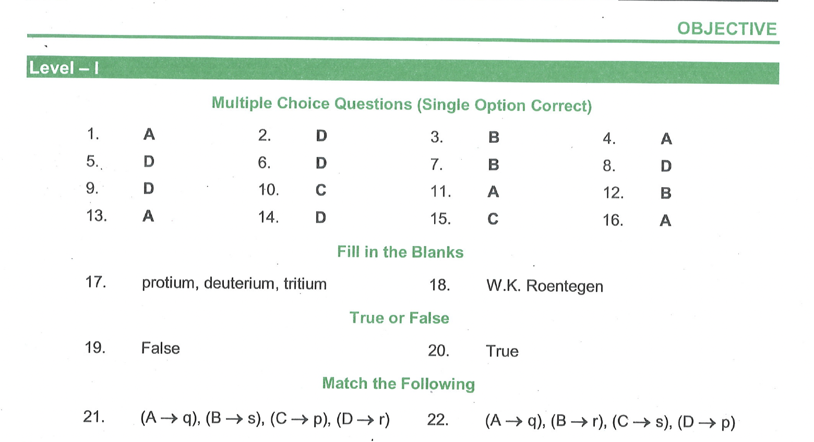

# OBJECTIVE

## Multiple Choice Questions (Single Option Correct)

1. Elements having 7 electrons in the valence shell are called  
(A) Halogens      
(B) Chalcogens   
(C) Alkali metals   
(D) Alkaline earths
2. Which of the following consist of particles of matter?
(A) Alpha rays      
(B) Beta rays   
(C) Cathode rays   
(D) All of these
3. Size of the nucleus is   
(A) $10^{-15} \mathrm{~cm}$      
(B) $10^{-13} \mathrm{~cm}$   
(C) $10^{-10} \mathrm{~cm}$   
(D) $10^{-8} \mathrm{~cm}$
4. An atom has a net charge of -1 . It has 18 electrons and 20 neutrons. Its mass number is   
(A) 37      
(B) 35   
(C) 38   
(D) 20
5. Nuclear model of the atom was proposed by   
(A) Thomson      
(B) Neils Bohr   
(C) Moseley   
(D) Rutherford
6. Cathode rays have   
(A) Only mass      
(B) Only charge   
(C) Neither mass nor charge   
(D) Both mass and charge
7. Number of neutrons in a heavy hydrogen atom is   
(A) 0      
(B) 1   
(C) 2   
(D) 3
8. Bohr's atomic theory gave the idea of   
(A) Electrons      
(B) Shape of atoms   
(C) Nucleus   qaqqaaqaqq
(D) Stationary states

9. If three neutrons are added to the nuclei of ${ }_{92} \mathrm{U}^{235}$, the new nucleus will have an atomic number of
(A) 89      
(B) 95   
(C) 90   
(D) 92
10. Which of the following has more electrons than neutrons?
(A) $\mathrm{Na}^{+}$      
(B) $\mathrm{F}^{-}$   
(C) $\mathrm{O}^{2-}$   
(D) $\mathrm{Mg}^{2+}$
11. ${ }_{25}^{55} \mathrm{Mn}^{2+}$ contains
(A) 25 protons +30 neutrons   
(C) 25 electrons +25 neutrons      
(B) 25 neutrons +25 protons

12. The isotopes of an element differ in
(A) The charge on the nucleus      
(B) The mass of the nucleus   
(C) The number of electrons   
(D) Both (A) and (C)

13. . The number of electrons that are accommodated in the M-shell of sodium atom
(A) 1      
(B) 8   
(C) 18   
(D) 32
14. The maximum number of electrons that can be accommodated in $4^{\text {th }}$ energy level are
(A) 10      
(B) 25   
(C) 50   
(D) 32
15. Which of the following sets of quantum numbers is correct for an electron in 3d orbital?
(A) $3,0,0,+1 / 2$      
(B) $3,1,1,-1 / 2$   
(C) $3,2,1,+1 / 2$   
(D) $3,2,3,-1 / 2$
16. The valence electronic configuration of an atom is $6 s^2$. It d orbital of the penultimate shell contains two unpaired electrons, calculate the atomic number
(A) 72      
(B) 48   
(C) 76   
(D) 58

## Fill in the Blanks

17._______ and_______ are isotopes of hydrogen.  
18. X-rays were discovered by_______

## True or False

19. Shells are also known as orbitals.
20. Common name of Thomson model is plum-pudding model.

## Match the Following  
21. Match the Column - I with Column - II.

| Column -I | Column - II |
| :--- | :--- |
| (A) Electron | (p) Chadwick |
| (B) Proton | (q) Thomson |
| (C) Neutron | (r) Rutherford |
| (D) Nucleus | (s) Goldstein |

22. Match the Column - I with Column - II.
    
| Column - I   Element | Column - II   Valence electrons |
| :--- | :--- |
| (A) Copper | (p) 3 |
| (B) Chromium | (q) 2 |
| (C) Carbon | (r) 1 |
| (D) Gallium | (s) 4 |

## Solutions

2. Let's analyze each type of ray:

    *   **Alpha rays:** Alpha rays consist of alpha particles, which are helium nuclei (2 protons and 2 neutrons). These are definitely particles of matter.
    *   **Beta rays:** Beta rays consist of beta particles, which are high-speed electrons or positrons. Electrons are fundamental particles of matter.
    *   **Cathode rays:** Cathode rays are streams of electrons, which are particles of matter.

    Since all three types of rays consist of particles of matter, the correct answer is:

    **(D) All of these**

3. 