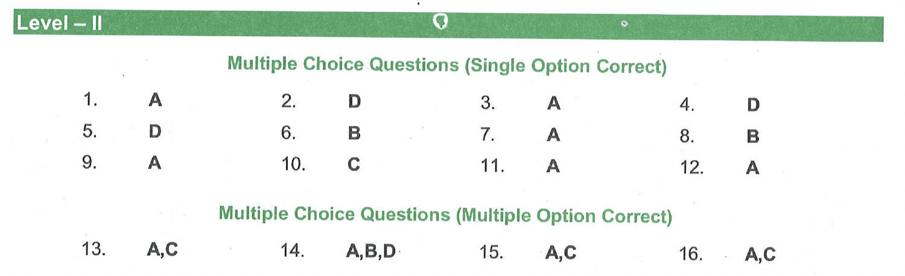

Level - II

Multiple Choice Questions (Single Option Correct)
1. The maximum number of electrons that can be accommodated in the $4^{\text {th }}$ energy level is   
(A) 32   
(B) 18   
(C) 2   
(D) 8
2. The existence of protons in the atoms was shown by   
(A) Neil Bohr   
(B) Chadwick   
(C) Madam Curie   
(D) Goldstein
3. Elements having 1, 2, or 3 valence electrons in their atoms are metals except   
(A) Hydrogen   
(B) Calcium   
(C) Magnesium   
(D) Sodium
4. The number of neutrons in the three isotopes of hydrogen are   
(A) $1,1,1$   
(B) 1, 2, 3   
(C) $2,1,0$   
(D) $0,1,2$
5. Which of the following do not possesses mass and charge?   
(A) Alpha particles   
(B) Beta particles   
(C) Protons   
(D) Gamma rays
6. Which of the following configuration represents a metallic element?   
(A) 2, 8, 7   
(B) 2, 8, 1   
(C) 2, 8, 4   
(D) 2, 8, 5
7. One atom of ${ }_{19} K^{39}$ contains   
(A) 19 protons +20 neutrons +19 electrons   
(B) 19 protons +20 neutrons +20 electrons   
(C) 20 protons +19 neutrons +20 electrons   
(D) 20 protons +20 neutrons +19 electrons
8. ${ }_{20} \mathrm{Ca}^{40}$ and ${ }_{19} \mathrm{~K}^{40}$ are example for      
(A) Isotopes   
(B) Isobars   
(C) Isotones   
(D) Nuclear isomers
9. Members of which of the following have similar chemical properties?      
(A) Isotope   
(B) Isobar   
(C) Allotrope   
(D) Both isotope and allotrope
10. For an element with atomic number 19 , the $19^{\text {th }}$ electron will occupy   
(A) L - shell   
(B) M - shell   
(C) N - shell   
(D) K - shell
11. What would be the sum of all four quantum numbers associated with the unpaired electrons present in a nitrogen atom (considering spin quantum as $-1 / 2$ )?   
(A) $7 \frac{1}{2}$   
(B) $8 \frac{1}{2}$   
(C) 7   
(D) 6
12. What is the maximum number of electrons present in the main energy level in which the ' $f$ ' subshell appears for the first time?   
(A) 32   
(B) 50   
(C) 72   
(D) None of the above

## Multiple Choice Questions (Multiple Option Correct)

13. The conclusion of Rutherford's $\alpha$-scattering experiment includes,     
(A) There is a positively charged sphere at the centre of an atom called nucleus.   
(B) The electrons revolve around the nucleus in the empty space in their respective orbits.   
(C) The empty space around nucleus was termed extra nuclear part.   
(D) Each orbit is associated with fixed amount of energy.
14. Species that show similar properties with hydrogen   
(A) Protium   
(B) Deuterium   
(C) Proton   
(D) Tritium
15. Nucleons contains   
(A) Protons   
(B) Electrons   
(C) Neutrons   
(D) Radicals
16. During a beta decay of an element   
(A) Atomic number of the daughter element increase by one unit   
(B) Atomic number of the daughter element decreases by two units   
(C) Atomic mass of the daughter element remains same   
(D) Atomic mass of daughter element decreases by for units

### Solution

11. 
12. For an electron in g-subshell, value of $1=4$ and thus value of $n=5$ (as $l=0$ to $\mathrm{n}-1$ )
Therefore maximum number of electrons $=2 \mathrm{n}^2=2 \times 5^2=50$
13. A and C There is a positively charged sphere at the centre of an atom called nucleus. and he empty space around nucleus was termed extra nuclear part.
14. Protium, Detrium and Tritium are similar to hydrogen
    ..
15. Nucleons is made up of protons and neutrons
16. Beta Decay is a type of radioactive decay in which a proton is transformed into a neutron or vice versa inside the nucleus of the radioactive sample. Processes like beta decay and alpha decay allow the nucleus of the radioactive sample to get as close as possible to the optimum neutron/ proton ratio. While doing so, the nucleus emits a beta particle which can either be an electron or positron. Remember that there either a proton can turn into a neutron or a neutron into a proton. Electron and the positron are generated to obey the law of conservation of charge. Beta-decay occurs via weak interaction.