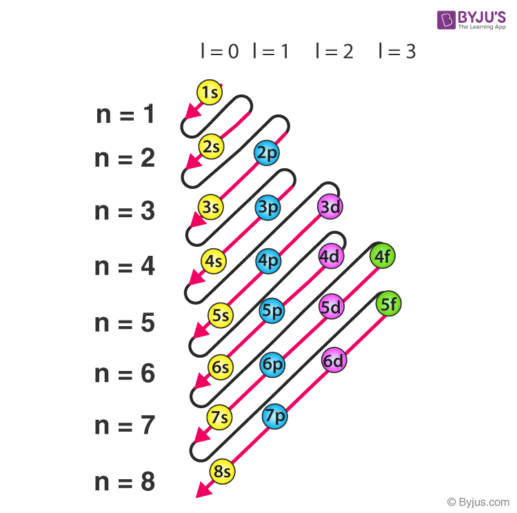

# SOLVED PROBLEMS

## SUBJECTIVE

### Section - A 

**Problem 1**. In which year proton was discovered?
**Solution:** 1886 

**Problem 2**. Write one use of X-rays.  
**Solution:** To detect fracture of bones.

**Problem 3**. How many neutrons are present in a sulphate ion?  
**Solution:** $\quad \mathrm{SO}_4^{2-}, \mathrm{S} \rightarrow 16$ neutrons and $\mathrm{O} \rightarrow 8$ neutrons  
So, total neutrons $=16+(4 \times 8)=48$  
**Problem 4**. Name the noble gas that does not have an octet configuration in its outer most shell.  
**Solution:** Helium  
**Problem 5**. What is the difference in reaction of a chlorine atom and a chloride ion?  
**Solution:** While chlorine atom reacts explosively with sodium atom, chloride ion does not.  
**Problem 6**. Why Bohr's orbits are called stationary states?  
**Solution:** $\quad$ This is because the energies of orbits in which electrons revolve are fixed.  
**Problem 7**. $\quad \mathrm{Fe}^{+3}$ ion is more stable than $\mathrm{Fe}^{+2}$. Why?  
**Solution:** $\quad \ln \mathrm{Fe}^{+3}$ ion, 3d-subshell is half-filled hence more stable configuration.  
**Problem 8**. Explain why electronic configuration of Cu is $4 s^1 3 d^{40}$ and not $4 s^2 3 d^9$.  
**Solution:** $\quad$ In the $4 \mathrm{~s}^1 3 \mathrm{~d}^{10}$, the d-sub-shell is completely filled which is more stable.  
**Problem 9**. Give one example each of isotopes, isotones and isobars.    
**Solution:** Isotopes $\longrightarrow$ Isotopes of hydrogen $\longrightarrow{ }_1^1 \mathrm{H} ;{ }_1^2 \mathrm{H} ;{ }_1^3 \mathrm{H}$   
Isotones $\longrightarrow \mathrm{C}-14$ and O-16  
Isobars $\longrightarrow$ Argon-40 and Calcium-40  

**Problem 10**. Wavelengths of different radiations are given below :

$$
\lambda_{\mathrm{A}}=300 \mathrm{~nm} \quad \lambda_{\mathrm{B}}=300 \mathrm{um} \quad \lambda_{\mathrm{c}}=30 \mathrm{~nm} \quad \lambda_{\mathrm{D}}=30 \AA
$$

Arrange these radiations in increasing order of their energies.

**Solution**: $\quad \mathrm{E} \alpha \frac{1}{\lambda}$
$\therefore$ Increasing order of energies will be $\mathrm{B}<\mathrm{A}<\mathrm{C}<\mathrm{D}$.  

**Problem 11**. What is the difference between the term orbit and orbitals?  
**Solution**: Orbit refers to shells where as orbitals refer to different types of subshells, which are present inside a shell.

**Problem 12**. Distinguish between a photon and a quantum.  
**Solution**: A quantum is a bundle of energy of a definite magnitude ( $\mathrm{E}-\mathrm{hv}$ ) and it may be from any source. However, a photon is a quantum of energy associated with light only.

**Problem 13**. Answer the following
(a) In summer we are advised not to water black clothes. Assign reason.  
(b) Out of 3d and 4s orbitals, which is filled first?  

**Solution**: (a) We know that the black bodies are good absorbers and they absorb all radiations which are falling on them. Thus, if one wears black clothes, he or she is likely to feel hotter in summer.  
(b) 4 s orbital is filled first because it has lower energy. The energies of the orbitals can be compared by their $(n+1)$ values. For $4 \mathrm{~s}, \mathrm{n}+1=4+0=4$ whereas for $3 \mathrm{~d}, \mathrm{n}+1=3+2=5$.

**Problem 14**. (a) How many electrons in Sulphur $(Z=16)$ can have $n+l=3$.  
(b) How many total electrons are present in all subshell (fully filled) with $n+l=5$.  

**Solution**:
(a) Electronic configuration of ${ }_{16} \mathrm{~S}$

$
1 s^2 2 s^2 2 p^6 3 s^2 3 p^4
$

$\mathrm{n}+\mathrm{l}=3$ is for 2 p and 3 s
So, $2 p=6$ electrons and $3 s=2$ electrons
$\therefore$ Total electrons $=8$

*ADDITIONAL EXPLAINATION*

The principal quantum number (n) and the azimuthal quantum number (l) determine the electron shell and subshell, respectively.  The relationship n + l = 3 helps us identify which orbitals contribute. Let's break down the possibilities:

* **n = 1, l = 2:** This is not possible because 'l' can't be greater than or equal to 'n'.  The maximum value of l is n-1.

* **n = 2, l = 1:** This corresponds to the 2p subshell.  The 2p subshell can hold a maximum of 6 electrons.

* **n = 3, l = 0:** This corresponds to the 3s subshell. The 3s subshell can hold a maximum of 2 electrons.

Therefore, the total number of electrons that can have n + l = 3 is 6 (from 2p) + 2 (from 3s) = 8 electrons.  However, we need to consider that Sulfur has an atomic number of 16, meaning only the first three shells are populated in neutral sulfur.  Therefore all these orbitals exist and will be filled in accordance with the Aufbau principle.

**So the answer is 8.**

(b) Subshell with $\mathrm{n}+\mathrm{I}=5$ are $5 \mathrm{~s}, 4 \mathrm{p}$ and 3 d . Hence electrons present $=2+6+10=18$.

Refer https://unacademy.com/content/neet-ug/study-material/chemistry/rules-for-filling-electrons-in-orbitals-the-aufbau-principle/

https://byjus.com/chemistry/aufbau-principle/#:~:text=Here%2C%20'n'%20refers%20to,and%20their%20corresponding%20energy%20levels.

