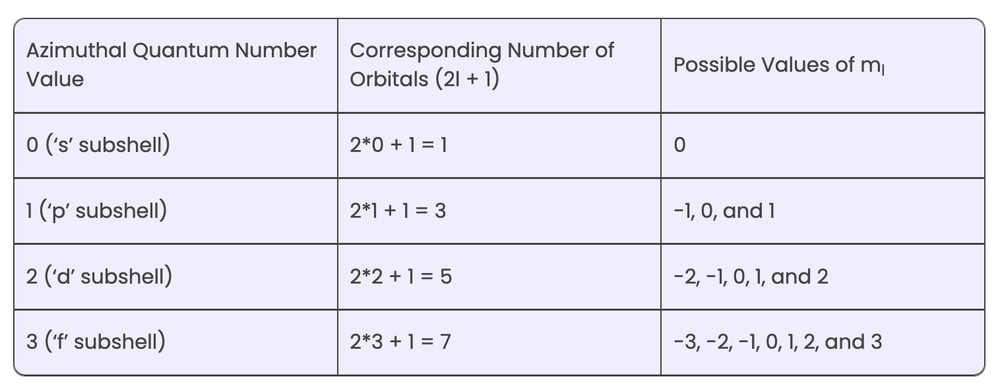
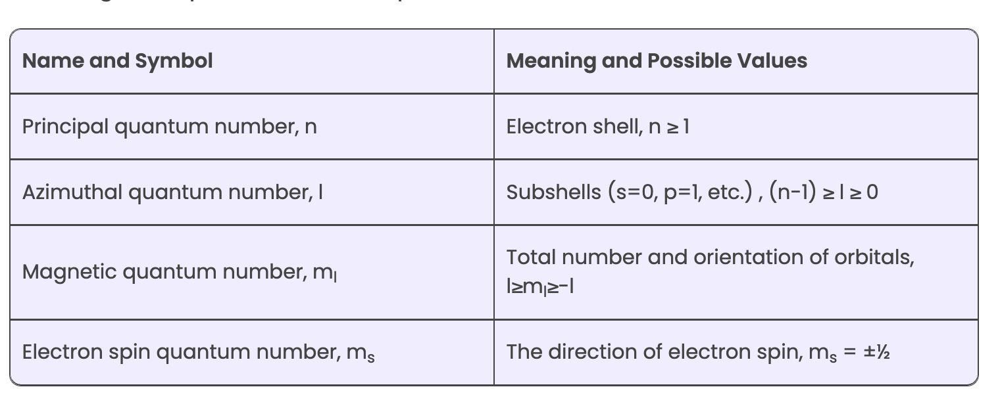

# Section - B

Problem 1. Calculate the frequency and energy associated with photon of radiations having a wavelength of $6200 \dot{A}$. Plank's constant $=6.625 \times 10^{-27} \mathrm{erg} \mathrm{sec}$.

Solution:

$
v=\frac{c}{\lambda}=\frac{3 \times 10^8 \mathrm{~m} / \mathrm{s}}{62 \times 10^{-8} \mathrm{~m}}=4.889 \times 10^{14}{\mathrm{cycles} \mathrm{sec}^{-1}}^{-1}
$

Energy associated with a radiation is given by :

$
\begin{aligned}
& E=h v \\
& =6.626 \times 10^{-34} \text { joules } \mathrm{sec} \times 4.839 \times 10^{-14} \sec ^{-1} \\
& =2.914 \times 10^{-19} \text { joules }
\end{aligned}
$

Problem 2. An electron is in $4 f$ orbital. What possible values for the quantum numbers $n, l, m$ and $s$ can it have?

Solution:

$
\begin{aligned}
& \mathrm{n}=4 \\
& \mathrm{l}=3 \\
& \mathrm{~m}=-3,-2,-1,0,+1,+2 \\
& \left.\mathrm{~s}=+\frac{1}{2} \text { and }-\frac{1}{2} \text { (for each value of } \mathrm{m}\right)
\end{aligned}
$

Problem 3. A neutral atom has $2 K, 8 \mathrm{~L}$ and 5 M electrons. Find out the following from the data:  
(a) Atomic number   
(b) Total number of $s$-electrons  
(c) Total number of p-electrons  
(d) Valency of the element  

Solution:  
(a) Atomic number $=15$  
(b) Total s-electrons $=2(1 \mathrm{~s})+2(2 \mathrm{~s})+2(3 \mathrm{~s})$  
(c) Total p-electrons $=6(2 p)+3(3 p)=9$  
(d) Valency $=8-5=3$  

Problem 4. Identify the related species among the following ${ }_{15} \mathrm{P}^{31},{ }_1 \mathrm{H}^1,{ }_{18} \mathrm{Ar}^{40},{ }_{14} \mathrm{Sl}^{30},{ }_{19} \mathrm{~K}^{40},{ }_{20} \mathrm{Ca}^{40},{ }_1 \mathrm{H}^2$, ${ }_1 H^3,{ }_{16} \mathrm{~S}^{32}$

isobar - $\mathrm{Ar}^{40}, \mathrm{~K}^{40} and \mathrm{Ca}^{40} $  
isotope - ${ }_1 \mathrm{H}^1, { }_1 \mathrm{H}^2$, ${ }_1 H^3$
## ====

Notes

1. $lambda = 6200 \text{ } \AA => 62 \times 10^8$  
   $ \nu = \frac{C}{\lambda} = \frac{3 \times 10^8}{62 \times 10^-8} = 4.889 \times 10^{14} \text{ } sec^-1$  
   $ E = h \times \nu = 6.626 \times 10^{-34} \times 4.839 \times 10^{14}$ 
   $ E = 2.9 \times 10^{-14} \text{joules}$

2.  Refer to tables below
   
    

    
    

3. Atomic number is 15,   
   
  6 s-electrons 1s -2, 2s -2,3s-2
  p - 9 electrons. 2p= 6, 3p - 3
  Valnecy is 3 ( 8-5)

4. 
    1. Isotopes
    2. Isobar
    3. 