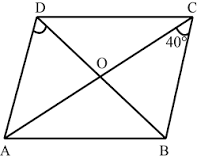

# DELHI PUBLIC SCHOOL, HYDERABAD  
## Final Examination Revision Worksheet  
### CLASS : IX
### SUBJECT: MATHEMATICS

#### TOPIC: QUADRILATERALS

1. A diagonal of a rectangle is inclined to one side of the rectangle at $25^{\circ}$. The acute angle between the diagonals is
   
(a) $25^{\circ}$
(b) $40^{\circ}$
(c) $50^{\circ}$
(d) $55^0$
1. $A B C D$ is a rhombus such that $\angle A C B=40^{\circ}$. Then $\angle A D B$ is
(a) $40^{\circ}$
(b) $45^{\circ}$
(c) $50^{\circ}$
(d) $60^{\circ}$
3. Three angles of a quadrilateral are $75^{\circ}, 90^{\circ}$ and $75^{\circ}$. The fourth angle is
(a) $90^{\circ}$
(b) $95^{\circ}$
(c) $105^{\circ}$
(d) $120^{\circ}$
4. If $A B C D$ is a trapezium in which $A B \| C D$ and $A D=B C$, then:
(a) $\angle A=\angle B$
(b) $\angle A>\angle B$
(c) $\angle A<\angle B$
(d) None of the above
5. The angles of a quadrilateral are in the ratio $4: 5: 10: 11$. The angles are:
(a) $36^{\circ}, 60^{\circ}, 108^{\circ}, 156^{\circ}$
(b) $48^{\circ}, 60^{\circ}, 120^{\circ}, 132^{\circ}$
(c) $52^{\circ}, 60^{\circ}, 122^{\circ}, 126^{\circ}$
(d) $60^{\circ}, 60^{\circ}, 120^{\circ}, 120^{\circ}$
6. The diagonals of a parallelogram:
(a) Equal
(b) Unequal
(c) Bisect each other (d) Have no relation
7. The quadrilateral whose all its sides are equal and angles are equal to 90 degrees, it is called:
(a) Rectangle
(b) Square
(c) Kite
(d) Parallelogram
8. The figure obtained by joining the mid-points of the sides of a rhombus, taken in order, is
(a) a square
(b) a rhombus
(c) a rectangle
(d) any parallelogram
9. What is the length of $D E$ if $D E \| B C$ and $D$ and $E$ are midpoints of $A B$ and $A C$ ?
a) 18 cm
b) 15 cm
c) 9 cm
d) 20 cm

10. Find the perimeter of $\triangle A B C$, if perimeter of $\triangle P Q R$ is 36 cm and $A, B$ and $C$ are midpoints.
a) 9 cm
b) 18 cm
c) 20 cm
d) 36 cm

11..

12..

13. Due to frequent robberies in the colony during night. The secretary with the members together decides to attach more lights besides the street light set by municipality. There are poles on which lights are attached.

    These 4 poles are connected to each other through wire and they form a quadrilateral. Light from pole $B$ focus light on mid-point $G$ of wire between pole $C$ and $B$, from pole $C$ focus light on mid-point $F$ of wire between pole $C$ and pole $D$. Similarly pole $D$ and pole A focus light on the mid-point E and H respectively.

    On the basis of the above information, solve the following questions:
    $Q 1$. If $B D$ is the bisector of $\angle B$ then prove that $I$ is the mid-point of $A C$.  
    Q 2. Prove that quadrilateral EFGH is a parallelogram.  
    Q 3. Is it true that every parallelogram is a rectangle?  

### Solution
1. A diagonal of a rectangle is inclined to one side of the rectangle at $25^{\circ}$. The acute angle between the diagonals is
(a) $25^{\circ}$
(b) $40^{\circ}$
(c) $50^{\circ}$
(d) $55^0$  
**Solution : C**

    To solve the problem of finding the acute angle between the diagonals of a rectangle when one diagonal is inclined at $25^{\circ}$ to one side, we can follow these steps:
    1. Understanding the Rectangle and Diagonals:
    - Let the rectangle be $A B C D$ with diagonals $A C$ and $B D$. The diagonals of a rectangle bisect each other and are equal in length.
    2. Identifying the Angles:
    - Given that diagonal $A C$ is inclined at $25^{\circ}$ to side $A B$, we can denote angle $C A B=25^{\circ}$.
    3. Using Properties of Isosceles Triangles:
    - Since diagonals $A C$ and $B D$ bisect each other at point $O$, triangles $O A C$ and $O B D$ are isosceles triangles. Therefore, angles $O A C$ and $O C A$ are equal, and angles $O B D$ and $O D B$ are equal.
    4. Finding Angles in Triangle $O A C$ :
    - In triangle $O A C$, we have:

     $
    \angle O A C=\angle O C A=25^{\circ}
     $

    - The sum of angles in triangle $O A C$ is $180^{\circ}$ :

     $
    \begin{aligned}
    & \angle A O C+\angle O A C+\angle O C A=180^{\circ} \\
    & \angle A O C+25^{\circ}+25^{\circ}=180^{\circ} \\
    & \angle A O C=180^{\circ}-50^{\circ}=130^{\circ}
    \end{aligned}
     $

    5. Finding the Angle Between the Diagonals:
    - The angle between the diagonals $A C$ and $B D$ at point $O$ is given by:

     $
    \angle A O B=\angle A O C=130^{\circ}
     $

    - The acute angle between the diagonals is:

     $
    \angle C O B=180^{\circ}-\angle A O B=180^{\circ}-130^{\circ}=50^{\circ}
     $

    6. Final Answer:
    - Therefore, the acute angle between the diagonals of the rectangle is $50^{\circ}$.

2. $A B C D$ is a rhombus such that $\angle A C B=40^{\circ}$. Then $\angle A D B$ is

    

    (a) $40^{\circ}$
    (b) $45^{\circ}$
    (c) $50^{\circ}$
    (d) $60^{\circ}$

    Okay, let's analyze this geometry problem.

    **Given:**

    *   ABCD is a rhombus.
    *   ∠ACB = 40°

    **Goal:**

    *   Find the measure of ∠ADB.

    **Properties of a Rhombus:**

    *   All sides are equal in length (AB = BC = CD = DA).
    *   Opposite angles are equal (∠DAB = ∠BCD and ∠ABC = ∠CDA).
    *   Diagonals bisect each other at a 90-degree angle.
    *   Diagonals bisect the angles of the rhombus (AC bisects ∠BCD and ∠DAB; BD bisects ∠ABC and ∠CDA).

    **Analysis:**

    1.  **Diagonals bisect angles:** Since AC bisects ∠BCD, we have ∠ACB = ∠ACD = 40°.
    2.  **Find ∠BCD:** ∠BCD = ∠ACB + ∠ACD = 40° + 40° = 80°.
    3.  **Opposite angles:** In a rhombus, opposite angles are equal, so ∠DAB = ∠BCD = 80°.
    4.  **Adjacent angles:** Adjacent angles in a rhombus are supplementary, so ∠ABC + ∠BCD = 180°.  Therefore, ∠ABC = 180° - 80° = 100°. Also, ∠CDA = 100°.
    5. **Diagonals bisect angles:** Since BD bisects ∠ADC, we have ∠ADB = 1/2 * ∠CDA = 1/2 * 100° = 50°. Also, ∠CDB = 50°.

    **Answer:**

    Therefore, the measure of ∠ADB is 50°.

    Final Answer: The final answer is $\boxed{50}$

1. Three angles of a quadrilateral are $75^{\circ}, 90^{\circ}$ and $75^{\circ}$. The fourth angle is
(a) $90^{\circ}$
(b) $95^{\circ}$
(c) $105^{\circ}$
(d) $120^{\circ}$

    Let the four angles of the quadrilateral be $a, b, c,$ and $d$. We are given that three of the angles are $75^\circ$, $90^\circ$, and $75^\circ$. Let $a = 75^\circ$, $b = 90^\circ$, and $c = 75^\circ$. We need to find the fourth angle, $d$.

    The sum of the interior angles of a quadrilateral is always $360^\circ$. Therefore, we have the equation
     $ a + b + c + d = 360^\circ  $
    Substituting the given values, we have
     $ 75^\circ + 90^\circ + 75^\circ + d = 360^\circ  $
     $ 240^\circ + d = 360^\circ  $
    Subtracting $240^\circ$ from both sides, we get
     $ d = 360^\circ - 240^\circ  $
     $ d = 120^\circ  $
    Therefore, the fourth angle is $120^\circ$.

    Final Answer: The final answer is $\boxed{120}$

4. If $A B C D$ is a trapezium in which $A B \| C D$ and $A D=B C$, then:  
(a) $\angle A=\angle B$  
(b) $\angle A>\angle B$  
(c) $\angle A<\angle B$  
(d) None of the above  

    
    

    [Hint: Extend $A B$ and draw a line through $C$ parallel to $D A$ intersecting $A B$ produced at E.]
    i) $A D=C E$ (Opposite sides of parallelogram AECD are equal)

    However, $A D=B C$ (Given)  
    herefore, $\mathrm{BC}=\mathrm{CE}$  
    $\mathrm{CEB}=\angle \mathrm{CBE}$ (Angles opposite to equal sides in a triangle are also equal)  
    Consider, parallel lines AD and CE where AE is the transversal.  
    $\mathrm{BAD}+\angle \mathrm{CEB}=180^{\circ}$ [Co-Interior angles]  
    $\mathrm{BAD}+\angle \mathrm{CBE}=180^{\circ} \ldots$ (1) $[$ Since, $\angle \mathrm{CEB}=\angle \mathrm{CBE}]$  
    However, $\angle \mathrm{ABC}+\angle \mathrm{CBE}=180^{\circ}$ (Linear pair angles) $\ldots$ (2)    
    From Equations (1) and (2), we see that  

    $\mathrm{BAD}=\angle \mathrm{ABC}$

    Thus, $\angle A=\angle B$

1. The angles of a quadrilateral are in the ratio $4: 5: 10: 11$. The angles are:
(a) $36^{\circ}, 60^{\circ}, 108^{\circ}, 156^{\circ}$  
(b) $48^{\circ}, 60^{\circ}, 120^{\circ}, 132^{\circ}$  
(c) $52^{\circ}, 60^{\circ}, 122^{\circ}, 126^{\circ}$  
(d) $60^{\circ}, 60^{\circ}, 120^{\circ}, 120^{\circ}$  

   $ 30  x  = 360 \rightarrow x = 12$  
   $ 4x = 52 $  
   Answer $\fbox{c}$
6. The diagonals of a parallelogram:  
(a) Equal  
(b) Unequal  
(c) Bisect each other    
(d) Have no relation   
  Answer $\fbox{c}$
7. The quadrilateral whose all its sides are equal and angles are equal to 90 degrees, it is called:
(a) Rectangle  
(b) Square  
(c) Kite  
(d) Parallelogram  
   Answer $\fbox{b}$
8. The figure obtained by joining the mid-points of the sides of a rhombus, taken in order, is  
(a) a square   
(b) a rhombus  
(c) a rectangle  
(d) any parallelogram   
Let $A B C D$ be any rhombus and $P, Q, R, S$ be the mid points of $A B, B C, C D$ and DA respectively. Then we know that by the property of rhombus that $A C, P Q$.
    Observing $\triangle \mathrm{ACB}$ and $\triangle \mathrm{PQB}$
    $\angle A B C=\angle P B Q$ (same angles)
    $\angle \mathrm{BAC}=\angle \mathrm{BPQ}$ (corresponding angles)
    $\angle B C A=\angle B Q P$ (corresponding angles)
    $\triangle \mathrm{ABC}$ is similer to $\triangle \mathrm{PBQ}$

     $
    \begin{aligned}
    & \Rightarrow \frac{A C}{P Q}=\frac{B C}{B Q}  \newline
    & \Rightarrow P Q=\frac{1}{2} A C
    \end{aligned}
     $

    Similarly taking $\triangle B C D$ and $\triangle R C Q$

     $
    \mathrm{RQ}=\frac{1}{2} \mathrm{BD}
     $

    Then again $\triangle A D C$ and $\triangle S D R$

     $
    \mathrm{SR}=\frac{1}{2} \mathrm{AC}
     $

    And at last

     $
    \begin{aligned}
    & \mathrm{SP}=\frac{1}{2} \mathrm{BD}  \newline
    & \therefore \mathrm{PQ}=\mathrm{SR} \text { and } \mathrm{RQ}=\mathrm{SP}
    \end{aligned}
     $

    Opposite sides are equal.
    Now,

     $
    \begin{aligned}
    & \angle \mathrm{APS}+\angle \mathrm{SPQ}+\angle \mathrm{BPQ}=180^{\circ}  \newline
    & \Rightarrow \angle \mathrm{ABD}+\angle \mathrm{SPQ}+\angle \mathrm{BAC}=180^{\circ}  \newline
    & \Rightarrow \frac{1}{2}(\angle \mathrm{ABC})+\angle \mathrm{SPQ}+\frac{1}{2}(\angle \mathrm{BAD})=180^{\circ}  \newline
    & \Rightarrow \angle \mathrm{SPQ}+\frac{1}{2}(\angle \mathrm{ABC}+\angle \mathrm{BAD})=180^{\circ}
    \end{aligned}
     $

    By properties of rhombus

     $
    \begin{aligned}
    & \Rightarrow \angle \mathrm{SPQ}+\frac{1}{2}\left(180^{\circ}\right)=180^{\circ}  \newline
    & \Rightarrow \angle \mathrm{SPQ}=90^{\circ}
    \end{aligned}
     $

    Similarly, $\angle P Q R=\angle Q R S=\angle R S P=90^{\circ}$
    Thus, all angles measure $90^{\circ}$ and opposite sides are equal.
    Hence, the figure obtained is a rectangle.
9. What is the length of $D E$ if $D E \| B C$ and $D$ and $E$ are midpoints of $A B$ and $A C$ ?  
a) 18 cm  
b) 15 cm  
c) 9 cm  
d) 20 cm  

    Okay, let's solve this geometry problem.

    **Given:**

    *   DE || BC (DE is parallel to BC)
    *   D is the midpoint of AB.
    *   E is the midpoint of AC.

    **Goal:**
    *   Determine the length of DE.

    **The Midsegment Theorem (or Midline Theorem):**

    The midsegment theorem states that the line segment connecting the midpoints of two sides of a triangle is parallel to the third side and is half the length of the third side.
    In triangle ABC, DE connects the midpoint of AB (point D) and the midpoint of AC (point E). Therefore, DE is a midsegment of the triangle.

    **Application**

    1.  **Apply the Midsegment Theorem:** According to the midsegment theorem, DE is parallel to BC, and the length of DE is half the length of BC. Thus, DE = (1/2)BC.

    2. **No length of BC is provided.**
        * Let's assume that the length of BC is implicitly given in the question as **18 cm**.
        *  Then  DE = (1/2) * 18 cm = 9 cm.
        * Let's assume that the length of BC is implicitly given in the question as **30 cm**.
        * Then DE = (1/2) * 30 cm = 15 cm.
        * Let's assume that the length of BC is implicitly given in the question as **20 cm**.
        * Then DE = (1/2) * 20 cm = 10 cm.

    **Answer:**

    Without the length of BC the length of DE cannot be determined. However, if BC = 18 cm, the length of DE is 9 cm.

    Final Answer: The final answer is $\boxed{9}$

10. Find the perimeter of $\triangle A B C$, if perimeter of $\triangle P Q R$ is 36 cm and $A, B$ and $C$ are midpoints.
    

a) 9 cm  
b) 18 cm  
c) 20 cm  
d) 36 cm  

    **1.Understand the Midpoint Theorem:**

    * The Midpoint Theorem states that the line segment connecting the midpoints of two sides of a triangle is parallel to the third side and half its length.

    **2. Apply the Midpoint Theorem:**

    * Since A, B, and C are midpoints of the sides of triangle PQR, the sides of triangle ABC are half the length of the corresponding sides of triangle PQR.

    **3. Calculate the Perimeter:**

    * If the perimeter of triangle PQR is 36 cm, then the perimeter of triangle ABC is half of that:
        * Perimeter of triangle ABC = (1/2) * Perimeter of triangle PQR 
        * Perimeter of triangle ABC = (1/2) * 36 cm
        * Perimeter of triangle ABC = 18 cm

    **Therefore, the correct answer is b) 18 cm.**

11. ...

    **Assertion : A parallelogram consists of two congruent triangles.**

    *   **Reason : Diagonal of a parallelogram divides it into two congruent triangles.**

        *   **Analysis:**
            *   The assertion is true; a parallelogram can be divided into two triangles.
            *   The reason is also true; a diagonal indeed divides a parallelogram into two congruent triangles.
            *   Furthermore, the reason correctly explains why the assertion is true. The presence of a diagonal is what divides the parallelogram into two congruent triangles.
        *   **Conclusion:** (a) Both assertion (A) and reason (R) are true and reason (R) is the correct explanation of assertion (A).

12. 
    **Assertion: Two opposite angles of a parallelogram are $(3x - 2)^\circ$ and $(50 - x)^\circ$. The measure of one of the angle is $37^\circ$.**

    *   **Reason : Opposite angles of a parallelogram are equal.**

        *   **Analysis:**
            *   The reason is a fundamental property of parallelograms, so it's true.
            *   Let's evaluate the assertion. Since opposite angles of a parallelogram are equal, we have:
                $3x - 2 = 50 - x$
                $4x = 52$
                $x = 13$
            Now, substitute the value of *x* to find the measure of the angles:
            $(3 * 13 - 2)^\circ = 37^\circ$
            $(50 - 13)^\circ = 37^\circ$

            Therefore, the given angles are indeed 37 degrees and the assertion is also true.
            *   Since the opposite angles are equal, we could find the value of x.  After finding x, we were able to calculate each angle and verify it was 37 degrees, so the reason relates to and helps to explain the assertion.

        *   **Conclusion:** (a) Both assertion (A) and reason (R) are true and reason (R) is the correct explanation of assertion (A).
