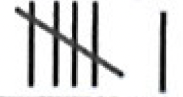
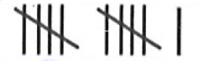
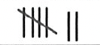
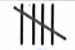

# Statistics I

# INTRODUCTION
Everyday we come across a variety of information in the form of figures, tables, graphs etc. through newspapers radio, television and other means of communication. These numerical figures may be about:
- imports and exports of different countries
- inflation rate in terms of consumer price index
- per capita national income
- food production as against population figures
- stock exchange sensex rates
- minimum and maximum temperature of cities, etc.

These numerical figures are called data. These figures not only help the planners but also play a vital role in almost all facets of life of an ordinary citizen. Statistics is the science which helps us in this regard. The word 'statistics' seems to have been derived from the Latin word status meaning a state. Originally, statistics was used simply for the collection of data useful to the state, like data about armoury, army taxes, land revenue or articles that needed to be exported or imported. With the passage of time, the scope of statistics has widened to include in it the collection and presentation of data in the forms of tables, charts and graphs related to all facets of life.

## Statistics and Statistical Data
The word statistics is used in both its singular and plural senses. In the singular sense, statistics is a science which concerns itself with the collection, presentation and drawing of valid inferences from the collected numerical data. In its plural with some specific purpose. For example, statistics of population of a country, imports and exports of a country, per capita national income, number of road accidents, etc.
Statistics as a set of numerical data, should have the following characteristics:
1. These should be as far as possible, expressed quantitatively and not qualitatively.
2. These should be a collection of observations and not a single observation. An individual observation cannot be called statistics.
3. Statistics should be collected with a definite purpose in view.
4. Statistics in an experiment should be comparable.

Primary and Secondary Data
Statistical data are of two types, i.e. primary data and secondary data. When an investigator is himself responsible for collection of data according to the plan and objective in view, the data are called primary data.
The primary data are more reliable and relevant to the need of the investigator as they have been collected by himself. But it may not be possible for him to collect data due to lack of time and resources. In that case, he uses data collected by other investigators or official data available with Government departments and other agencies in the form of published reports, thesis etc. Since the same data can serve various purposes, it is possible that data collected by one individual are used by another for a related study. The data that are collected by one individual are used by another for his/her studies are called secondary data. Since these data are collected for a purpose other than that of original investigator, the user may lose, some details or the data may not be all that relevant to his/her study. Therefore, such data must be used with great care.

Presentation of Data
After collection of data the investigator has to find way to condense them in tabular form in order to study their salient features. Such an arrangement is called presentation of data.
The raw data can be arranged in any one of the following ways.  
(i) Serial order or alphabetical order  
(ii) Ascending order  
(iii) Descending order 

The raw data when put in ascending or descending order of magnitude is called an array.
Let the marks obtained by 30 students of Class XI in a class test out of 50 marks according to roll numbers be $39,25,05,33,19,21,12,41,12,21,19,01,10,8,12,17,19,17,17,41,40,12,41,33,19$, $21,33,05,01,21$.

The above raw data can be arranged in serial order as follows:

Now suppose we wish to judge the standard of achievement of the students. The data in this form do not give us a clear picture of the group. If we arrange them in ascending or descending order, it gives us a slightly better picture. In ascending order the data looks as follows :

$
\begin{aligned}
& 01,01,05,05,08,10,12,12,12,12,17,17,17,19,19,19,19,21,21,21,21,25,33,33,33,39 \text {, } \newline
& 40,41,41,41 .
\end{aligned}
$

In descending order, the data looks as follows:

| Roll No. | Marks |
| :---: | :---: |
| 1. | 39 |
| 2. | 25 |
| 3. | 05 |
| 4. | 33 |
| 5. | 19 |
| 6. | 21 |
| 7. | 12 |
| 8. | 41 |
| 9. | 12 |
| 10. | 21 |
| 11. | 19 |
| 12. | 01 |
| 13. | 10 |
| 14. | 08 |
| 15. | 12 |
| 16. | 17 |
| 17. | 19 |
| 18. | 17 |
| 19. | 17 |
| 20. | 41 |
| 21. | 40 |
| 22. | 12 |
| 23. | 41 |
| 24. | 33 |
| 25. | 19 |
| 26. | 21 |
| 27. | 33 |
| 28. | 05 |
| 29. | 01 |
| 30. | 21 |

$
\begin{aligned}
& 41,41,41,40,39,33,33,33,25,21,21,21,21,19,19,19,19,17,17,17,12,12,12,12,10,08 \text {, } \newline
& 05,05,01,01 .
\end{aligned}
$

Now suppose we wish to judge the standard of achievement of the students. The data in this form do not give us a clear picture of the group. If we arrange them in ascending or descending order, it gives us a slightly better picture. In ascending order the data looks as follows :

$
\begin{aligned}
& 01,01,05,05,08,10,12,12,12,12,17,17,17,19,19,19,19,21,21,21,21,25,33,33,33,39 \text {, } \\
& 40,41,41,41 .
\end{aligned}
$

In descending order, the data looks as follows:

$
\begin{aligned}
& 41,41,41,40,39,33,33,33,25,21,21,21,21,19,19,19,19,17,17,17,12,12,12,12,10,08 \text {, } \\
& 05,05,01,01 \text {. }
\end{aligned}
$

If the number of observations is large, then arranging data in ascending or descending or serial order is a tedious job and it does not tell us much except the minimum(s) and maximum(s) of data. So to make it easily understandable and clear, we can tabulate data in the form of a table given below. In this table the first column shows all marks from the lowest to the highest. We now look at the first value in the given raw data and put a bar (vertical line) in the second column opposite to it. Now we see the second value in the given raw data and put a bar opposite to it in the second column. This process is repeated till, all observations in the given raw data are exhausted. The bars drawn in the second column are known as tally marks and to facilitate we record tally marks in bunches of five, the fifth tally marks is drawn diaaonally across the first four. For example ||||$=8$.

We finally count the number of tally marks corresponding to each observation and write in the column under number of students.

| Marks | Tally Marks | Number of   Students |
| :---: | :---: | :---: |
| 1 | $\|\|$ | 2 |
| 5 | $\|\|$ | 2 |
| 8 | $\|$ | 1 |
| 10 | $\|$ | 1 |
| 12 | $\|\|\|\|$ | 4 |
| 17 | $\|\|\|$ | 3 |
| 19 | $\|\|\|\|$ | 4 |
| 21 | $\|\|\|\|$ | 4 |
| 25 | $\|$ | 1 |
| 33 | $\text { \|\|\|} $ | 3 |
| 39 | $\|$ | 1 |
| 40 | $\|$ | 1 |
| 41 | $\|\|\|$ | 3 |

This way of presentation of data is known as frequency distribution. Marks are called variates and the number of students who have secured a particular number of marks is called frequency of the variate. The number of times an observation occurs in the given data, is called the frequency of the observation.

The presentation of data can be further condensed into class groups. In this representation, all observations are divided into groups. These groups are called classes or class intervals. We can arrange the above data into classes as follows:

| Marks | No. of Students   (Frequency) |
| :---: | :---: |
| $1-10$ | 6 |
| $11-20$ | 11 |
| $21-30$ | 5 |
| $31-40$ | 5 |
| $41-50$ | 3 |

The class $1-10$ means the marks obtained between 1 and 10 including both numbers 1 and 10 . The number of observations falling in a particular class is called the frequency of that class or class frequency. Thus the class $1-10$ has frequency 6 and the class $11-20$ has 11 as class frequency. In the class $1-10$ we say that 1 is the lower limit and 10 is the upper limit of the class. Similarly in class 11-20, 11 is the lower limit and 20 is the upper limit. This type of presentation of data is called grouped frequency distribution.

### Frequency Distribution
Frequency table or frequency distribution is a method to present raw data in such a way that one can easily understand the information contained in the raw data.
Frequency distributions are of two types:
(i) Discrete frequency distribution
(ii) Continuous or grouped frequency distribution

#### Discrete Frequency Distribution
The process of preparing this type of distribution is very simple. The construction of a discrete frequency distribution from the given raw data is done by the use of the method of tally marks. In the first column of the frequency table we write all possible values of the variable from the lowest to the highest.
We now look at the first value in the given raw data and put a bar (vertical line) in the second column opposite to it. Now we see the second value in the given raw data and put a bar opposite to it in the second column. This process is repeated till all observations in the given raw data are exhausted. To facilitate counting blocks in five ( $W_W$ ) are prepared and some space is left in each block. We finally count the number of bars corresponding to each value of the variable and place it in the third column of frequency. The process will be clear from the following example of marks obtained by students of class XII in a class test of 100 marks are as follows:

$$
\begin{aligned}
& 75,35,41,41,16,28,75,45,55,25,41,45,37,28,75,82,55,61,75,19,75,61,19,28,19,61 \\
& 28,25,16,16 .
\end{aligned}
$$

The data may be put in the form of a discrete frequency distribution as follows:

| Marks | Tally Marks | Frequency |
| :---: | :---: | :---: |
| 16 | \|\|\| | 3 |
| 19 | \|\|\|| 3 |
| 25 | \|\| | 2 |
| 28 | \|\|\|\| | 4 |
| 35 | $\mid$ | 1 |
| 37 | $\mid$ | 1 |
| 41 | \|\|\| | 3 |
| 45 | $\|\|$ | 2 |
| 55 | $\|\|$ | 2 |
| 61 | $\|\|$ | 3 |
| 75 | | 5 |
| 82 | $\mid$ | 1 |
|  |  | Total $=\mathbf{3 0}$ |

#### Continuous or Grouped Frequency Distribution

The above method of condensing the raw data is convenient only where the values in the raw data are largely repeating and the difference between the greatest and the smallest observation is not very large. If the number of observations in data is large and the difference between the greatest and the smallest observations is large, then we condense the data into classes or groups. For example, let the marks obtained by 30 students of a class in a test be :

$$
\begin{aligned}
& 39,25,5,33,19,21,48,13,21,09,01,10,08,12,17,19,17,41,40,12,46,37,17,27,30,06 \\
& 02,23,19,12 .
\end{aligned}
$$

We can arrange these marks as follows:

| Marks   (Class   intervals) | Tally Marks | Number of   students   (Frequency) |
| :---: | :---: | :---: |
| 0-10 |   | 6 |
| 10-20 |   | 11 |
| 20-30 |  | 5 |
| 30-40 | \|\|\|\| | 4 |
| 40-50 | \|\|\|\| | 4 |
|  |  | Total $=30$ |

Such a presentation of data is known as the grouped frequency distribution. In the above example 30 observations have been divided into 5 groups. These groups are called classes. Thie class $0-10$ means the marks obtained between 0 and 10 including 0 and excluding 10 . The number of observations falling in a particular class is called the frequency of that class or class frequency. Thus the class $0-10$ has frequency 6 and the class $11-20$ has 11 as class frequency. In the class $0-10$, we say that 0 is the lower limit and 10 is the upper limit of the class. The span of class i.e., the difference between the upper limit and the lower limit is known as the class interval. For example, in the class $10-20$ the class interval is $(20-10)=10$.  
There are two methods of classifying the data according to the class intervals:  
(i) exclusive method and  
(ii)inclusive method

#### Exclusive Method
When the class intervals are so fixed that the upper limit of one class is the lower limit of the next class it is known as the exclusive method of classification. In this method, the upper limit of a class is not. included in the class. Thus, in the class $0-10$ of marks obtained by students, a student who has obtained 10 marks is not included in this class. He is counted in the next class 10-20.

#### Inclusive Method
In this method the classes are formed in such a way that the upper limit of a class is included in that

| Wages (in Rs.) | No. of workers |
| :---: | :---: |
| $1000-1099$ | 125 |
| $1100-1199$ | 150 |
| $1200-1299$ | 200 |
| $1300-1399$ | 250 |
| $1400-1499$ | 175 |
| $1500-1.599$ | 100 |
|  | Total $=\mathbf{1 0 0 0}$ |

In this class 1000-1099 we include workers having wages between Rs. 1000 and Rs. 1099. If the incomes of a worker is exactly Rs. 1100. He is included in the next class 1100-1199.

| Exclusive Method |  | Inclusive Method |  |
| :---: | :---: | :---: | :---: |
| Wages (in Rs.) | No. of workers | Wages (in Rs.) | No. of workers |
| $1000-1100$ | 125 | $1000-1099$ | 125 |
| $1100-1200$ | 150 | $1100-1199$ | 150 |
| $1200-1300$ | 200 | $1200-1299$ | 200 |
| $1300-1400$ | 250 | $1300-1399$ | 250 |
| $1400-1500$ | 175 | $1400-1499$ | 175 |
| $1500-1600$ | 100 | $1500-1599$ | 100 |
|  | Total $=1000$ |  | Total $=1000$ |

It is evident from the above example that both the inclusive and exclusive methods give us the same class frequency although the class intervals are apparently different in the two cases. In the above example in case of exclusive method the class interval is 100 where in case of inclusive method, the class interval is 99 . However, 99 is not the correct class interval. Whenever the inclusive method is used it is necessary to make an adjustment to determine the correct class intervals and to have continuity. If (a -
b) is a class in inclusive method, when in exhaustive method it becomes $\left(a-\frac{h}{2}\right)-\left(b+\frac{h}{2}\right)$,
where $\mathrm{h}=\left(\frac{(\text { lower limit of a class })-\text { (upper limit of previous class) }}{2}\right)$.  
In the above example on inclusive method the difference between the lower limit of a class and the upper limit of the preceding class is i.e., $h=1$. Therefore we subtract ( $1 / 2$ ) from the lower limit of each class and add $1 / 2$ in the upper limit of each class to make it continuous. The adjusted classes would then as follows:

| Wages (in Rs.) | No. of workers |
| :---: | :---: |
| $999.5-1099.5$ | 125 |
| $1099.5-1199.5$ | 150 |
| $1199.5-1299.5$ | 200 |
| $1299.5-1399.5$ | 250 |
| $1399.5-1499.5$ | 175 |
| $1499.5-1599.5$ | 100 |

It should be noted that before adjustment the class interval was 99 but after adjustment it is 100 .  
The mid value of a class is called class mark.  
Class mark $=\frac{\text { (lower limit }+ \text { upper limit) }}{2}$
or, Class mark $=$ lower limit $+\frac{1}{2}$ (difference between the upper and the lower limits).  

There are some rules to construct the frequency table :  
(i) The class should be non-overlapping.  
(ii) There should be no gaps between classes as far as possible.  
(iii) The classes should be of same size.  
(iv) Do not keep open-ended classes.  
(v) There should not be less than 5 and more than 10 classes.  

And now necessary steps in forming classes are:  
Step - 1: Determine the minimum and maximum values of the variable occurring in the data.  
Step - 2: We decide the number of classes to be formed according to the rule given above.  
Step - 3: We decide the difference of the maximum value and the minimum value of the variable by the number of classes to be formed to determine the class size.  
Step - 4: We take each item of the data one by one and put a tally mark (1) against the class to which it belongs.  
Step - 5: By counting tally marks in each class, we get the frequency of that class. Obviously the total of all frequencies should be equal to the total number of observations the data.  
Step - 6: The frequency table should be given a proper title so that it conveys exactly what the table is about.  

 
<b>$\sigma$ Illustration 1:</b>  
The electricity bills (in rupees) of 25 houses in a locality are given below. Construct a frequency distribution table with a class of size 75.
170, 212, 252, 225, 310, $712,412,425,322,325,198,192,230,320,412,530,602,724,370,402,317$, $403,405,372,413$.

Solution:   
Steps:  
(i) The minimum value in the data is 170 and the maximum is 724 .
(ii) The difference is $(724-170)$ or 554 .
(iii) As the class size is 75 , the number of classes is $\frac{554}{75}$ or 8 (nearest whole number), which falls between the suggested limits.

(iv) The classes therefore, are $150-225,225-300,300-375,375-450,450-525$, 525-600, 600-675 and 675-750.

| Bill (in Rs.) | Tally Marks | Frequency |
| :---: | :---: | :---: |
| $150-225$ | $\|\|\|\|$ | 4 |
| $225-300$ | $\|\|\|$ | 3 |
| $300-375$ |  | 7 |
| $375-450$ | | 7 |
| $450-525$ |  | 0 |
| $525-600$ | $\mid$ | 1 |
| $600-675$ | $\mid$ | 1 |
| $675-750$ | $\|\|$ | 2 |
|  |  | Total =25 |

Cumulative Frequency
Definition:
The sum of frequency of a particular class and frequencies of all classes preceding that class is called the cumulative frequency of that class. The table showing cumulative frequencies is called cumulative frequency table.
There are two types of cumulative frequencies viz. less than and greater than types. For less than cumulative frequencies we add up frequencies from above and for greater than cumulative frequencies we add up frequencies from below.
In the above table we are talking about less than type frequency distribution.

| Bill (in   Rupees) (less   than type) | No. of houses   (Cumulative frequency) |
| :---: | :---: |
| 225 | 4 |
| 300 | 7 |
| 375 | 14 |
| 450 | 21 |
| 525 | 21 |
| 600 | 22 |
| 675 | 23 |
| 750 | 25 |

 Now the cumulative frequency of greater than type being described as: 

| Bill (in Rupees)   (greater than   type) | No. of houses   (Cumulative frequencies) |
| :---: | :---: |
| 150 | 25 |
| 225 | 21 |
| 300 | 18 |
| 375 | 11 |
| 450 | 4 |
| 525 | 4 |
| 600 | 3 |
| 675 | 2 |
| 750 | 0 |

So cumulative frequency of a class can be calculated as frequency of a class + cumulative frequency of the previous class.

<b>$\sigma$ Illustration 2:</b>  

This water tax bills (in rupees) of 30 houses in a locality are given below. Construct a grouped frequency distribution [showing the cumulative frequency (less than type)] of class size 10.

$$
30,32,45,54,78,108,112,68,75,88,40,14,20,15,35,44,66,75,84,95,96,102,110,88,74,112 \text {, }
$$

$14,34,44,80$.

Solution:   
Here the maximum and minimum values of the variate are 112 and 14 respectively.
$\therefore$ range $\rightarrow(112-14)=98$.
It is given that the class size is 10
and $\frac{\text { Ranges }}{\text { Class size }}=\left(\frac{98}{10}\right)=9.8$.  
So, we should have 10 classes each of size 10.  
The minimum and maximum values of the variate are 14 and 112 respectively. So, we have to make the classes in such a way that first class includes the minimum value and the last class includes the maximum value. If we take the first class as $14-24$ it includes the minimum value 14. If the last class is taken as 104-114, then it includes the maximum value 112. Here we form classes by exclusive method. In the class 14-24, 14 is included but 24 is included. Similarly, in other classes, the lower limit is included and the upper limit is excluded.  
In the view of above discussion, we construct the frequency distribution table as follows:

| Bill (in   Rupees) | Tally Marks | Frequency | Cumulative   frequency |
| :---: | :---: | :---: | :---: |
| 14-24 | \|||| | 4 | 4 |
| 24-34 | II | 2 | 6 |
| 34-44 | III | 3 | 9 |
| 44-54 | III | 3 | 12 |
| 54-64 | \| | 1 | 13 |
| 64-74 | II | 2 | 15 |
| 74-84 | | 5 | 20 |
| 84-94 | III | 3 | 23 |
| 94-104 | III | 3 | 26 |
| 104-114 | IIII | 4 | 30 |
|  |  | Total $=30$ |  |

<b>$\sigma$ Illustration 3:</b>  

  <mark>TODO</mark>

<b>$\sigma$ Exercise 1:</b>  

  <mark>TODO</mark>

## Graphical Representation of Statistical Data

In the previous section we have studied how to arrange the given data in tabular form. The tabular representation of data is very useful in summarising the raw data and presenting them in a symmetric manner. However the tabular representation of data do not always proved to be very interesting. One of the most appealing and convincing ways of presenting the data is through pictures and graphs. There are various methods of graphical representation of frequency distribution. We shall study three of them viz.  
(i) Histogram  
(ii) Frequency polygon and  
(iii) Cumulative frequency curve (given).  

### Histogram
A histogram or frequency histogram is a graphical representation of a frequency distribution in the form of rectangles with class intervals as bases and heights proportional to corresponding frequencies such that there is no gap between any two successive rectangles.
A histogram is a two dimensional diagram we shall discuss the construction of a histogram for the following frequency distribution separately.  
(a) A continuous grouped frequency distribution with equal class intervals.  
(b) A continuous grouped frequency distribution with unequal class intervals.  
(c) A frequency distribution in which mid-points of class intervals are given.  
(d) A grouped frequency distribution in which class intervals are given in inclusive form.  

Construction of a histogram of a continuous grouped frequency distribution:

#### Algorithm  
Step-I: Take a graph paper and draw two perpendicular lines, one  horizontal and one vertical intersecting at O. Mark them as OX and OY.  
Step-II: Take horizontal line OX as $x$-axis and vertical line OY as $y$-axis.  
Step-III: Choose a suitable scale and along $x$-axis represent class limits.  
Step-IV: Choose a suitable side for $y$-axis and mark frequencies along $y$-axis.  
Step-V: Construct rectangles with class intervals as bases and respective frequencies as heights.  

**Example**: The following is a distribution of weights (in kg ) of 50 persons.

| Weight (in kg) | $50-55$ | $55-60$ | $60-65$ | $65-70$ | $70-75$ | $75-80$ | $80-85$ | $85-90$ |
| :---: | :---: | :---: | :---: | :---: | :---: | :---: | :---: | :---: |
| No. of persons | 12 | 8 | 5 | 4 | 5 | 7 | 6 | 3 |

Histogram and Frequency polygon showing the distribution of weights of 50 persons.

#### Remarks:
(i) Sometimes, when the negative quantities are not allowed, the part $A B$ of frequency polygon is removed and in its place AQ is taken for completing the polygon.  
(ii) If both histogram and frequency polygon are to be drawn, it is convenient to draw a histogram first and then the frequency polygon as explained. If only frequency polygon is to be drawn, first represent the class marks on the $x$-axis and corresponding frequencies on $y$-axis. Plot the corresponding points and join them by line segments.  
(iii) While drawing a graph, put a kink denoted by on that axis on which the markings do not begin with zero and are started from some other desired point.

## Frequency polygon
A frequency polygon is obtained by joining the mid-points of the respective tops of the rectangles in a histogram. To complete the polygon, the mid-points of each rectangle are joined to the immediately lower or higher mid-point (as the case may be) at zero frequency.

<b> Exercise 2:</b> 
(i) . The following table gives the marks scored by 100 students in an examination.

| Marks | $0-10$ | $10-20$ | $20-30$ | $30-40$ | $40-50$ | $50-60$ | $60-70$ | $70-80$ |
| :---: | :---: | :---: | :---: | :---: | :---: | :---: | :---: | :---: |
| No. of students | 4 | 10 | 16 | 22 | 20 | 18 | 8 | 2 |

Represent this data in the form of a histogram.

| Cost of living index | $140-150$ | $150-160$ | $160-170$ | $170-180$ | $180-190$ | $190-200$ |
| :---: | :---: | :---: | :---: | :---: | :---: | :---: |
| No. of weeks | 5 | 10 | 20 | 9 | 6 | 2 |

Draw histogram and frequency polygon.

## Bar diagram

In a bar chart or bar diagram bars of uniform width, usually shown as rectangles, are drawn with equal spaces in between them on the x-axis and heights of rectangles, proportional to the value of the variable are shown on the $y$-axis. The width of the rectangle has no significance except to make the presentation attractive.
Here we given with an example of data to be described by a bar diagram.

| Head | Salary | T.A. | Appliances | Rent | Others |
| :---: | :---: | :---: | :---: | :---: | :---: |
| Expenditure | 400 | 100 | 250 | 150 | 200 |

Graphs related to day to day activities
Sometimes certain graphs are used conveniently to indicate the position of the variable at various intervals of time. These may be temperature-time graph, velocity-time graph, time per over graph etc. We shall illustrate these with the help of examples.
Example: The velocity of a car at various times (in hours) of the day are given below:

| Time | 7.00 | 7.15 | 7.30 | 7.45 | 8.00 | 8.15 | 8.30 | 8.45 | 9.00 |
| :---: | :---: | :---: | :---: | :---: | :---: | :---: | :---: | :---: | :---: |
| Velocity (in km/hr) | 44 | 50 | 60 | 75 | 40 | 70 | 30 | 45 | 20 |

