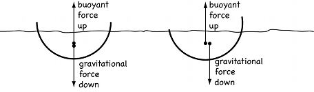

<h1 style="background-color:#7612ce; color:white; text-align: center;padding: 5px">Section C</h1> 

<h2 style="background-color:#7612ce; color:white; text-align: center;padding: 5px;text-align: left">Level II</h2> 

<h4 style="background-color:#f5ecfd; color:black; text-align: center;padding: 5px;text-align: left">Multiple choice questions (single option correct)</h4>

1. An object just floats in water. If common salt is added into the water  
   (A) the volume of the object immersed in the liquid decreases  
   (B) the object sinks  
   (C) the object first sinks and then floats up  
   (D) cannot be determined  

   Solution: 
   Let $V$ be the volume of the object, and $V_i$ be the volume of the object immersed in the water. Let $\rho_o$ be the density of the object and $\rho_w$ be the density of water.
  Since the object just floats in water, the buoyant force acting on the object is equal to the weight of the object.  
    Buoyant force = Weight of the object  
    $\rho_w g V_i = \rho_o g V$    
    $V_i = \frac{\rho_o}{\rho_w} V$  
    Since the object floats, $\rho_o \le \rho_w$, so $V_i \le V$.  

  When common salt is added to the water, the density of the water increases. Let the new density of the salt water be $\rho_s$. Since $\rho_s > \rho_w$,
  The new buoyant force is $\rho_s g V_i'$, where $V_i'$ is the new immersed volume.
    For the object to float,
    $\rho_s g V_i' = \rho_o g V$  
    $V_i' = \frac{\rho_o}{\rho_s} V$    

   Since $\rho_s > \rho_w$,  
    $\frac{1}{\rho_s} < \frac{1}{\rho_w}$  
    $\frac{\rho_o}{\rho_s} V < \frac{\rho_o}{\rho_w} V$  
    $V_i' < V_i$  

   Thus, the volume of the object immersed in the liquid decreases.

2. A block floats in a liquid, but sinks in coconut oil. The density of block  
(A) is less than the density of liquid.  
(B) is greater than the density of oil  
(C) both A and B  
(D) given information is insufficient.  

Solution : (C)

3. When an object of weight $W$ is immersed in a liquid, its weight in the liquid, is found $w_1$. When it is immersed in water, the weight of the water displaced is found to be $w_2$. The relative density of the liquid is  
(A) $\mathrm{W}_2 / \mathrm{~W}_1$  
(B) $\frac{W-W_1}{W_2}$  
(C) $\frac{W_2}{W-W_1}$  
(D) $\frac{W-W_2}{W_1}$  

    Let $W$ be the weight of the object in air. When the object is immersed in the liquid, its apparent weight is $W_1$.
    The loss in weight in the liquid is $W - W_1$.
    This is equal to the weight of the liquid displaced.
    Let $W_l$ be the weight of the liquid displaced.
    $W_l = W - W_1$

    When the object is immersed in water, the weight of the water displaced is $W_2$.
    The relative density of the liquid is the ratio of the density of the liquid to the density of water.
    Relative density $= \frac{\rho_l}{\rho_w} = \frac{W_l / V}{W_2 / V}$, where $V$ is the volume of the object.
    Relative density $= \frac{W_l}{W_2} = \frac{W - W_1}{W_2}$.

    Final Answer: The final answer is $\boxed{B}$

4. Two solids $A$ and $B$ floats in water. It is observed that $A$ float $1 / 2$ of its volume immersed in water and $B$ floats with $1 / 4$ of its volume above the water level. The ratio of the density of $A$ to that of $B$ is  
(A) $4: 3$  
(B) $2: 3$  
(C) $3: 4$  
(D) $1: 2$  

    Let $V_A$ and $V_B$ be the volumes of solids A and B respectively. Let $\rho_A$ and $\rho_B$ be the densities of A and B respectively. Let $\rho_w$ be the density of water.

    A floats with 1/2 of its volume immersed in water. So, the volume immersed is $V_{iA} = \frac{1}{2}V_A$.
    Since A floats, the weight of A is equal to the weight of the water displaced.  
    $W_A = \rho_A g V_A = \rho_w g V_{iA}$  
    $\rho_A V_A = \rho_w \frac{1}{2} V_A$  
    $\rho_A = \frac{1}{2} \rho_w$

    B floats with 1/4 of its volume above the water level. So, the volume immersed is $V_{iB} = \frac{3}{4}V_B$.  
    Since B floats, the weight of B is equal to the weight of the water displaced.    
    $W_B = \rho_B g V_B = \rho_w g V_{iB}$    
    $\rho_B V_B = \rho_w \frac{3}{4} V_B$    
    $\rho_B = \frac{3}{4} \rho_w$  

    Now, we find the ratio of the densities of A and B.  
    $\frac{\rho_A}{\rho_B} = \frac{\frac{1}{2}\rho_w}{\frac{3}{4}\rho_w} = \frac{1/2}{3/4} = \frac{1}{2} \times \frac{4}{3} = \frac{4}{6} = \frac{2}{3}$

    Final Answer: The final answer is $\boxed{B}$

5. A body floats in water with one third of its volume above the surface of water. If its is placed in oil. It floats with half of its volume above the surface of oil. The specific gravity of the oil is   
(A) $5 / 3$     
(B) $4 / 3$      
(C) $3 / 2$    
(D) 1     

    Let $V$ be the volume of the body. When it floats in water, one-third of its volume is above the surface, so two-thirds of its volume is submerged.  
    $V_{submerged, water} = \frac{2}{3}V$  
    Let $\rho_b$ be the density of the body and $\rho_w$ be the density of water.
    Weight of the body = Weight of water displaced  
    $\rho_b V g = \rho_w (\frac{2}{3}V) g$  
    $\rho_b = \frac{2}{3} \rho_w$  

    When placed in oil, half of its volume is above the surface, so half of its volume is submerged.  
    $V_{submerged, oil} = \frac{1}{2}V$  
    Let $\rho_o$ be the density of oil.  
    Weight of the body = Weight of oil displaced  
    $\rho_b V g = \rho_o (\frac{1}{2}V) g$  
    $\rho_b = \frac{1}{2} \rho_o$  
    
    Now we have two expressions for $\rho_b$:  
    $\frac{2}{3}\rho_w = \rho_b = \frac{1}{2}\rho_o$  
    $\frac{2}{3}\rho_w = \frac{1}{2}\rho_o$
    $\frac{\rho_o}{\rho_w} = \frac{2/3}{1/2} = \frac{2}{3} \times \frac{2}{1} = \frac{4}{3}$

    The specific gravity of the oil is the ratio of the density of oil to the density of water.
    Specific gravity $= \frac{\rho_o}{\rho_w} = \frac{4}{3}$

    Final Answer: The final answer is $\boxed{B}$
6. Pressure at the bottom of a tank containing a liquid does not depend on  
(A) acceleration due to gravity  
(B) height of the liquid column  
(C) area of the bottom surface  
(D) nature of the liquid  

   Answer : C

7. A sample of metal weighs 210 gm in air, 180 gm in water and 120 gm in a liquid. Then relative density (R.D.) of  
(A) metal is 3  
(B) metal is $1 / 3$  
(C) liquid is 3  
(D) liquid is $1 / 3$  

    Buoyant force $\Rightarrow$ loss in weight forcafer

    $$
    \begin{aligned}
    & v \rho_{\text {w} } \times g= (210-180) \times 100 . \\
    & \frac{m}{\rho_m} \times \rho_{\text {w} } \mathrm{~g} = 30 \times 100 \\
    & \frac{210}{\rho_m} \times 1 \times 100 \Rightarrow 30 \times 100 \\
    & \rho_m \Rightarrow \frac{210}{30} \Rightarrow 7 \mathrm{~g} / \mathrm{cm}^3 .
    \end{aligned}
    $$

    Bayont force $\Rightarrow$ loss in weigue for

    $$
    \begin{aligned}
    & V \rho_l g = (210-120) \times 100 . \\
    & \frac{m}{\rho_m} \times \rho_l \times 100 = 90 \times 100 \\
    & \frac{210}{7} \times \rho_l \times 100 \% = 90 \times 100 \\
    & \rho_l = \frac{90 \times * 7}{\frac{210}{3}}
    \end{aligned}
    $$

8. A raft of wood (density $400 \mathrm{~kg} / \mathrm{m}^3$ ) of mass 120 kg floats in water. How much weight can be put on the raft to make it "just sink",  
(A) 120 kg  
(B) 200 kg  
(C) 200 kg  
(D) 180 kg  
  Solution:
  Volume of mass = $\frac{120}{400} = \text{0.3} m^3$

  Mass of water displaced if complete block is immersed = $0.3 \times 1000 = 300 kg$  
  Extra mass needed = $300 - 120 = 180 kg$

9. A body floats in a liquid if the buoyant force is 
(A) Zero  
(B) greater than its weight  
(C) less than its weight  
(D) equal to its weight  

   Solution : (D)  
   A body floats when the upward buoyant force acting on it is equal to its weight. If the buoyant force is less than the weight, the body will sink. If the buoyant force is greater than the weight, the body will rise to the surface and float with part of it above the surface.
10. In order that a floating object to be in a stable equilibrium, its centre of buoyancy should be  
(A) vertically above its centre of gravity  
(B) vertically below its centre of gravity  
(C) horizontally in line with its certain of   gravity  
(D) may be anywhere  

    Stability in Flotation
    Show why objects float in a prefered orientation and why one hull shape is more stable than another.

    What it Shows:
    Place a wooden stick or board into a fish tank in some random orientation and it will flip over and float in its prefered orientation. This demonstration helps explain why. As an example of the principles involved, you can show why putting a load on the deck of a boat can make for a completely unstable situation. Adding ballast in the bottom helps. Contrast how different hull shapes can exacerbate or alleviate the problem.

    

    
    How it Works:
    The line of action of the upward buoyant force runs through the center of gravity of the displaced water. The line of action of the downward gravitational force is through the center of gravity of the floating object. If the center of gravity of the object is below the center of buoyancy, the floating object is stable—a push from equilibrium produces a pair of forces (called a torque couple) that act to restore the object's original orientation. It's unstable if the object's center of gravity lies above the center of buoyancy—the torque couple causes the object to roll over and the boat fills with water.

    Two different model boats are used to demonstrate this principle. One has a semicircular hull shape (in cross section) for which the center of buoyancy does not shift when the boat rolls. The center of gravity shifts by very little in a roll and thus there is very little torque to right the boat back up again.

    Diagram of a stable boat.

    Contrast this to a rectangular shaped hull for which the center of buoyancy can shift considerably, creating a torque couple that tends to right the boat and results in very stable floatation.

    Schematic of an unstable boat.
11. A block of ice is floating on water  contained in a beaker. When all the ice melts, the level of water  
(A) rises  
(B) falls  
(C) remains unchanged  
(D) none of these  

    Let $V_i$ be the volume of ice and $\rho_i$ be the density of ice. Let $\rho_w$ be the density of water.
    When the ice is floating, the weight of the ice is equal to the weight of the water displaced. Let $V_s$ be the volume of the submerged part of the ice.
    $W_{ice} = \rho_i V_i g = \rho_w V_s g$ 
    $V_s = \frac{\rho_i}{\rho_w} V_i$  

    When the ice melts completely, it turns into water with volume $V_w$. The mass of the ice is equal to the mass of the water formed.
    $\rho_i V_i = \rho_w V_w$  
    $V_w = \frac{\rho_i}{\rho_w} V_i$  

    Comparing the volume of the submerged part of the ice ($V_s$) and the volume of water formed after melting ($V_w$), we see that:
    $V_s = V_w$  
    This means the volume of water displaced by the ice is equal to the volume of water formed when the ice melts. Hence, the water level remains unchanged

12. When a body submerged in a liquid, its weight:  
(A) remains same  
(B) increases  
(C) decreases  
(D) reduces to zero  

    When a body is submerged in a liquid, it experiences an upward buoyant force. This buoyant force is equal to the weight of the liquid displaced by the body. The apparent weight of the body in the liquid is the difference between its actual weight and the buoyant force. Since the buoyant force acts upwards against the weight, the apparent weight of the body decreases.

    Final Answer: The final answer is $\boxed{C}$

<h4 style="background-color:#f5ecfd; color:black; text-align: center;padding: 5px;text-align: left">Multiple choice questions (Multiple option correct)</h4>

13.  A solid floats in a liquid in a partially dipped position.  
(A) The solid exerts a force equal to its weight on the liquid.  
(B) The liquid exerts a force of buoyancy on the solid which is equal to the weight of the solid.  
(C) The weight of the dipped part of the solid is equal to the weight of the displaced liquid.  
(D) The weight of the displaced liquid equals the weight of the solid.  
   
     Solution : A,B and D

14. The spring balance A reads 2 kg with a block m suspended from it, A balance B reads 5 kg when a beaker with liquid is put on the pan of balance. The two balances are nor so arranged that the hanging mass is inside the liquid in the beaker as shwn.
In this situation
(A) the balance $B$ will read more than 5 kg
(B) the balance A will read less than 2 kg
(C) the balance $A$ will read less than 5 kg
(D) the balance A will read more than 2 kg
15. A solid is completely immersed in a liquid. The force exerted by the liquid on the solid will
(A) increase if it is pushed deeper inside the liquid
(B) change if its orientation is changed
(C) decrease if it is taken partially out of the liquid
(D) be in the vertically upward direction

