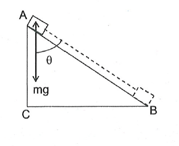
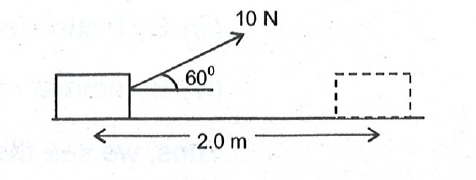
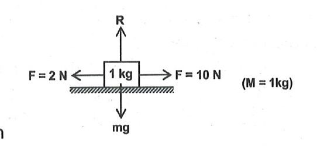

## INTRODUCTION
In our daily language, we use the word work for some sort of exertion, physical or mental or at times for various activities, e.g. while writing we say that we are doing work.

But in Physics, work is said to be done only when the force applied to a body makes the body move (i.e. there is a displacement of the body).

For example, a man while pushing the car, a cyclist while pedalling a cycle a coolie lifting a load, all do work.

## WORK
The work done by force acting on an object is equal to the product of the force and the displacement of the object in the direction of the force.
i.e. work $=$ force $\times$ displacement in the direction of force.  

The SI unit of work is 'Newton metre' or Joule. It is a scalar quantity.
Displacement in the direction of the force:
If the displacement of an object is in the direction of the force applied on it, then  
work done $=$ force $\times$ displacement
If we denote work, force and displacement by $\mathrm{W}, \mathrm{F}$ and d respectively,
then $\quad W=F d$
e.g. when an object falls, its displacement is in the direction of the force of gravity.

<b>Illustration 1:</b>
A man pushes a book by applying a force of 6 N . Find the work done by this force as the book is displaced through 30 cm along the direction of the push.

Solution: Work done,

$
\begin{aligned}
W & =F d \newline 
& =(6.0 \mathrm{~N}) \times(30 \mathrm{~cm}) \newline 
& =(6.0 \mathrm{~N}) \times(0.3 \mathrm{~m}) \newline 
& =1.8 \mathrm{Nm} \newline
& =1.8 \text { Joule. }
\end{aligned}
$

Displacement in a direction opposite to the force:
If the force acting on an object and its displacement are in opposite direction, the work done by the force on the object is

$
W=-F d
$

<b>Illustration 2:</b>

A body of mass 0.5 kg thrown upwards reaches a maximum height of 5 m . Calculate the work done by the force of gravity during this vertical displacement.

**Solution:**  
Given that,

$
\begin{aligned}
\mathrm{F} & =\mathrm{mg}
& =0.5 \times 9.8=4.9 \mathrm{~N} \newline
\mathrm{~d} & =5.0 \mathrm{~m}
\end{aligned}
$

The force and the displacement are in opposite directions. Hence

$
W=-F . d=-(4.9 \mathrm{~N}) \times(5.0 \mathrm{~m})=-24.5 \mathrm{~J}
$

<b>Displacement in a direction perpendicular to the force:</b>
If the displacement of an object is perpendicular to the force acting on it, the work done by the force on the object is zero.
e.g. when a porter moves on a railway platform with a heavy load on his head, he exerts a vertically upward force on the load. But the displacement of the load is in the horizontal direction. The load has not moved any distance in the vertical direction and hence, the work done by the force exerted by the porter is zero.

<b>Displacement at an angle to the force:</b>
Consider an object of mass $m$ sliding on an inclined surface AB. Its displacement from $A$ to $B$ is $A B$. The force of gravity on this object is mg acting vertically downward direction.

As the object moves from $A$ to $B$, it comes down through a height $A C$. So the displacement in the direction of the force is AC. The work done in this case is

$
\begin{aligned}
& W=m g(A C) \newline
& W=m g(A B) \cos \theta
\end{aligned}
$

In other words, if the displacement $d$ of an object makes an angle $\theta$ with a force $F$ acting on it, the work done by the force is

$
\mathrm{W}=\mathrm{Fd} \cos \theta
$

| case  | Value of $\theta$ | Value of  $\cos \theta$ |
| :--- | :--- | :--- |
| (i) | $0 \leq \theta \leq \pi / 2$ | then $\cos \theta$ is +ve |
| (ii) | $\pi / 2 \leq \theta \leq \pi$ | then $\cos \theta$ is -ve |
| (iii) | $\theta=\pi / 2$ | then $\cos \theta$ is zero |

<b> $\sigma$ Illustration 3:</b>  
A man pulls a box on a horizontal surface by applying a force of 10.0 N at an angle $60^{\circ}$ with the horizontal as shown in figure. Find the work done by this force in displacing the body through 2.0 m .

Work done by the force is

$
\begin{aligned}
& W=F d \cos \theta=10 \times 2 \times \cos 60^0 \newline
& W=10 \times 2 \times 1 / 2=10 \text { Joule. }
\end{aligned}
$

<b> $\sigma$ Illustration 4:</b> 

A man pushes a roller with a force 50 N through a distance of 20 m . Calculate the work done if the handle of the roller is inclined at an angle of $60^{\circ}$ with the ground.

Solution:

$
\begin{aligned}
& \text { Here, } F=50 \mathrm{~N}, \mathrm{~s}=20 \mathrm{~m} \newline
& \theta=60^{\circ}, W=? \newline
& \text { As } W=F s \cos \theta \newline
& \therefore W=50 \times 20 \cos 60^{\circ}=1000 \times \frac{1}{2}=500 \mathrm{~J}
\end{aligned}
$

<b> $\sigma$ Illustration 5:</b> 

A body moves a distance of 10 m along a straight line under the action of a force of 5 Newton. If the work done is 25 Joules, what is the angle that the force makes with direction of motion of the body?

Solution:

$
\begin{aligned}
& W=F s \cos \theta \newline
& 25=(5)(10)(\cos \theta) \newline
& \Rightarrow \cos \theta=\frac{5}{10}=\frac{1}{2} \Rightarrow \theta=60^{\circ}
\end{aligned}
$

<b>$\sigma$ Illustration 6:</b> 
A block of mass 1 kg moves on a horizontal rough surface under the application of 10 N horizontal force. If magnitude of frictional force acting on block is 2 N . calculate the work done by  
(i) gravity force  
(ii) 10 N force  
(iii) frictional force  
(iv) normal reaction force  
at the end of 2 seconds. Assume that block starts from rest.  

**Solution:** 

Acceleration of 1 kg block,

$
\mathrm{a}=\frac{10-2}{1}=8 \mathrm{~m} / \mathrm{s}^2
$

The distance covered in time 2 seconds

$
\mathrm{S}=\mathrm{ut}+\frac{1}{2} a t^2=0 \times 2+\frac{1}{2} \times 8 \times 2^2=16 \mathrm{~m}
$

Now,
(i) Work done by gravity force, $=(\mathrm{Mg}) \cdot(\mathrm{S}) \cdot \cos 90^{\circ}=0$  
(ii) By 10 N force, $=10 \times 16 \times \cos 0^{\circ}=160 \mathrm{~J}$  
(iii) By friction force, $=2 \times 16 \times \cos 180^{\circ}=-32 \mathrm{~J}$  
(iv) By normal reaction, $=\mathrm{N} \times 16 \times \cos 90^{\circ}=0$  

Thus, we see that work done can be zero, negative as well as positive.

<b>Exercise 1: $\square$</b>  
(i.) On a rough surface, if a block is moved by force F through displacement ' $s$ ' the work done by frictional force is negative (true/false). Give reasons.  
(ii). If the Earth revolves round the sun in perfectly circular orbit, does the Sun do any work on earth? Give reason.  
(iii). The work done in holding a 20 kg bag while waiting for a train for 30 minutes is $\qquad$  
(iv) What should be the angle between the force and the displacement for maximum and minimum work?  