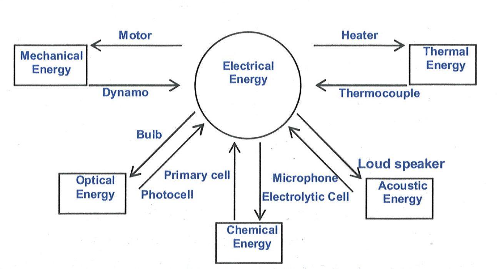

# ENERGY

Energy is defined as capacity of doing work. When we say, a body has energy, we mean that it can do work. Unit of energy is same as that of work i.e. Joule, other units of energy are kWh , calorie, erg, electron volt etc. Energy can be in many forms and it can be converted from one form to another.

Energy can neither be destroyed, nor be created, it can only be converted from one form to other. This is the law of conservation of energy. Its diversity can be illustrated by a figure shown.
Apart from above various forms, conventional energies also exist such as wind energy, tidal energy, solar energy. We can have various other forms such as energy obtained by coal, natural gases, nuclear energy etc.

Mechanical energy is the sum of kinetic energy and potential energy. Kinetic Energy is the energy possessed by a body by virtue of its motion. It is a scalar quantity.
Kinetic energy is defined as $K=\frac{1}{2} m v^2$. As we know that momentum $(P)=m . v . \quad \therefore \quad K=\frac{P^2}{2 m}$
Where $m$ is mass of body and $v$ is speed.
Kinetic energy is dependent on speed and is always positive.

Illustration 14
A man of mass 20 kg climbs up a ladder in 20 seconds. If the height of ladder is 10 metre. What is power used?

Illustration 15:
A person carrying a bag of total mass 25 kg climbs up to a height of 5 m in 30 seconds slowly. Calculate the power delivered by him to the bag.

Illustration 16:
The turbine pits at the Niagra falls are 50 m deep. The average horse power developed is 5000 , the efficiency being $85 \%$. How much water passes through the turbines per minutes?
Given $1 \mathrm{HP}=746 \mathrm{~W}$ and $g=10 \mathrm{~m} / \mathrm{s}^2$.