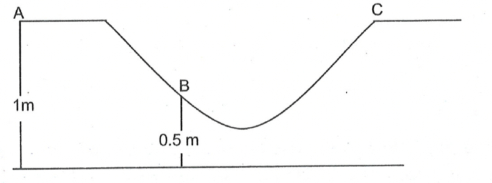

<h1 style="background-color:#630fad; color:white; text-align: center;padding: 5px">SOLVED PROBLEMS</h1> 

<h2 style="background-color:#7612ce; color:white; text-align: center;padding: 5px">SUBJECTIVE</h2> 

<h3 style="background-color:#af64f1; color:white; text-align: center;padding: 5px">Section A</h3> 

#### Questions Only

**Problem 1:**  Force of 3 N acts through a distance of 12 m in the direction of the force. Find the work done.

**Problem 2:** How much work is done against gravity in lifting 3 kg object through a height of 40 cm ?

**Problem 3:**  A block of mass 2 kg slides on a rough surface with initial speed of $2 \mathrm{~m} / \mathrm{s}$. It stops after travelling 20 cm . Find work done by the frictional force.

**Problem 4:**  b body of mass 5 kg is taken from a height 5 m to 10 m . Find the increase in its potential energy $\left(g=10 \mathrm{~m} / \mathrm{s}^2\right)$

**Problem 5:** A block of mass 100 kg is taken to height 10 metres. The initial and final velocity of the block is zero. Find
(i) amount of work done by agent (ii) amount of work done by gravity.

**Problem 6:** How fast should a man of mass 60 kg run so that his kinetic energy is 750 J ?

**Problem 7:**  A force of 10 N displaces an object through 20 cm and does work of 1 J in the process. Find the angle between the force and the displacement.

**Problem 9:** A rocket of $3 \times 10^6 \mathrm{~kg}$ mass takes off from a launching pad and acquires a vertical velocity of $1 \mathrm{~km} / \mathrm{sec}$ at an altitude of 25 km . Calculate at this instant
(i) Potential energy
(ii) Kinetic energy
(take $g=10 \mathrm{~m} / \mathrm{s}^2$ )

**Problem 10:** A block of mass 2.0 kg slides on a rough surface. At $t=0$, its speed is $2.0 \mathrm{~m} / \mathrm{s}$. It stops after covering a distance of 20 cm because of the friction exerted by the surface on it. Find the work done by friction.

**Problem 1:**  force of 3 N acts through a distance of 12 m in the direction of the force. Find the work done.

**Solution:** $W=F s=(3 \mathrm{~N} \times 12 \mathrm{~m})=36 \mathrm{~J}$.  

**Problem 2:** How much work is done against gravity in lifting 3 kg object through a height of 40 cm ?

**Solution: An upward force equal in magnitude to its weight must be exerted on the object. Work done by the force $(\mathrm{mg})(\mathrm{h})=11.8 \mathrm{~J}$.

**Problem 3:** . A block of mass 2 kg slides on a rough surface with initial speed of $2 \mathrm{~m} / \mathrm{s}$. It stops after travelling 20 cm . Find work done by the frictional force.

**Solution:**  Initial kinetic energy $=\frac{1}{2} m v^2=4 \mathrm{~J}$
Change in KE. $=-4 \mathrm{~J}$
From work energy theorem $\mathrm{W}=-4 \mathrm{~J}$.  

**Problem 4:**  b body of mass 5 kg is taken from a height 5 m to 10 m . Find the increase in its potential energy $\left(g=10 \mathrm{~m} / \mathrm{s}^2\right)$

**Solution:**  Given $\mathrm{m}=5 \mathrm{~kg}, \mathrm{~h}_1=5 \mathrm{~m}, \mathrm{~h}_2=10 \mathrm{~m}, \mathrm{~g}=10 \mathrm{~m} / \mathrm{s}^2$

$
\begin{aligned}
\text { Increase in potential energy } & =\mathrm{mg}\left(\mathrm{~h}_2-\mathrm{h}_1\right) \newline
& =5 \times 10 \times(10-5)=250 \mathrm{~J}
\end{aligned}
$

**Problem 5:** A block of mass 100 kg is taken to height 10 metres. The initial and final velocity of the block is zero. Find
(i) amount of work done by agent (ii) amount of work done by gravity.

**Solution:**
(i) Work done by agent + work done by gravity
$=$ change in $\mathrm{KE}=0$
$\Rightarrow$ (WD) by agent $=-$ WD by gravity $=10000 \mathrm{~J}$
(ii) (WD) by gravity $=-10,000 \mathrm{~J}$.

**Problem 6:** How fast should a man of mass 60 kg run so that his kinetic energy is 750 J ?

**Solution:** $\quad m=60 \mathrm{~kg}$, kinetic energy $=750 \mathrm{~J}, v=?$
kinetic energy $=\frac{1}{2} m v^2$

$
750=\frac{1}{2} \times 60 \times v^2 \quad \therefore v^2=\frac{2 \times 750}{60}=25 \quad \text { or } \quad v=\sqrt{25}=5 \mathrm{~m} / \mathrm{s}
$

**Problem 7:**  A force of 10 N displaces an object through 20 cm and does work of 1 J in the process. Find the angle between the force and the displacement.

**Solution:**

$
\begin{aligned}
W & =F d \cos \theta \newline
& =(10 \mathrm{~N}) \times(20 \mathrm{~cm}) \cos \theta
\end{aligned}
$

or, $1 \mathrm{~J}=10 \mathrm{~N} \times 0.2 \mathrm{~m} \cos \theta$
or, $\quad \cos \theta=1 / 2$
or, $\quad \theta=60^{\circ}$
**Problem 8:** A player kicks a ball of mass 250 g placed at the centre of a field. The ball leaves his foot with a speed of $8 \mathrm{~m} / \mathrm{s}$. Find the work done by the player on the ball.

**Solution:** Initially, the ball is at rest. the player does some work on it, and hence, the ball gains kinetic energy. So the work done by the player on the ball is equal to the kinetic energy of the ball as it leaves the foot.

$
\mathrm{W}=\frac{1}{2} m v^2=\frac{1}{2} 0.25 \mathrm{~kg} \times(8 \mathrm{~m} / \mathrm{s})^2=8 \mathrm{~J}
$

**Problem 9:** A rocket of $3 \times 10^6 \mathrm{~kg}$ mass takes off from a launching pad and acquires a vertical velocity of $1 \mathrm{~km} / \mathrm{sec}$ at an altitude of 25 km . Calculate at this instant
(i) Potential energy
(ii) Kinetic energy
(take $g=10 \mathrm{~m} / \mathrm{s}^2$ )

**Solution:**
(i)

$
\begin{aligned}
& \mathrm{PE}=\mathrm{mgh}=3 \times 10^6 \times 10 \times 25000 \mathrm{kgm}^2 / \mathrm{sec}^2 \newline
& \mathrm{PE}=75 \times 10^{10}=7.5 \times 10^{11} \mathrm{Joules}
\end{aligned}
$

(ii) Kinetic energy $=\frac{1}{2} m v^2$

$
\begin{aligned}
& =\frac{1}{2} \times 3 \times 10^6 \times(1000)^2 \newline
& =\frac{1}{2} \times 3 \times 10^6 \times 10^6 \newline
& =1.5 \times 10^{12} \text { Joules }
\end{aligned}
$

**Problem 10:** A block of mass 2.0 kg slides on a rough surface. At $t=0$, its speed is $2.0 \mathrm{~m} / \mathrm{s}$. It stops after covering a distance of 20 cm because of the friction exerted by the surface on it. Find the work done by friction.

**Solution:** The kinetic energy of the ball at $\mathrm{t}=0$ is

$
\begin{aligned}
& \mathrm{K}=\frac{1}{2} \mathrm{mv}^2 \newline
& =\frac{1}{2}(2.0 \mathrm{~kg}) \times(2.0 \mathrm{~m} / \mathrm{s})^2=4 \mathrm{~J}
\end{aligned}
$

When the block comes to rest, its kinetic energy becomes zero this loss of energy takes place because friction does negative work on the block. Thus, the work done by the friction is -4 J .

**Problem 11:** A block of mass $m$ is suspended by a light thread from an elevator. The elevator is accelerating upward with uniform acceleration a. Find the work done during $t \mathrm{sec}$ by the tension in the thread.

**Solution:** Let the block moves up with an acceleration a

$
\begin{aligned}
& \Rightarrow F_{n e t}=T-m g=m a \newline
& \Rightarrow T=m(g+a)
\end{aligned}
$

Now the work done W by the tension T in displacing the block through a distance $x$ is given as,

$
\begin{gathered}
W=T \cdot x \newline
\text { where } x=1 / 2 a t^2 \newline
\text { Putting } x \text { and T from (3) in } \newline
\qquad \begin{aligned}
W & =m(g+a)\left(1 / 2 t^2\right) \newline
\Rightarrow W & =m / 2(g+a) a t^2 .
\end{aligned}
\end{gathered}
$

Putting $x$ and $T$ from (3) in (2), we obtain

**Problem 12:** $\quad A$ ball of mass $m$ is thrown in air with speed $v_1$ from a height $h_1$ and it is caught at a height $h_2>h_1$ when its speed becomes $v_2$. Find the work done on the ball by the air resistance.

**Solution:**  Work done on the ball by gravity is

$
W_g=-m g\left(h_2-h_1\right)
$

Work done on the ball by air resistance is $\mathrm{W}_{\text {air }}=$ ?

$
\begin{aligned}
& \because \mathrm{W}_{\mathrm{g}}+\mathrm{W}_{\text {air }}=\Delta K . E \newline
& \Rightarrow-m g\left(h_2-h_1\right)+W_{\text {air }}=\frac{1}{2} m\left(v_2^2-v_1^2\right) \newline
& \Rightarrow W_{\text {air }}=m g\left(h_2-h_1\right)+\frac{1}{2} m\left(v_2^2-v_1^2\right)
\end{aligned}
$

**Problem 13:** A person decided to use his bath tub water to generate electricity to run a 40 W - bulb. The bath tub is located at a height of 10 m from the ground and it holds 200 litres of water. He installs a water driven wheel generator on the ground. At what rate should the water drain from the bath tub to light the bulb? How long can he keep the bulb on if the bath tub was full initially? The efficiency of the generator is $90 \%$.

**Solution:**
Let V be the volume flowing/ sec from the tub to generate the power required to run a 40 W lamp.
Height of tub, $\mathrm{h}=10 \mathrm{~m}$
The input power (i.e. potential energy converted to heat + electricity) $=\mathrm{mgh}$

$
\begin{aligned}
& =\mathrm{V} g \mathrm{gh}=-\mathrm{V} \times 10^3 \times 9.8 \times 10 \text { joule } / \mathrm{sec} \newline
& =98000 \mathrm{~V} \text { watt. }
\end{aligned}
$

$
\begin{aligned}
& \text { Efficiency }=\frac{\text { Outputpower }}{\text { Inputpower }} \newline
& \Rightarrow \quad \frac{90}{100}=\frac{40}{98000 \mathrm{~V}} \newline
& \therefore \quad \mathrm{~V}=\frac{40 \times 100}{90 \times 98000} \mathrm{~m}^3 / \mathrm{s} \newline
& =0.453 \text { litres/second. }
\end{aligned}
$

Time for which the bulb will run

$
=\frac{200}{0.453}=441 \text { seconds. }
$

Problem 14:** A particle is placed at the point $A$ of a frictionless track $A B C$ as shown in figure. It is pushed slightly towards right. Find its speed when it reaches the point B. Take $g=10$ $\mathrm{m} / \mathrm{s}^2$

**Solution:** Let us take the gravitational potential energy to be zero at the horizontal surface shown in figure. The potential energies of the particle at $A$ and $B$ are

$
\begin{aligned}
& \mathrm{U}_{\mathrm{A}}=\mathrm{Mg}(1 \mathrm{~m}) \newline
& \text { and } \quad U_B=M g(0.5 \mathrm{~m})
\end{aligned}
$

The kinetic energy at the point A is zero. As the track is frictionless, no energy is lost. The normal force on the particle does no work. Applying the principle of conservation of energy,

$
\begin{array}{ll} 
& U_A+K_A=U_B+K_B \newline
\text { or, } & M g(1 \mathrm{~m})=M g(0.5 \mathrm{~m})+\frac{1}{2} \mathrm{Mv}_B^2 \newline
\text { or, } & \frac{1}{2} v_B^2=g(1 \mathrm{~m}-0.5 \mathrm{~m}) \newline
& =\left(10 \mathrm{~m} / \mathrm{s}^2\right) \times 0.5 \mathrm{~m}=5 \mathrm{~m}^2 / \mathrm{s}^2 \newline
\text { or, } \quad & \quad v_B=\sqrt{10} \mathrm{~m} / \mathrm{s}
\end{array}
$

<h3 style="background-color:#af64f1; color:white; text-align: center;padding: 5px">Section B</h3> 

<h3 style="background-color:#d3a9f7; color:black; text-align: center;padding: 5px">Level II</h3> 

<h3 style="background-color:#d3a9f7; color:black; text-align: center;padding: 5px">Level III</h3> 

<h4 style=" color:black; text-align: center;padding: 5px">Multiple choice questions (single option correct)  </h4>

Problem 1: An iron sphere of mass 10 kg has the same diameter as an aluminium sphere of mass is 3.5 kg . Both spheres are dropped simultaneously from a tower. When they are 10 m above the ground, they have the same.  
(A) acceleration  
(B) momenta  
(C) potential energy  
(D) kinetic energy  

Solution: The acceleration of a freely falling body is equal to g. It does not depend on the mass of the falling body.
Hence option (A) is correct.  

Problem 2: A girl is carrying a school bag of 3 kg mass on her back and moves 200 m on a levelled road. The work done against the gravitational force will be $\left(g=10 \mathrm{~m} / \mathrm{s}^2\right)$  
(A) $6 \times 10^3 \mathrm{~J}$   
(B) 6 J  
(C) 0.6 J  
(D) zero  

Solution: In this case the angle betweent he gravitational force and displacement is $90^{\circ}$. Hence option (D) is correct.

Problem 3: Which one of the following is not the unit of energy?  
(A) joule  
(B) newton metre  
(C) kilowatt  
(D) kilowatt hour  

Solution: kilowatt is the unit of power.
Hence option (C) is correct.