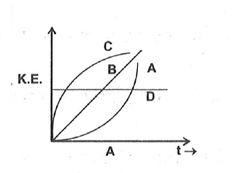
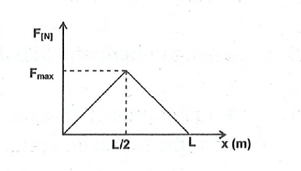

<h1 style="background-color:#630fad; color:white; text-align: center;padding: 5px">CHAPTER PRACTICE PROBLEMS</h1>

1. What happens if you are doing work without changing velocity of an object.
2. How is the dropping of a ball from a given height is an example of conservation of energy?
3. A body of mass 200 gm is freely falling under the action of gravity. Calculate its momentum and kinetic energy after 10 seconds from start.
4. A running man has half the K.E. than that of a boy of half his mass. The man speed up by $1 \mathrm{~m} / \mathrm{s}$ and then he has the same K.E. as the boy. Find their initial speeds?
5. $\quad 1 \mathrm{mg}$ of uranium - 235 is completely destroyed in an atomic bomb. How much energy is liberated?
6. An object is dropped to the earth from a height of 10 m . Which of the following graphs of kinetic energy vs time best represent the kinetic energy of the object as it approached the earth (neglect air friction)

  

7. Show that a simple pendulum bob which has been pulled aside from its equilibrium position through an angle $\theta$ and then released will pass through the equilibrium position with speed $\mathrm{v}=\sqrt{2 \mathrm{~g} \ell(1-\cos \theta)}$, where $\ell$ is the length of the pendulum.
8. A pump motor is used to deliver water at a certain rate from a given pipe. To obtain ' $n$ ' times water from the same pipe in the same time, by what amount (a) the force (b) power of the motor be increased?
9.  A particle starts from rest at $x=0$ and moves to $x=L$, under the action of a variable force $F(x)$ which is shown in figure. What is the kinetic energy of particles at $x=\mathrm{L} / 2$ \& at $\mathrm{x}=\mathrm{L}$.

 

10. A human heart discharges 75 mL of blood at each beat against a pressure at 0.1 mm of Hg . Calculate the power of the heart assuming that the pulse frequency is 80 beats $/ \mathrm{min}$. Given density of mercury $=13.6 \times 10^3 \mathrm{~kg} / \mathrm{m}^3$.
11. An object of mass 25 kg is at a certain height above the ground. If the potential energy of the object is 5000 J , find the height at which the object is with respect to the ground. Given, $\mathrm{g}=10 \mathrm{~m} / \mathrm{s}^2$.
12. Find the energy possessed by an object of mass 20 kg when it is at a height of 5 m above the ground. Given, $\mathrm{G}=9.8 \mathrm{~m} / \mathrm{s}^2$
13. A body of mass 4 kg fall freely from a height of 50 m . Find initial potential energy
14. In the previous question find the kinetic and potential energy after $2 \mathrm{sec} .\left(\mathrm{g}=10 \mathrm{~m} / \mathrm{s}^2\right)$
15. The kinetic energy of a body is 300 J . A force on 25 N is applied to stop it. Calculate the distance traveled by the body before come to rest?