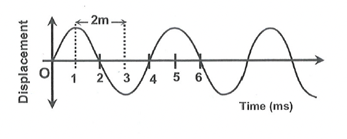
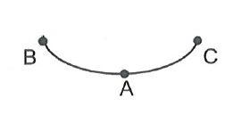
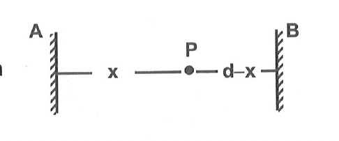

# SOLVED PROBLEMS
## SUBJECTIVE

### Section - A - Questions Only

**Problem 1:** Find the wave velocity, wavelength and frequency of wave shown in the figure.

  

**Problem 2:** At a location the depth of bottom from sea level is 12 km . A ship at surface sends sonar signal towards bottom. After how long it is expected to get reflected signal. (Speed of sound in sea $=1200 \mathrm{~m} / \mathrm{s}$ )

Problem 3: $\quad$ Calculate the ratio of wavelength of two ultrasonic wave having frequency $10^4 \mathrm{~Hz}$ and 1.5 $\times 10^4 \mathrm{~Hz}$. Speed of both wave is same.

**Problem 4:** A wave pulse on a string moves a distance of 12 m in 0.06 sec . Find the velocity of the pulse?

**Problem 5:** $\quad$ A child is standing 600 m away from a 40 Hz sound source. What is the time interval in which successive compression pulses from the source reach him?

**Problem 6:** A periodic longitudinal wave is sent on a helical spring. The wave propagation speed is $48 \mathrm{~cm} / \mathrm{s}$ \& each particle oscillate at a frequency of 12 Hz . Calculate the minimum separation between the positions where the spring is most elongated.

**Problem 7:** Figure shows the mean position $A$ \& the extreme positions $B \& C$ of the bob of a oscillating pendulum. Identify which of the following distances represent a quarter oscillations \& which represent half an oscillation.  

(A) $B A$  
(B) $A C$  
(C) $B A C$  
(D) $C A B$  
(E) $A B$  
(F) $A B A$  

**Problem 8:** A sound wave has a frequency of 1000 Hz and a wavelength of 34 cm . How long will it take to travel 1 km ?

**Problem 9:** Calculate the wavelength of a sound wave whose frequency is 300 Hz and speed is $330 \mathrm{~m} / \mathrm{s}$.

**Problem 10:** A certain sound has a frequency of 256 hertz and a wavelength of 1.3 m . Calculate the speed with which this sound travels. What difference would be felt by a listener between this sound and another sound travelling at the same speed but of wavelength 2.6 m ?

**Problem 11:** A person stands in between two walls and claps his hands. He hears two successive echoes at a time interval of 0.25 sec . If the distance between two is $d$ and speed of sound in air is $v$, locate the position of person.

**Problem 12:** A boy is playing with a ball on the roof of a building of 480 m high from the ground. Suddenly, the ball slips from his hand and fell into a well on the ground. The water level in the well is 20 m below the ground, and he hears the sound of ball hitting water after 11.5 sec from the instant of slip. Find the speed of sound in air. (Take $g=10 \mathrm{~m} / \mathrm{s}^2$ )
 

**Problem 13:** A simple pendulum has a time period of 2 s at the earth's surface. It is taken to certain height above the earth's surface, so that its time period becomes 4 s . Find the height.

**Problem 14:** The time period of a simple pendulum released from extreme position is 2.0 s.  
(a) How many times does it pass through the other extreme position in 50 sec ?  
(b) How many times does it pass through the mean position in 50 sec ?  

**Problem 15:** The time period of a simple pendulum at the surface of the earth is 2.0 s . Its length is increased six-times, and taken to the surface of the moon. Find its time period, if the acceleration due to gravity on the moon's surface is one-sixth of that on the surface of the earth.
