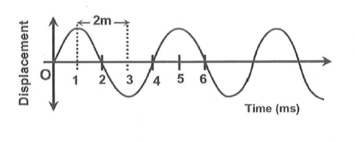

# SOLVED PROBLEMS
## SUBJECTIVE

### Section - A

**Problem 1:** Find the wave velocity, wavelength and frequency of wave shown in the figure.

  

**Solution:** It is clear from figure
Time period of wave $\mathrm{T}=4$ milli second $=4 \times 10^{-3} \mathrm{sec}$  
$\therefore$ Frequency of wave $v=\frac{1}{\mathrm{~T}}=\frac{1}{4 \times 10^{-3}}=250 \mathrm{~Hz}$  
Distance between trough and crest is 2 m . Hence $\lambda / 2=2 \mathrm{~m}$  
Wavelength $(\lambda)=4 \mathrm{~m}$  
Wave speed $v=v \bar{\lambda}=250 \times 4=1000 \mathrm{~m} / \mathrm{s}$.  

**Problem 2:** At a location the depth of bottom from sea level is 12 km . A ship at surface sends sonar signal towards bottom. After how long it is expected to get reflected signal. (Speed of sound in sea $=1200 \mathrm{~m} / \mathrm{s}$ )

**Solution:** Total distance travelled by sonar signal between the ship, the bottom and back

$
\mathrm{d}=2 \times 12=24 \mathrm{~km}=24000 \mathrm{~m}
$

Time taken by sound to travel this distance,

$
\mathrm{T}=\frac{\mathrm{x}}{\mathrm{~V}}=\frac{24000}{1200}=20 \mathrm{sec}
$

$\therefore \quad$ The reflected signal will reach the ship 20 sec after the signal is send.

**Problem 3:** Calculate the ratio of wavelength of two ultrasonic wave having frequency $10^4 \mathrm{~Hz}$ and 1.5 $\times 10^4 \mathrm{~Hz}$. Speed of both wave is same.

**Solution:** Let their wavelengths are $\lambda_1$ and $\lambda_2$. Now as speed of wave is same and equal to $v$.
Frequency of wave are $v_1=10^4$ and $v_2=1.5 \times 10^4$
We know that $\lambda=\frac{v}{v}$

$
\frac{\lambda_1}{\lambda_2}=\frac{v_1 v_2}{v_2 v_1}=\frac{v \times 1.5 \times 10^4}{v \times 10^4}=\frac{3}{2} .
$

**Problem 4:** A wave pulse on a string moves a distance of 12 m in 0.06 sec . Find the velocity of the pulse?

**Solution:** $\quad$ Velocity of the wave pulse $\mathrm{v}=\frac{\text { Distance covered }}{\text { time taken }}=\frac{12}{0.06}=200 \mathrm{~m} / \mathrm{s}$.

**Problem 5:** $\quad$ A child is standing 600 m away from a 40 Hz sound source. What is the time interval in which successive compression pulses from the source reach him?

**Solution:** We have, $v=40 \mathrm{~Hz}$
Time period of the sound

$
\mathrm{T}=\frac{1}{v}=\frac{1}{40} \mathrm{sec}=0.025 \mathrm{sec}
$

This is the time interval between successive compression (or refraction) pulses.
$\therefore$ Successive compression pulse reaches the person after each 0.025 sec .

**Problem 6:** A periodic longitudinal wave is sent on a helical spring. The wave propagation speed is $48 \mathrm{~cm} / \mathrm{s}$ \& each particle oscillate at a frequency of 12 Hz . Calculate the minimum separation between the positions where the spring is most elongated.

**Solution:** The minimum separation between the positions of maximum compression is the same as the wavelength $\lambda$. Here, the frequency is 12 Hz . and wave speed is $48 \mathrm{~cm} / \mathrm{s}$.

$
\lambda=\frac{v}{v}=\frac{48 \mathrm{~cm} / \mathrm{s}}{12 \mathrm{~s}^{-1}}=4 \mathrm{~cm} .
$

**Problem 7:** Figure shows the mean position $A$ \& the extreme positions $B \& C$ of the bob of a oscillating pendulum. Identify which of the following distances represent a quarter oscillations \& which represent half an oscillation.  

(A) $B A$  
(B) $A C$  
(C) $B A C$  
(D) $C A B$  
(E) $A B$  
(F) $A B A$  

**Solution:** $B A C+C A B$ is a complete oscillation. Thus each of $B A C$ and $C A B$ is half an oscillation. Each of $B A, A C$ and $A B$ is half of $B A C$. So three are quarter oscillations $A B A=A B+B A$. As $A B=B A=$ quarter oscillation, $A B A$ is also half an oscillation.

**Problem 8:** A sound wave has a frequency of 1000 Hz and a wavelength of 34 cm . How long will it take to travel 1 km ?

**Solution:** We have, $\mathrm{v}=1000 \mathrm{~Hz}$ and $\lambda=34 \mathrm{~cm}=\frac{34}{100} \mathrm{~m}$  
The wave speed is $v=v \lambda=\left(1000 \mathrm{~s}^{-1}\right) \frac{34}{100} \mathrm{~m}=340 \mathrm{~m} / \mathrm{s}$.  
The time taken by the wave to travel 1 km is $\mathrm{t}=\frac{\mathrm{x}}{\mathrm{v}}=\frac{1 \mathrm{~km}}{340 \mathrm{~m} / \mathrm{s}}=\frac{1000 \mathrm{~m}}{340 \mathrm{~m} / \mathrm{s}}=2.94 \mathrm{~s}$. .  

**Problem 9:** Calculate the wavelength of a sound wave whose frequency is 300 Hz and speed is $330 \mathrm{~m} / \mathrm{s}$.

**Solution:** We have, $\quad v=v \lambda$
or,

$
\lambda=\frac{v}{v}=\frac{330 \mathrm{~m} / \mathrm{s}}{300 \mathrm{~s}^{-1}}=1.1 \mathrm{~m}
$

**Problem 10:** A certain sound has a frequency of 256 hertz and a wavelength of 1.3 m . Calculate the speed with which this sound travels. What difference would be felt by a listener between this sound and another sound travelling at the same speed but of wavelength 2.6 m ?

**Solution:** $\quad$ For the first sound, $\mathrm{f}=256 \mathrm{~Hz}, \lambda=1.3 \mathrm{~m}$.
Speed $V=\mathrm{f} \lambda=256 \times 1.3=332.8 \mathrm{~m} / \mathrm{s}$
For second sound, $\mathrm{V}=332.8 \mathrm{~m} / \mathrm{s}, \lambda=2.6 \mathrm{~m}$
Frequency $f=\frac{V}{\lambda}=\frac{332.8}{2.6}=128 \mathrm{~Hz}$.
The frequency (i.e., pitch) of first sound is more than that of the second sound. Hence, the first sound will be shriller than the second sound.

**Problem 11:** A person stands in between two walls and claps his hands. He hears two successive echoes at a time interval of 0.25 sec . If the distance between two is $d$ and speed of sound in air is $v$, locate the position of person.

**Solution:** Let the distance of person from the wall A is x . Let time taken by sound to travel from $\mathrm{P} \rightarrow \mathrm{A} \rightarrow \mathrm{P}$ is $\mathrm{t}_1=\frac{2 \mathrm{x}}{\mathrm{V}}$
Let time taken by sound to travel from $P \rightarrow B \rightarrow P$ is $t_2=\frac{2(d-x)}{v}$
Now $\mathrm{t}_2-\mathrm{t}_1=\frac{2(\mathrm{~d}-2 \mathrm{x})}{\mathrm{v}} \ldots$
As, $\mathrm{t}_2-\mathrm{t}_1=\frac{1}{4} \mathrm{sec} \quad \ldots(2)$
Hence from (1) and (2) $\frac{2(d-2 x)}{v}=\frac{1}{4}$
Distance from one wall $x=\frac{8 \mathrm{~d}-\mathrm{v}}{16}$.

**Problem 12:** A boy is playing with a ball on the roof of a building of 480 m high from the ground. Suddenly, the ball slips from his hand and fell into a well on the ground. The water level in the well is 20 m below the ground, and he hears the sound of ball hitting water after 11.5 sec from the instant of slip. Find the speed of sound in air. (Take $g=10 \mathrm{~m} / \mathrm{s}^2$ )

**Solution:** Let t be the time taken by the ball to reach the well  
Now, $\mathrm{h}=\mathrm{ut}+\frac{1}{2} \mathrm{gt}^2=480+20=500  \mathrm{~m}, \mathrm{~g}=10 \mathrm{~m} / \mathrm{s}^2, \mathrm{u}=0$  
$\therefore 500=0 \times \mathrm{t}+\frac{1}{2} \times 10 \times \mathrm{t}^2 \Rightarrow \mathrm{t}=10 \mathrm{sec}$  
Hence time taken by the sound to travel $500 \mathrm{~m}=11.5-10=1.5 \mathrm{sec}$  
$\therefore \quad$ The speed of sound in air $=\frac{500}{1.5}=333.33 \mathrm{~m} / \mathrm{s}$.  

**Problem 13:** A simple pendulum has a time period of 2 s at the earth's surface. It is taken to certain height above the earth's surface, so that its time period becomes 4 s . Find the height.

**Solution:**

Each complete oscillation is known as a period and is constant. The formula for determining the period of a pendulum is $T = 2π \sqrt{L/g}$, where L is the length of the pendulum and g is the acceleration due to gravity.
$
\begin{aligned}
& 2=2 \pi \sqrt{\frac{\mathrm{~L}}{\mathrm{~g}}} \newline
& \text { and, } 4=2 \pi \sqrt{\frac{\mathrm{~L}}{\mathrm{~g}^{\prime}}} \newline
& \Rightarrow 4 \mathrm{~g}^{\prime}=\mathrm{g}  \newline
& \Rightarrow 4 \frac{\mathrm{GM}_{\mathrm{e}}}{\left(\mathrm{R}_{\mathrm{g}}+\mathrm{h}\right)^2}=\frac{\mathrm{GM}_{\mathrm{e}}}{\mathrm{R}_{\mathrm{e}}^2}  \newline
& \Rightarrow \mathrm{~h}=\mathrm{R}_{\mathrm{e}}=6400 \mathrm{~km}
\end{aligned}
$

**Problem 14:** The time period of a simple pendulum released from extreme position is 2.0 s.  
(a) How many times does it pass through the other extreme position in 50 sec ?  
(b) How many times does it pass through the mean position in 50 sec ?  

**Solution:** In 50 sec , the number of oscillations completed by the bob is $\frac{50}{2}=25$
(a) In each oscillation, it passes through one extreme position once.
$\therefore$ In 25 oscillations it passes through one extreme 25 times.
(b) In each oscillation, it passes through mean position twice.
$\therefore$ In 25 oscillations it passes through mean position $2 \times 25=50$ times.

**Problem 15:** The time period of a simple pendulum at the surface of the earth is 2.0 s . Its length is increased six-times, and taken to the surface of the moon. Find its time period, if the acceleration due to gravity on the moon's surface is one-sixth of that on the surface of the earth.

**Solution:** $\quad \because \mathrm{T}=2 \pi \sqrt{\frac{\mathrm{~L}}{\mathrm{~g}}} \Rightarrow \quad \frac{\mathrm{~g} \mathrm{~T}^2}{\mathrm{~L}}=$ constant
If $T_m, g_m$ and $L_m$ are time-period, acceleration due to gravity and length of the pendulum respectively on moon surface and $T_e, g_e$ and $L_e$ are the respective quantities at earth's surface, then

$
\begin{aligned}
& \frac{g_m T_m^2}{L_m}=\frac{g_e T_e^2}{L_e} \newline
& \Rightarrow T_m=T_e \sqrt{\frac{L_m}{L_e} \times \frac{g_e}{g_m}}=2 \sqrt{\frac{6 L_e}{L_e} \times \frac{g_e}{\left(g_e / 6\right)}} s=12 \mathrm{~s}
\end{aligned}
$
