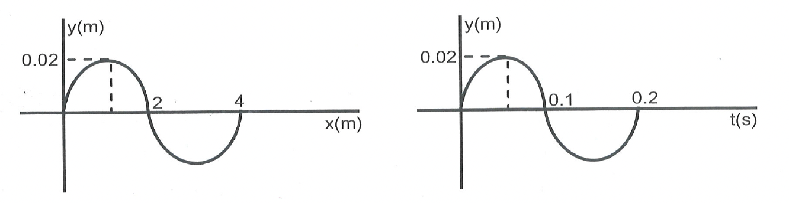

# OBJECTIVE

## Multiple Choice Questions (Single Option Correct)

### Questions Only  

**Problem 1**. The eardrum is a  
(A) coiled tube  
(B) bone  
(C) fluid  
(D) a stretched membrance  

**Problem 2**. An object moving at a speed greater than that of sound is moving at  
(A) ultrasonic speed  
(B) sonic speed  
(C) supersonic speed  
(D) infrasonic speed  
 

**Problem 3**. Loudness of sound is related to  
(A) frequency  
(B) speed  
(C) amplitude  
(D) none of these  

**Problem 4**. The velocity, wavelength and time period of a wave are related as  
(A) $\mathrm{v}=\frac{\lambda}{\mathrm{T}}$  
(B) $\mathrm{v}=\lambda \mathrm{T}$  
(C) $\mathrm{T}=\frac{\lambda}{\mathrm{v}}$  
(D) none of these  

**Problem 5**. In a wave motion transfer, which of the following takes place?  
(A) energy only  
(B) momentum only  
(C) both energy and momentum  
(D) neither energy nor momentum  

**Problem 6**. In which of the following medium does sound travel faster?  
(A) solid  
(B) liquid  
(C) gas  
(D) both solid and liquid  

**Problem 7**. Sound waves cannot pass through  
(A) solid  
(B) liquid  
(C) gas  
(D) vacuum 

### Fill in the Blanks

**Problem 8**. The S.I. unit of frequency is ________ .

**Problem 9**. Sound cannot travel in ________ .

**Problem 10**. Both kinetic and potential energies are maximum at the mean position.

## Level - II

### Multiple Choice Questions (Single Option Correct)

**Problem 1**. The distance between a consecutive crest and trough is $x$. The wavelength of the wave is  
(A) $2 x$  
(B) $\frac{x}{2}$  
(C) $x$  
(D) $4 x$  

**Solution**: $\quad$ The wavelength of the wave is $2 x$  
Hence option (A) is correct.

**Problem 2**. The velocity of sound in air at room temperature is about  
(A) $332 \mathrm{~ms}^{-1}$  
(B) $468 \mathrm{~ms}^{-1}$  
(C) $232 \mathrm{~ms}^{-1}$  
(D) $618 \mathrm{~ms}^{-1}$  

**Problem 3**. The upper limit of frequency of sound waves audible to human beings are  
(A) 5 Hz  
(B) 20 Hz  
(C) $20,000 \mathrm{~Hz}$  
(D) $35,000 \mathrm{~Hz}$  

## Level - III

### Multiple Choice Questions (Single Option Correct)

**Problem 1**. A pulse is generated at one end of the slinky of length 10 m . The pulse returns back to its point of generation in 10 seconds. The velocity of the pulse in the slinky will be:  
(A) $4 \mathrm{~ms}^{-1}$  
(B) $3 \mathrm{~ms}^{-1}$  
(C) $2 \mathrm{~ms}^{-1}$  
(D) $1 \mathrm{~ms}^{-1}$  

**Problem 2**. A longitudinal pulse is produced in a slinky. The frequency of the pulse is 60 Hz and it travels at a speed of $3 \mathrm{~cm} / \mathrm{s}$. the separation between consecutive compressions is :  
(A) 90 cm  
(B) 0.5 cm  
(C) 2 cm  
(D) 1.25 cm  

Comment by Rajdeep: These options are wrong if speed was 30 cm/s then it will come to 0.5 cm

**Problem 3**. Find out which of the following statements regarding sound is false?  
(A) sound waves are longitudinal waves  
(B) sound is a form of energy  
(C) sound travels in form of wave  
(D) sound travels faster in vacuum than in air  

## Level - IV

### Multiple Choice Questions (Single Option Correct-Based on Case Study Type)

A transverse wave is travelling in positive x -direction.
**Problem 1**: Amplitude of the given wave is  
(A) 2 cm  
(B) 20 cm  
(C) 0.02 cm  
(D) 0.01 cm  
 

**Problem 2**: Wavelength of the wave is  
(A) 2 cm  
(B) 4 cm  
(C) 2 m  
(D) 4 m  
 

**Problem 3**: Frequency of the wave is  
(A) 0.1 Hz  
(B) 0.2 Hz  
(C) 5 Hz  
(D) 10 Hz  

## Level - V

### Multiple Choice Questions (Single Option Correct-Assertion Reasoning Type)
**Problem 1**: Assertion: When a wave travels from one medium to the other then its frequency changes.    
Reason: Frequency is number of waves per second.  

(A) If both Assertion and Reason are correct and Reason is the correct explanation of Assertion.  
(B) If both Assertion and Reason are correct, but Reason is not the correct explanation of Assertion.  
(C) If Assertion is correct but Reason is incorrect.  
(D) If Assertion is incorrect but Reason is correct.  

**Solution:**  
(D) Assertion is incorrect but Reason is correct.  

**Problem 2**: Assertion: Sound is a longitudinal wave.  
Reason: In longitudinal wave medium particles vibrate along the direction of the wave.  
(A) If both Assertion and Reason are correct and Reason is the correct explanation of Assertion.  
(B) If both Assertion and Reason are correct, but Reason is not the correct explanation of Assertion.  
(C) If Assertion is correct but Reason is incorrect.  
(D) If Assertion is incorrect but Reason is correct.  

**Solution:**  
(A) Both Assertion and Reason are correct and Reason is the correct explanation of Assertion.  