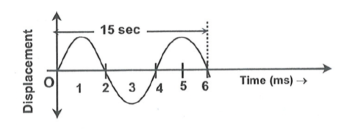

# Questions 
1. Find the minimum and maximum wavelengths of sound in water that is in the audible range $20-20,000 \mathrm{~Hz}$ for an average human ear speed of sound in water $=1450 \mathrm{~m} / \mathrm{s}$.

2. Ultrasonic waves of frequency 4.5 MHZ are used to detect tumour in soft tissues. The speed of sound in tissue is $1.5 \mathrm{~km} / \mathrm{s}$ and that in air is $340 \mathrm{~m} / \mathrm{s}$. Find the wavelength of this ultrasonic wave in air \& in tissue.

3. In a sinusoidal wave the time required for a particular point to move from maximum displacement to zero displacement is 0.15 sec . Find the frequency of wave.
   
4. A man sets his watch by the sound of a siren placed at a distance 990 m away. How slow his watch is ? $\left(\mathrm{v}_{\text {sound }}=330 \mathrm{~m} / \mathrm{s}\right)$
5. What will be the frequency?

6. Ultrasonic signals sent from SONAR returns to it after reflection from a rock after a lapse of 1 sec. If the velocity of ultrasound in water is $1600 \mathrm{~m} / \mathrm{s}$. What will be the depth of the rock in water?

7. What is the angle between wave velocity and particle velocity of a longitudinal wave.
8. A stone is dropped by a man into a lake from a tower of height 500 m . What time will require hearing the splash of sound by the man?

9. The speed of a wave in a certain medium is $960 \mathrm{~m} / \mathrm{s}$. If 3600 waves pass over a certain point of the medium in 1 minute. What will be the wavelength?
10. What will be the nature of wave in sound?
11. The frequency of a tuning fork is 384 per second and velocity of sound in air is $352 \mathrm{~m} / \mathrm{s}$. How far the sound has traveled while fork completes 36 vibrations?
12. An under water sonar source operating at a frequency of 60 kHz directs its beam towards the surface. If the velocity of sound in air is $330 \mathrm{~m} / \mathrm{s}$. What is the wavelength and frequency of waves in air?
13. What is the phase difference between two successive crests?
14. What is sound intensity? What is/are its unit(s)?
15. Define longitudinal and transverse wave.

## Answers
1.  
2. We are given the frequency of the ultrasonic waves (f = 4.5 MHz) and the speeds of sound in tissue (v_tissue = 1.5 km/s = 1500 m/s) and air (v_air = 340 m/s). We need to find the wavelength in both media.

    The relationship between speed (v), frequency (f), and wavelength (λ) is:
    v = fλ

    First, convert the frequency from MHz to Hz:
    f = 4.5 MHz = 4.5 x 10^6 Hz

    In tissue:
    λ_tissue = v_tissue / f
    λ_tissue = 1500 m/s / (4.5 x 10^6 Hz)
    λ_tissue = (1/3) x 10^-3 m = 0.33 x 10^-3 m = 0.33 mm ≈ 3.33 x 10^-4 m

    In air:
    λ_air = v_air / f
    λ_air = 340 m/s / (4.5 x 10^6 Hz)
    λ_air = (340/4.5) x 10^-6 m ≈ 75.56 x 10^-6 m ≈ 7.56 x 10^-5 m = 0.0756 mm

    Final Answer: The final answer is $\boxed{3.33e-4 , 7.56e-5}$

3. $\lambda = 0.15 \times 4 = 0.6$  
   $ \nu = \frac{1}{0.6} = \mathrm{1.66} \mathrm{hz} $

4. .

5. Time taken to complete 1.5 cycles = 15 secs, time take to complete one cycle is 10 sec. Hence frequence = 1/T  
   $ \nu = \frac{1}{10} = 0.1 \mathrm{ hz}$

6. v = 1600; T = 0.5 sec
   $ v = \nu \times \lambda $  
   $ v = 2 d / T $ 
   $ 2d = v \times T  $  
   $ d =  \frac{v}{2 \times T} $  
   $ d = \frac {1600} { 2} = 800 \mathrm{m} $

7. $0 \degree $ as both are in the same direction

8. Speed of sound in air is 343 m/s,  
   Time taken for stone to reach water $s = \frac{1}{2}gt^2 $   
   $ t^2 = \frac{2s}{g} = \frac{1000}{10} $
   $ t_1 =  10 sec $
   $ t_2 = \frac{2d}{V} = \frac{500}{343} $  
   $ t_2 = 1.46 \mathrm{ s} $   
   $ t = t_1 + t_2 = 10+ 1.46 = 11.46 \mathrm{ s} $ 

