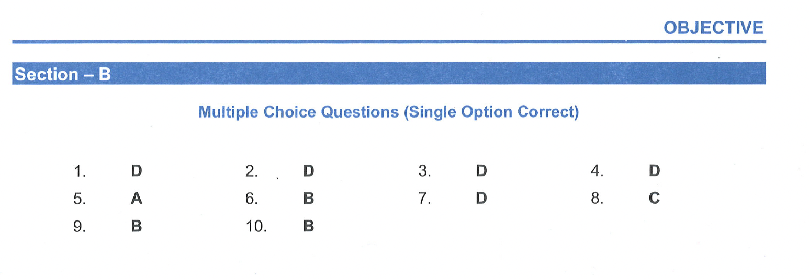

# Multiple Choice Questions
## (Single Option Correct)

1. The use of sound waves to determine distance or find objects is called:
(A) ultrasound  
(B) infrasound  
(C) acoustics  
(D) sonar  

2. Which of the following is a mechanical wave?  
(A) Radio waves    
(B) X-rays    
(C) Light waves    
(D) Sound waves.    

3. Velocity of sound in air is $332 \mathrm{~m} / \mathrm{s}$. Its velocity in vacuum will be  
(A) $>332 \mathrm{~m} / \mathrm{s}$    
$(B)=332 \mathrm{~m} / \mathrm{s}$    
(C) $<332 \mathrm{~m} / \mathrm{s}$    
(D) meaningless    

4. Which of the following is mechanical wave?
(A) Radio waves  
(B) X-rays  
(C) Light waves  
(D) Sound waves  

5. A cork floating in a calm pond executes simple harmonic motion of frequency $\gamma$ when a wave generated by a boat passes by it. The frequency of the wave is  
(A) $\gamma$  
(B) $\gamma / 2$  
(C) $2 \gamma$  
(D) $\sqrt{ } 2 \gamma$  

6. Light can travel in vacuum but not sound, because:  
(A) speed of sound is very much slower than light  
(B) light waves are electromagnetic in nature  
(C) sound waves are electromagnetic in nature  
(D) light waves are not electromagnetic in nature  

7. Which of the following is not a transverse wave?  
(A) X-rays  
(B) $\gamma$-rays  
(C) Visible light wave  
(D) Sound wave in a gas  

8. Which of the following statements is correct ?  
(A) All vibrations produce sound     
(B) Vibrations of frequency more than 20 Hz only produce sound    
(C) Vibrations of frequency between 20 Hz and $20,000 \mathrm{~Hz}$ only produce sound  
(D) None of these  

9. In a progressive longitudinal wave, the particle velocity and wave velocity are
(A) mutually perpendicular  
(B) on the same line  
(C) not at fixed directions   
(D) always equal  
 
10. When the bob of a simple pendulum moves away from the mean position. How does its speed changes?  
(A) increase  
(B) decrease  
(C) constant  
(D) data not sufficient  

