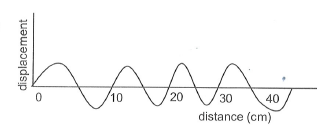
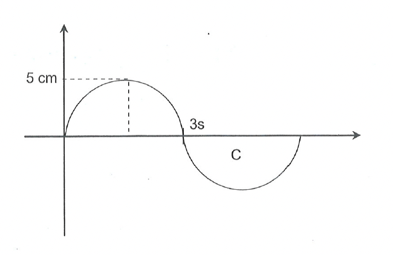
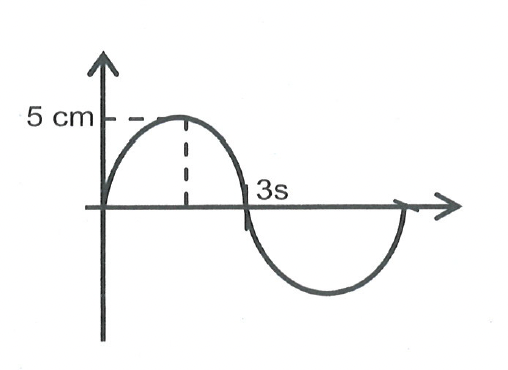
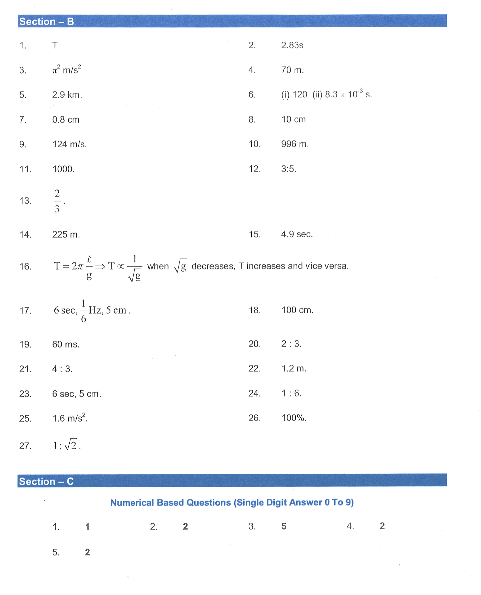
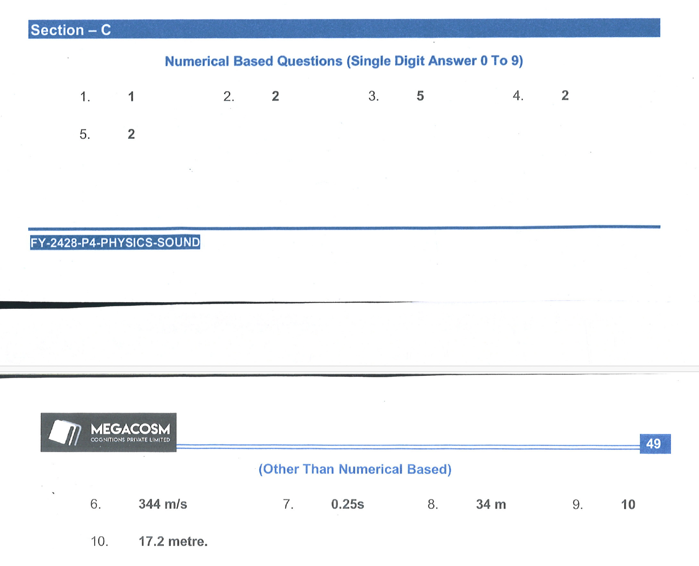

# Section-B

## Questions

1. A simple pendulum has amplitude $A$ and time period $T$. If it's amplitude is doubled, find its new time period.
   
2. The length of a simple pendulum is 2.0 m . Find its time period. Take $\mathrm{g}=\pi^2 \mathrm{~m} / \mathrm{s}^2$.
3. Find the value of g at a place where a pendulum of length 1 m has a periodic time of 2 s .
4. What should be the minimum distance between source and reflector in water so that echo is heard distinctly? (The speed of sound in water $=1400 \mathrm{~m} / \mathrm{s}$ ).
5. A ship on the surface of water sends a signal and receives it back from a submarine inside the water after 4 s . Calculate the distance of the submarine from the ship. (The speed of sound in water is $1450 \mathrm{~m} / \mathrm{s}$.
6. The wavelength of wave produced on the surface of water is 20 cm . If the wave velocity is 24 $\mathrm{m} / \mathrm{s}$. Calculate   
   (i) the number of wave produced is one second and (ii) the time required to produce one wave.
7. A longitudinal wave is produced on a slinky. The frequency of the wave is 25 Hz and it travels at a speed of $20 \mathrm{~cm} / \mathrm{s}$. Find the separation between consecutive positions of maximum compression.
8. The shape of a string carrying a periodic wave is shown in figure for a particular time. Find the wavelength.
   
   

9.  A man fires a gun and hears its echo after 5 sec . The man then moves 124 m towards the hill and fires his gun again. This time he hears the echo after 3 sec . calculate the speed of sound.
10. The flash of a gun is seen by man 3 seconds before the sound is heard. Calculate the distance of the gun from the man (speed of sound in air is $332 \mathrm{~m} / \mathrm{s}$ ).
11. The distance between a compression and next refraction of sound wave in 12.5 cm . If the sound waves can travel 750 m in 3 sec , the find the number of waves produced in one second.
12. A wave of time period 10 ms travels with a velocity of $1.5 \mathrm{~m} / \mathrm{s}$. If the time period of another wave in 6 ms , find its velocity and also find the ratio of their velocities. (Assume that the wavelength of the two waves are same).
13. The wavelength of sound wave traveling in a solid becomes one third when it propagates through air. If the frequency of the wave remains constant, then find the decrease in the velocity of the wave.
14. The frequency of the sound wave is 200 Hz and its wavelength is 150 cm . What is the distance traveled by a sound wave in the time taken to produce 150 waves?
15. What would be the time period of seconds pendulum constructed on the earth, if it is taken to the surface of the moon. The acceleration due to gravity on the surface of the moon is $\frac{1}{6} \mathrm{~g}_{\text {carth }}$.
16. How does the time period T of a simple pendulum vary with altitude?
17. The oscillation of a simple pendulum is graphically represented as follows.
Determine the
(a) time period
(b) frequency
(c) amplitude

18. A sound wave travels 60 m in the time taken to produce 60 waves. Find the wavelength of the sound wave in centimeters.
19. If 500 sound waves are produced in one minute then find the time taken by the vibrating particle to move from its mean position to the immediate rarefaction.
20. Two tuning forks $A$ and $B$ of frequencies 200 Hz and 400 Hz are vibrated simultaneously. Then the ratio of time taken by the sound produced by $A$ and $B$ to travel 660 m and 990 m repectively in air is $\qquad$ (velocity of the sound in air $=330 \mathrm{~m} \mathrm{~s}^{-1}$ )?

21.  Two pendulums $A$ and $B$ of length 9 m and 16 m respectively are made to oscillate on the Earth's surface then the ratio of their frequency is $\qquad$ ?
22. A sound wave travels 60 m in the time taken to produce 50 waves. Find the wavelength of the sound wave in centimetres.
23. The oscilation of a simple pendulum is graphically represented as follows. Determine the
(A) Time period
(B) Amplitude

24. Find the ratio of time periods of two pendulums whose lengths are in the ratio $1: 36$.
25. The time period of a pendulum on the surface of the moon is 5 s . If it is a seconds pendulum on earth and the acceleration due to gravity on the earth is $9.8 \mathrm{~m} \mathrm{~s}^{-2}$, find the acceleration due to gravity on the surface of the moon.

## Section - C

### Numerical Based Questions (Single Digit Answer 0 To 9)

1. A source of sound produces 20 compressions and 20 rarefaction in 0.2 seconds. The distance between a compression and a successive rarefactions is 50 cm . Find the wavelength and frequency of the wave.
   
2. Calculate the wavelength of a sound wave whose frequency is 220 Hz speed is $440 \mathrm{~m} / \mathrm{s}$ in a given medium.
3. A source produces 40 crests and 40 troughs in 0.4 second. If the frequency of the wave is $20 \times n \mathrm{~Hz}$. Find the value of n
4. A boat at anchor is rocked by waves whose consecutive crests are 100 m apart. The wave velocity of the moving crests is $20 \mathrm{~m} / \mathrm{s}$. If the frequency of rocking of the boat is $\frac{\mathrm{n}}{10}$. What is the value of $n$
5. If the percentage increase in the length of the simple pendulum is $1 \%$ then the percentage increase in its time period will be $\frac{1}{n} \%$ then find the value of $n$.
### (Other Than Numerical Based)
6. A monkey drops a coconut from the top of a tree. He hears the sound of the coconut hitting the ground 2.057 seconds after dropping it. If the monkey was 19.6 meters above the ground, what is the speed of sound? $\left(\mathrm{g}=9.8 \mathrm{~m} / \mathrm{s}^2\right)$
7. A boat using SONAR detects a fish 190 meters below. How much time elapsed between sending the ultrasonic signal which detected the fish \& receiving the signal's echo? (Speed of sound in sea water $=1520 \mathrm{~m} / \mathrm{s}$.)
8. A boy is at the centre of a large empty hemispherical hall. He shouts \& hears echo of his voice after 0.2 seconds. What is the radius of the hall? (Speed of sound $=340 \mathrm{~m} / \mathrm{s}$ )
9. Ripples are produced on water surface in a bucket. The separation between consecutive crests is 2 mm \& the ripples proceed on the surface at a speed of $2 \mathrm{~cm} / \mathrm{s}$. How many crests hit the wall of the container per second?
10. What is the minimum distance of a person in air from a wall to listen echo?

## Solutions
1. The time period of a simple pendulum is given by:

    T = 2π√(L/g)

    where:

    * T is the time period
    * L is the length of the pendulum
    * g is the acceleration due to gravity

    Notice that the formula does *not* include the amplitude (A).  For small angles of oscillation (which is the usual assumption for a simple pendulum), the time period is independent of the amplitude.

    Therefore, if the amplitude is doubled, the time period **remains the same**,  it will still be **T**.

2. $l = 2.0 \textbf{ } \mathrm{m} \newline
    g = \pi^2 \newline  \newline
    T = 2\pi\sqrt{\frac{L}{g}} = 2 \frac{\pi \sqrt{2}}{\pi} = 2 \sqrt{2}
   $
3. We can use the formula for the period of a simple pendulum:

    T = 2π√(L/g)

    Where:

    * T is the period (2 seconds)
    * L is the length of the pendulum (1 meter)
    * g is the acceleration due to gravity (what we want to find)

    Let's solve for g:

    1. Square both sides:  T² = 4π²(L/g)
    2. Rearrange to solve for g: g = 4π²L/T²

    Now, substitute the known values:

    g = 4π²(1 m) / (2 s)² 
    g = 4π² m/4 s²
    g = π² m/s²

    Using the approximation π ≈ 3.14159:

    g ≈ (3.14159)² m/s² ≈ 9.87 m/s²

    Therefore, the value of g at that place is approximately **9.87 m/s²**.

4. The minimum distance for a distinctly heard echo depends on the persistence of hearing.  The human ear can distinguish two sounds as separate if they are separated by at least 0.1 seconds.

    Let's denote:

    * v = speed of sound in water = 1400 m/s
    * t = minimum time interval for distinct hearing = 0.1 s
    * d = distance to the reflector

    The sound travels to the reflector and back to the source.  Therefore, the total distance covered is 2d.  We can use the formula:

    distance = speed × time

    2d = v × t

    Solving for d:

    d = (v × t) / 2

    Substituting the values:

    d = (1400 m/s × 0.1 s) / 2 = 70 m

    Therefore, the minimum distance between the source and reflector in water should be **70 meters** to hear a distinct echo.

5. $ 2d = v \times t \newline
     2d  = 1450 \times 4 \newline
     d = 1450 \times 2 = \boxed{ 2900 \textbf{ } \mathrm{m}}
   $

6. We can use the wave equation to solve this:

    v = fλ

    where:

    * v = wave velocity (24 m/s)
    * f = frequency (what we want to find)
    * λ = wavelength (20 cm = 0.2 m)

    Rearrange the equation to solve for frequency:

    f = v / λ

    Substitute the values:

    f = (24 m/s) / (0.2 m) = 120 Hz

    Therefore, the frequency of the wave is $\boxed{120 Hz}$
7. Okay, let's break down how to solve this problem:

    **Understanding the Concepts**

    * **Longitudinal Wave:**  In a longitudinal wave, the particles of the medium oscillate parallel to the direction the wave travels. Think of a slinky being pushed and pulled.
    * **Compression:** In a longitudinal wave, a compression is a region where the particles are bunched together.
    * **Wavelength (λ):** The distance between two consecutive points in the wave that are in the same phase (e.g., the distance between two consecutive compressions).
    * **Frequency (f):** The number of wave cycles that pass a point in one second, measured in Hertz (Hz).
    * **Wave Speed (v):** The speed at which the wave travels through the medium.

    **Key Relationship**

    The relationship between these quantities is given by the equation:

    v = fλ

    where:
        * v is the wave speed
        * f is the frequency
        * λ is the wavelength

    **Solving the Problem**

    1.  **Identify the knowns:**
        *  Frequency (f) = 25 Hz
        *  Wave speed (v) = 20 cm/s

    2.  **Identify the unknown:**
        *  Wavelength (λ) - The distance between consecutive compressions, which is what we need to find.

    3.  **Use the equation and solve for the unknown:**
        *   v = fλ
        *   λ = v / f
        *   λ = (20 cm/s) / (25 Hz)
        *   λ = 0.8 cm

    **Answer**

    The separation between consecutive positions of maximum compression (the wavelength) is **0.8 cm**.

8. $ V =\nu \times \lambda \newline
     \lambda = \frac{V}{\nu} \newline
   $ 
   From diagram it is clear wavelenth is $10 \textbf{ } \mathrm{cm}$

9. $2d = v * 5  \newline
    d = 5v /2 \newline
    2(d-124) = v* 3$  
  $ 2d - 248 = 3v $
  $ 5v = 3v - 248 $
  $ 2v = 248 => v = 124 $

10. $ d = V*T $  
    $ d = 332*3 = 996 \textbf{ } m $
11. $ \lambda = 25 cm; V = 250 m/s \newline
    \nu =  V/ \lambda = \frac{250}{25/100} = 1000 \textbf{ } hz \newline
    $
12. A wave of time period 10 ms travels with a velocity of $1.5 \mathrm{~m} / \mathrm{s}$. 
    If the time period of another wave in 6 ms , find its velocity and also find the ratio 
    of their velocities. (Assume that the wavelength of the two waves are same).

    $ V = 1.5 \mathrm{~m} / \mathrm{s}$
    $ \lambda = V*T = \frac{1.5 * 10}(1000)$

13. ..

14. ..

15. What would be the time period of seconds pendulum constructed on the earth, if it is taken to the surface of the moon. The acceleration due to gravity on the surface 
    of the moon is $\frac{1}{6} \mathrm{~g}_{\text {carth }}$.
    Give $T_e = 2 secs $  
    $ T = 2 \pi \sqrt{\frac{L}{g}} $  
    $ T' = 2 \pi \sqrt{\frac{L}{\frac{g}{6}}} $
    $ T' = \sqrt{6} \times T_e = 2 \sqrt{6} $  

16. ..
17. $ T = 6 sec $  
    $ \nu = \frac{1}{6} $  
    $ Amplitude = 5 cm $  
18. $ 60 \textbf{ } m , 60 \textbf{ } waves, \newline
    \lambda = 1 \textbf{ } m \rightarrow \lambda = 100 \textbf{ } cm$
19. 500 sounds waves in 1 minute  
    Time taken from mean position to rarefaction $\newline$
    T= $ \frac{60}{500} \newline 
    T_{m\_r} = \frac{T}{4} =  \frac{6}{100}
    $
20. Okay, this is a much clearer and well-defined problem statement! Let's solve it step-by-step.

    **Understanding the Concepts**

    * **Frequency (f):** The number of oscillations per second, measured in Hertz (Hz).
    * **Speed of Sound (v):** The speed at which sound waves travel through a medium (in this case, air).
    * **Relationship between Speed, Distance, and Time:**
    * Time (t) = Distance (d) / Speed (v)

    **Given Information**

    * Frequency of Tuning Fork A (fA) = 200 Hz
    * Frequency of Tuning Fork B (fB) = 400 Hz
    * Distance traveled by sound from Tuning Fork A (dA) = 660 m
    * Distance traveled by sound from Tuning Fork B (dB) = 990 m
    * Speed of Sound (v) = 330 m/s

    **What We Need to Find**

    * The ratio of the time taken by sound from tuning fork A (tA) to the time taken by sound from tuning fork B (tB), i.e., tA / tB.

    **Calculations**

    1. **Time for Tuning Fork A (tA):**
    * tA = dA / v
    * tA = 660 m / 330 m/s
    * tA = 2 s

    2. **Time for Tuning Fork B (tB):**
    * tB = dB / v
    * tB = 990 m / 330 m/s
    * tB = 3 s

    3. **Ratio of Times (tA / tB):**
    * tA / tB = 2 s / 3 s
    * tA / tB = 2/3

    **Answer**

    The ratio of the time taken by the sound produced by tuning fork A to the time taken by the sound produced by tuning fork B is **2/3**.

    **Important Note:**
    As emphasized before, the frequency of the tuning fork does not affect the speed of sound or the time it takes to travel a certain distance, as long as the medium and other factors such as temperature remain constant. The speed of sound depends on the properties of the medium (air in this case).

21. $L_1 = 16m, L_2=9m $  
    $T = 2 \pi \sqrt{\frac{L}{g}}$  
    $ \frac{T_A}{T_B} = \sqrt{\frac{L_A}{L_B}} = \frac{4}{3}$

22. ..
23. ..
24. ..

### Section C Answers
1. 20 compressions and 20 rarefaction in 0.2 seconds. The distance between a compression and a successive rarefactions is 50 cm . Find the wavelength and frequency of the wave.
     
   **Solution**
   
   Frequence = 20/0.2 = 200/2 = 100 hz
   $ \lambda = 100 cm = 1m $
   $ 
2. Calculate the wavelength of a sound wave whose frequency is 220 Hz speed is $440 \mathrm{~m} / \mathrm{s}$ in a given medium.
  
   **Solution**
   
   $ \lambda = \frac{V}{\nu} $  
   $ \lambda = 440/220 = 2m$

3. A source produces 40 crests and 40 troughs in 0.4 second. If the frequency of the wave is $20 \times n \mathrm{~Hz}$. Find the value of n
  
   **Solution**
   
    $ \nu = 40/0.4 = 400/4 = 100 hz $
    $ Answer \textbf{ n} = \mathrm{5} $
4. A boat at anchor is rocked by waves whose consecutive crests are 100 m apart. The wave velocity of the moving crests is $20 \mathrm{~m} / \mathrm{s}$. If the frequency of rocking of the boat is $\frac{\mathrm{n}}{10}$. What is the value of $n$
  
   **Solution**
   
   $ \lambda = 100 \textbf{ } m $  
   $ V =  20 \textbf{ } m/s $  
   $ \nu = \frac{V}{\lambda} $  
   $ \nu = \frac{20}{100}$  
   $ \frac{n}{10} = \frac{20}{100} $
   $ n = 2 $

5. If the percentage increase in the length of the simple pendulum is $1 \%$ then the percentage increase in its time period will be $\frac{1}{n} \%$ then find the value of $n$.  
   
   **Solution**
   
    Okay, let's break down this problem step-by-step so it's easy to understand for a class 9 student.

    **Understanding the Problem**

    * **Simple Pendulum:** A simple pendulum is just a weight (called a bob) hanging from a string or rod that swings back and forth.
    * **Length of the Pendulum (L):** This is the length of the string/rod from the point where it's attached to the center of the bob.
    * **Time Period (T):** This is the time it takes for the pendulum to complete one full swing (go to one side and back).
    * **Percentage Increase:** When we say something increases by a certain percentage, it means we're looking at how much bigger it became relative to its original value.

    **The Key Relationship**

    The time period (T) of a simple pendulum is related to its length (L) by the following formula (you might have seen this in class):

    T  =  2π√(L/g)

    Where:

    *  π (pi) is a mathematical constant (approximately 3.14)
    *  g is the acceleration due to gravity (this is pretty much constant on Earth)

    **What the Problem Tells Us**

    The problem states:
    * The length of the pendulum (L) is increased by 1%.
    * We need to find how much the time period (T) changes as a percentage, and that this change is represented by (1/n)%. We then have to find the value of n

    **Using Approximations (This is important for class 9!)**

    Because we're dealing with small percentage changes (1%), we can use a handy shortcut. We can say that:

    * If the length (L) changes by x%, the time period (T) changes by approximately half of x%.

    **Applying the Shortcut**

    1. **Length Change:** The problem says the length (L) increased by 1%.

    2. **Time Period Change:** According to our shortcut, if the length increases by 1%, the time period (T) will increase by approximately half of that, which is 1%/2 = 0.5%

    3. **Finding n:** The problem tells us the percentage increase in time period is represented by (1/n)%.  So we have:

    (1/n)% = 0.5%

    1/n = 0.5

    n = 1/0.5 = 2

    **Therefore, the value of n is 2.**

    **Why the Approximation Works (For Your Curiosity, Not Required)**

    The square root function in the time period formula is the reason why the change in the time period is half the change in length, when we have a small change in length.

    **In Simple Terms:**

    Imagine the length of the pendulum is like a string. If you stretch the string a little bit, the swing will be a bit slower, but not as much slower as the string is longer.  That's why a 1% increase in the string makes about a 0.5% increase in the time of the swing.

    **Final Answer:**

    The value of n is 2.
