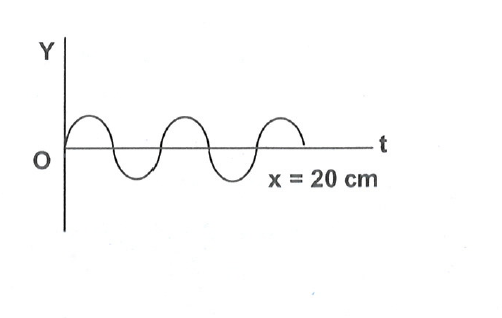
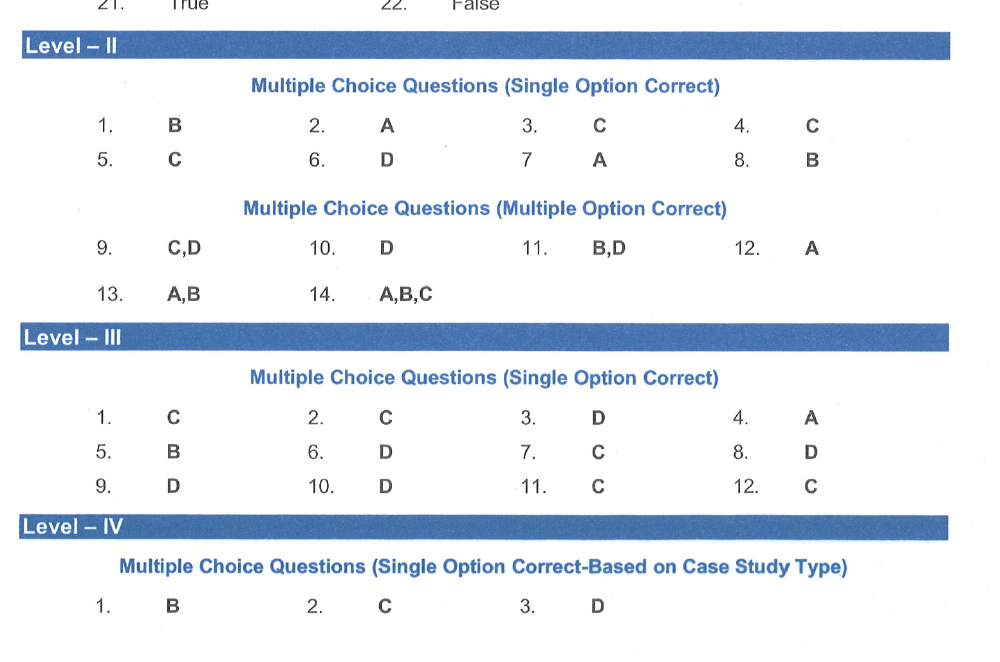

# Level-II

## Multiple Choice Questions (Single Option Correct)

1. If the amplitude of waves at a distance r from a point source is A , the amplitude at a distance 2 r will be:        
(A) 2 A  
(B) A  
(C) A/2  
(D) $\mathrm{A} / 4$  
2. Sound travels in air as:        
(A) longitudinal waves  
(B) transverse waves  
(C) torsional waves  
(D) electromagnetic waves  
3. For the wave shown in figure, the frequency and wavelength, if its speed is $320 \mathrm{~m} / \mathrm{sec}$, are:  
   

    (A) $8 \mathrm{~cm}, 400 \mathrm{~Hz}$  
    (B) $80 \mathrm{~cm}, 40 \mathrm{~Hz}$  
    (C) $8 \mathrm{~cm}, 4000 \mathrm{~Hz}$  
    (D) $40 \mathrm{~cm}, 8000 \mathrm{~Hz}$  
4. When mechanical waves have a frequency above the audible range, these are called:        
(A) sonics  
(B) infrasonics  
(C) ultrasonics  
(D) supersonics  
5. Supersonic planes fly:          
(A) with the speed less than the speed of sound  
(B) with the speed of sound  
(C) with the speed greater than the speed of sound  
(D) with the speed of light  
6. With the propagation of a longitudinal wave through a material medium, the quantities transmitted in the direction of propagation are:        
(A) energy, momentum and mass  
(B) energy  
(C) energy and mass  
(D) energy and linear momentum  
7. The waves in which the particles of the medium vibrate in a direction perpendicular to the direction of wave motion are known as:        
(A) transverse waves  
(B) longitudinal waves  
(C) propagated waves  
(D) none of these  
8. An echo is heard when minimum distance of the reflecting surface is:        
(A) 10 cm  
(B) 17 m  
(C) 34 cm  
(D) 340 cm  

### Multiple Choice Questions (Multiple Option Correct)
9. A mechanical wave propagates in a medium along the $X$-axis. The particles of the medium         
(A) must move on the $X$-axis   
(B) must move on the Y -axis   
(C) may move on the $X$-axis   
(D) may move on the $Y$-axis
10. Longitudinal waves cannot         
(A) have a unique wavelength   
(B) transmit energy   
(C) have a unique wave velocity   
(D) be polarized
11. A wave going in a solid (using the solid as a medium)
(a) must be longitudinal   
(B) may be longitudinal   
(C) must be transverse   
(D) may be transverse
12. A wave moving in a gas (using the gas as a medium)         
(A) must be longitudinal   
(B) may be longitudinal   
(C) must be transverse   
(D) may be transverse
13. Longitudinal wave contains         
(A) compressions   
(B) rarefractions   
(C) crests   
(D) troughs

14. Which of the following is/are a transverse wave?        
(A) $\gamma$-rays  
(B) visible light wave  
(C) X-rays  
(D) sound wave in a gas  

## Level III

### Multiple Choice Questions (Single Option Correct)

1. A tuning fork produces waves in a medium. If the temperature of the medium changes, then which of the following will change      
(A) Amplitude      
(B) frequency   
(C) wavelength   
(D) time period
2. A wavelength 0.6 cm is produced in air and it travels at a speed of $300 \mathrm{~m} / \mathrm{s}$. It will be an   
(A) audible wave      
(B) infrasonic wave   
(C) ultrasonic wave   
(D) none of the above
3. The property of sound by which the brain interprets the frequency of sound is:   
(A) loudness      
(B) quality   
(C) amplitude   
(D) pitch
4. When ultrasonic, infrasonic and audible waves travel through a medium with speeds $v_u, v_i$ and $v_a$ respectively, then   
(A) $v_{u t}, v_i$ and $v_a$ are nearly equal      
(B) $v_u \geq v_a \geq v_i$   
(C) $v_c \leq v_a \leq v_i$   
(D) $v_a \leq v_u$ and $v_u \approx v_i$
5. If a wave completes 20 vibrations in 2.5 s , then its frequency is   
(A) 20 Hz      
(B) 8 Hz   
(C) 200 Hz   
(D) 50 Hz
6. Ultrasonic waves are used for stirring liquid solutions because   
(A) they do not produce noise during the operation      
(B) they do not produce chemical reactions in the solutions   
(C) they are easy to produce   
(D) they can produce perfectly homo-geneous solutions
7. A sound has an intensity of $3 \times 10^{-8} \mathrm{~W} / \mathrm{m}^2$. What is the sound level in dB (decibels)?
(Given, $\log 3=0.477$ )   
(A) 4.477 dB      
(B) 0.4477 dB   
(C) 44.77 dB   
(D) 44.7 dB
8. The wave velocity v in a medium of elasticity E and density d is given by :-   
(A) $V=\frac{E}{d}$      
(B) $V=\sqrt{E d}$   
(C) $V=\sqrt{\frac{d}{E}}$   
(D) $V=\sqrt{\frac{E}{d}}$
9. If the distance between two successive compressins of a sound wave is 16 cm . Then the distance between a compression and the next rarefaction is $\qquad$   
(A) 16 cm      
(B) 32 cm   
(C) 4 cm   
(D) 8 cm
10. Two pendulums $A$ and $B$ of length 9 cm and 16 cm respectively are made to oscillate on the earths surface then the ratio of their frequency is :-   
(A) $3: 4$      
(B) $9: 16$   
(C) $16: 9$   
(D) $4: 3$
11. Two turning forks $A$ and $B$ of frequencies 200 Hz and 400 Hz are vibrated simultaneously. Then the ratio of time taken by the sound produced by $A$ and $B$ to travel 660 m and 490 m respectively in air is $\qquad$ (velocity of the sound in air = $330 \mathrm{~m} / \mathrm{s}$ )   
(A) $1: 2$      
(B) $1: 3$   
(C) $2: 3$   
(D) $1: 1$
12. A wave is passing through a medium and the density is changing continuously, the particle of medium oscillate about their mean position, the wave is :-   
(A) periodic transverse wave      
(B) non-periodic longifudinal wave   
(C) periodic longitudinal wave   
(D) none of the above

### Level - IV

Multiple Choice Questions (Single Option Correct-Based on Case Study Type)   
Frequency of a wave travelling from source to recever is 400 Hz . If the speed of the wave is $200 \mathrm{~m} / \mathrm{sec}$.  
1. Time period of wave is -  
(A) $2 \times 10^{-3} \mathrm{sec}$  
(B) $2.5 \times 10^{-3} \mathrm{sec}$  
(C) $4 \times 10^{-3} \mathrm{sec}$  
(D) $5 \times 10^{-3} \mathrm{sec}$  
2. Wavelength of the wave is -  
(A) 5.0 meter  
(B) 0.4 meter  
(C) 0.5 meter  
(D) 4 meter  
3. Distance travelled by the wave in 2 sec is -  
(A) 200 meter  
(B) 500 meter  
(C) 100 meter  
(D) 400 meter  

### Solutions

#### Level II

1. $ \lambda_1 = \frac{v}{2d} $    
   $ \lambda_2 = \frac{v}{4d} $ = $ \frac{\lambda_1}{2} $  

   Answer = $\fbox{C} $ 
2. A
3. 2.5 waves in 20 cm, 1 wave in 0.2/2.5 = 2/25 sec
4. When mechanical waves have a frequency above the audible range, these are called:        
(A) sonics  
(B) infrasonics  
(C) ultrasonics  
(D) supersonics 
   Final Answer: The final answer is $\boxed{(C)}$
   
5. Supersonic planes fly:          
(A) with the speed less than the speed of sound  
(B) with the speed of sound  
(C) with the speed greater than the speed of sound  
(D) with the speed of light  

   Final Answer: The final answer is $\boxed{(C)}$
6. Energy and Linear momentum,B
7. Transverse, A
8. 10 cm, B

9. A mechanical wave propagates in a medium along the $X$-axis. The particles of the medium         
(A) must move on the $X$-axis   
(B) must move on the Y -axis   
(C) may move on the $X$-axis   
(D) may move on the $Y$-axis  

   Final Answer: The final answer is $\boxed{(C)}, \boxed{(D)}$
10. Longitudinal waves cannot         
(A) have a unique wavelength   
(B) transmit energy   
(C) have a unique wave velocity   
(D) be polarized  

      **Solution:**  
      Let's analyze each option in the context of longitudinal waves:

      **(A) have a unique wavelength:** Longitudinal waves, like all waves, have a characteristic wavelength, which is the distance between two consecutive compressions or rarefactions. So, this statement is incorrect. Longitudinal waves *can* have a unique wavelength.

      **(B) transmit energy:** Longitudinal waves, just like transverse waves, are a mechanism for transferring energy through a medium. They carry energy from one location to another through the oscillations of the medium's particles. So, this statement is incorrect. Longitudinal waves *can* transmit energy.

      **(C) have a unique wave velocity:** Longitudinal waves propagate through a medium with a specific velocity, which depends on the properties of the medium (e.g., density, elasticity). So, this statement is incorrect. Longitudinal waves *can* have a unique wave velocity.

      **(D) be polarized:** Polarization is a phenomenon specific to transverse waves. Polarization refers to the orientation of the oscillations of the wave. In a transverse wave, the oscillations occur perpendicular to the direction of wave propagation. We can select the orientation of these oscillations to filter the light, for example. Since longitudinal waves have oscillations along the direction of wave propagation, there is no perpendicular direction that can be oriented. Therefore, longitudinal waves cannot be polarized. So, this statement is correct.

      Therefore, the correct answer is:

      Final Answer: The final answer is $\boxed{(D)}$

11. A wave going in a solid (using the solid as a medium)
(A) must be longitudinal   
(B) may be longitudinal   
(C) must be transverse   
(D) may be transverse  

      **Solution:**  
      In a solid medium, both longitudinal and transverse waves can propagate. 

     * **Longitudinal waves** (also known as compressional waves) involve particle displacement parallel to the wave's direction of propagation. These waves are associated with changes in volume (compression and rarefaction).

      *   **Transverse waves** involve particle displacement perpendicular to the wave's direction of propagation. These waves are associated with changes in shape (shear).

      Solids can support both types of waves because the particles are held together by strong interatomic forces. These forces allow the solid to resist changes in both volume (for longitudinal waves) and shape (for transverse waves).
      Liquids and gases, on the other hand, have weaker inter-particle forces and cannot support transverse waves. Liquids can support longitudinal waves, as they have volume, while gases only support longitudinal waves.

      Since solids can support both longitudinal and transverse waves, the correct answer is that a wave in a solid may be either longitudinal or transverse.

      Therefore, the correct answer is **(B) may be longitudinal** and **(D) may be transverse**.

      However, if we have to pick one option which best describes this scenario it would be **(B) may be longitudinal** as it is the broader statement. Option D is not incorrect but it does not cover the broader category.

      Final Answer: The final answer is $\boxed{(B), (D)}$

12.  A wave moving in a gas (using the gas as a medium)         
(A) must be longitudinal   
(B) may be longitudinal   
(C) must be transverse   
(D) may be transverse   
   **Solution:**  
   Okay, let's analyze the behavior of waves in a gas medium.

     **Understanding Wave Types**

     *   **Longitudinal Waves:** In longitudinal waves, the particles of the medium oscillate *parallel* to the direction of wave propagation. These waves are also called compression waves. Sound waves are a prime example of longitudinal waves. They require a medium, which is why you can't hear sounds in a vacuum.
     *   **Transverse Waves:** In transverse waves, the particles of the medium oscillate *perpendicular* to the direction of wave propagation. Examples include light waves and waves on a string. These waves can travel in a vacuum, but not all waves of this type can exist in a gas medium.

     **Analyzing Waves in a Gas**

     *   **Gases and Particle Movement:** In a gas, the particles (atoms or molecules) are relatively free to move in all directions.
     *   **Compression and Rarefaction:** When a wave travels through a gas, it causes areas of compression (where particles are closer together) and rarefaction (where particles are farther apart). This compression and rarefaction mechanism leads to longitudinal waves.
     *   **Shear Forces:** Transverse waves require that the medium can sustain shear forces – forces that cause a deformation perpendicular to the force direction. Gases don't effectively transmit shear forces, which make it very difficult for transverse waves to propagate in a gas. This is because gases do not have fixed positions for the molecules. The molecules are quite free to move around.

     **Conclusion**

     Since gases primarily transmit compressional motion and do not sustain significant shear forces, the waves that propagate through them *must be* longitudinal waves. This means they're analogous to sound waves.

     **Answer:**

     The correct answer is **(A) must be longitudinal**.

     The final answer is $(A)$
13. Longitudinal wave contains         
(A) compressions   
(B) rarefractions   
(C) crests   
(D) troughs
**Solution:**  The final answer is $(A),(B)$
1.  Which of the following is/are a transverse wave?        
(A) $\gamma$-rays  
(B) visible light wave  
(C) X-rays  
(D) sound wave in a gas  

    **Solution:**
   Based on this, we can analyze the given options:
   (A) $\boldsymbol{\gamma}$-rays: $\boldsymbol{\gamma}$-rays are electromagnetic waves, so they are transverse waves.
   (B) visible light wave: Visible light is an electromagnetic wave, so it is a transverse wave.
   (C) X-rays: X-rays are electromagnetic waves, so they are transverse waves.
   (D) sound wave in a gas: Sound waves in a gas are longitudinal waves, not transverse waves.

   Thus, options (A), (B), and (C) represent transverse waves.

   Final Answer: The final answer is $(A),(B),(C)$

#### Level III Solutions
1. If the temperature changes then velocity of wave and its wavelength changes. Frequency amplitude and time period remains constant.  
   Answer = $\fbox{Amplitude} =\fbox{C} $ 
2. $ v = \frac{\nu}{\lambda}$  
   $ \lambda = \frac{v}{\nu} = \frac{300}{\frac{6}{1000}} = 50000 $ 

   Answer = $\fbox{Ultrasonic} =\fbox{C} $ 
3. Answer: Pitch $ \fbox{D} $
4. Answer: $ \fbox{A} $
5. $ \nu = \frac{20}{2.5} = \frac{200}{25} = 8 \textbf{ } hz \newline  $   
   Answer = $\fbox{B}$
6. The correct answer is **(D) they can produce perfectly homo-geneous solutions.**

    Here's why:

    *   **Homogeneous Solutions:** The primary reason for using ultrasonic waves in liquid solutions is their ability to create very fine and uniform mixing. The high-frequency vibrations induce cavitation (formation of tiny bubbles that quickly collapse) and acoustic streaming, leading to vigorous mixing at a microscopic level. This ensures that different components of the solution are evenly distributed, resulting in a homogeneous mixture.

    Let's look at why the other options are not the primary reasons:

    *   **(A) they do not produce noise during the operation:** Ultrasonic waves are beyond the range of human hearing, so while we don't hear them, they do produce sound waves that can be quite intense within the liquid. They aren't chosen for being noiseless, since sound is essential for them to work.
    *   **(B) they do not produce chemical reactions in the solutions:** While generally ultrasonic waves don't directly cause most common chemical reactions, extremely intense ultrasound can generate free radicals and influence chemical reactions through sonochemistry, so it's not true that they *never* cause chemical reactions.
    *   **(C) they are easy to produce:** While ultrasonic wave generators are relatively common, this isn't the *main* reason they are used for stirring. Other ways to stir are also easy to produce.

    **In summary:** Ultrasonic waves are used in stirring primarily for their ability to produce very fine and uniform mixing, creating perfectly homogeneous solutions.

7. Solution
    The level of sound or loudness may be expressed in decibels above the standard threshold of hearing $\mathrm{I}_{\mathrm{o}}$. The expression is

    $
    \mathrm{B}=10 \log _{10}\left(\mathrm{I} / \mathrm{I}_{\mathrm{o}}\right)
    $

    or, $B=10 \log _{10}\left(3 \times 10^{-8} / 10^{-12}\right)$

    $
    \text { or, } B=10 \times 4 \log _3=44.77 \mathrm{~dB}
    $

    Answer is $\fbox{C}$

8. $v=\sqrt{\frac{E}{d}}$
9. Answer $\fbox{D}$  
10.  ..
   $ T = 2 \pi \sqrt{\frac{L}{g}} $
   $ L_1 = 9cm, L_2 = 16cm $  
   $ \nu = K \times \frac{1}{\sqrt{L}} $  
   $ \frac{\nu_1}{\nu_2} = \sqrt{\frac{L_2}{L_1}} $  
   $  \frac{\nu_1}{\nu_2} = 4/3$   
   Answer $\fbox{D}$  
 
11. $ v = \nu \times \lambda $  
    $ v = \frac{660}{T_1}$  
    $ v = \frac{490}{T_2}$  
    $ T_1 = \frac{660}{330} =  2 \textbf{ s}$  
    $ T_2 = \frac{490}{330} =  49/33 \textbf{ s}$
    $ \frac{T_1}{T_2} = \frac{660}{490} = \frac{66}{49} = 1.34 $  
    Answer $\fbox{1.34}$
12. Answer $\fbox{C}$ 

### Level IV Solutions
Frequency of a wave travelling from source to recever is 400 Hz . If the speed of the wave is $200 \mathrm{~m} / \mathrm{sec}$.   
1. Time period of wave is -  
(A) $2 \times 10^{-3} \mathrm{sec}$  
(B) $2.5 \times 10^{-3} \mathrm{sec}$  
(C) $4 \times 10^{-3} \mathrm{sec}$  
(D) $5 \times 10^{-3} \mathrm{sec}$  

   $ \nu = \frac{v}{\lambda}$  
   $ T = \frac{1}{ \nu} = \frac{1}{400} = 2.5 \times 10^{-3} \textbf{ } $  
   Answer = $\fbox{D}$ 
2. Wavelength of the wave is -  
(A) 5.0 meter  
(B) 0.4 meter  
(C) 0.5 meter  
(D) 4 meter  

   $ \lambda = \frac{v}{\nu} = 200/400 = 0.5 \textbf{ m} $  
Answer = $\fbox{C}$ 
1. Distance travelled by the wave in 2 sec is -  
(A) 200 meter  
(B) 500 meter  
(C) 100 meter  
(D) 400 meter  
Answer = 400 m $\fbox{D}$ 

