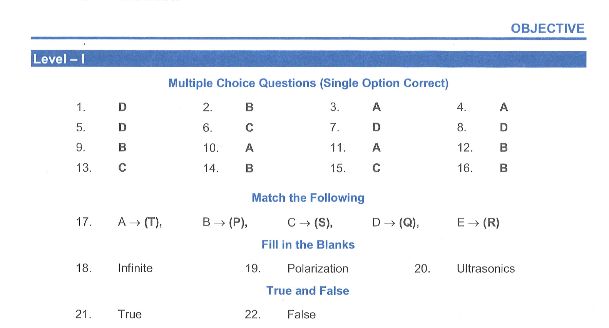

---
layout: default
title: 7.3 Objective (Pg 39)
nav_order: 3
description: ""
has_children: false
parent: 7 Assignment Index
# grand_patent: Class 9
tags: [MathJax, Mathematic]
mathjax: true
---      
# OBJECTIVE
      
## Multiple Choice Questions (Single Option Correct)
1. The quantities that a travelling wave carry with it     
(A) mass     
(B) velocity     
(C) wavelength     
(D) energy  
2. A sound wave produces 60 compressions and 60 rarefactions in 0.6 sec then the frequency of sound wave is   
(A) 50 Hz   
(B) 100 Hz   
(C) 200 Hz   
(D) none of these.
3. Sonar works on the principal of   
(A) reflection of sound waves.         
(B) momentum of sound waves.         
(C) energy of sound waves   
(D) refraction of sound waves.
4. When a wave goes from one medium to another medium. Which quantity does not changes   
(A) frequency   
(B) wavelength   
(C) velocity   
(D) time period
5. The velocity of sound is maximum in   
(A) water   
(B) helium   
(C) oil   
(D) copper
6. Which of the following sound waves can not be heard by human?         
(A) 20 Hz   
(B) 500 Hz   
(C) 15 Hz   
(D) 15000 Hz
7. Mechanical waves on the surface of a liquid are:         
(A) transverse   
(B) longitudinal   
(C) torsional   
(D) both transverse and longitudinal (or ripples)
8. Which of the following statements is incorrect?         
(A) Sound travels radially outwards   
(B) Sound travels as waves   
(C) Sound is a form of energy   
(D) Sound travels faster in vacuum than in air
9. Ultrasonic waves are those waves:         
(A) which a man can hear   
(B) which a man cannot hear   
(C) which are of high velocity   
(D) which have high amplitude  
10. Velocity of sound in air is:     
(A) 300 metres per second   
(B) $3 \times 10^{10}$ metres per second   
(C) $3 \times 10^8$ metres per second   
(D) $3 \times 10^{19}$ metres per second
11. If a wave of wavelength $\lambda$ is traveling in a medium with velocity $v$ then its frequency is   
(A) $\frac{v}{\lambda}$     
(B) $v \lambda$   
(C) $\frac{\lambda}{v}$   
(D) $\frac{1}{v}$
12. The bob of an oscillating simple pendulum arrives at one of the extreme positions 100 times in 200 seconds. Then the time period of the pendulum is   
(A) 2.5 s   
(B) 2 s   
(C) 1.5 s   
(D) 1 s
13. The persistence of hearing for human beings is not more than   
(A) 1 s   
(B) $\frac{1}{5} \mathrm{~s}$   
(C) $\frac{1}{10} \mathrm{~s}$   
(D) $\frac{1}{2} \mathrm{~s}$
14. The distance between $2^{\text {nd }}$ crest and $6^{\text {th }}$ trough of a wave shown below is 24 cm . If the velocity of the moving wave is $20 \mathrm{~m} / \mathrm{s}$ then what is the frequency of the wave.   
(A) 300 Hz   
(B) 375 Hz   
(C) 500 Hz   
(D) 575 Hz
15. When sound waves travelling in air enter into the medium of water, the quantity which remains unchanged is :   
(A) wavelength   
(B) velocity   
(C) frequency   
(D) none
16. On moon, sound is:
(A) like a thunder   
(B) inaudible
(C) louder than on Earth   
(D) none

